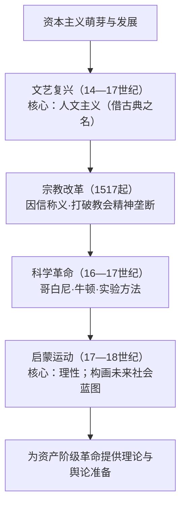

# 第8课 欧洲的思想解放运动

## 时空坐标

- 14世纪：文艺复兴发端于意大利（但丁、彼特拉克、薄伽丘"文学三杰"）
- 15世纪后期起：文艺复兴扩展到西欧各国（达·芬奇等"美术三杰"、莎士比亚）
- 1517年：马丁·路德发表《九十五条论纲》，宗教改革开始
- 16—17世纪：近代科学兴起（哥白尼日心说、牛顿力学体系）——"科学革命"
- 17—18世纪：启蒙运动兴起并在法国达到高潮（伏尔泰、孟德斯鸠、卢梭）

## 知识梳理

| 运动 | 核心思想 | 代表人物 | 影响 |
| --- | --- | --- | --- |
| 文艺复兴 | 人文主义 | 文学三杰、美术三杰、莎士比亚 | 解放思想，促进新文化发展 |
| 宗教改革 | 因信称义 | 马丁·路德、加尔文 | 打击教会权威，助推民族国家与资本主义 |
| 科学革命 | 实验与理性方法 | 哥白尼、牛顿 | 形成科学的世界观与方法论 |
| 启蒙运动 | 理性主义 | 孟德斯鸠、伏尔泰、卢梭、亚当·斯密、康德 | 为革命与建制提供蓝图 |

## 重点精讲

1. **文艺复兴的实质**：并非单纯"复兴古典"，而是新兴资产阶级**借助古希腊罗马文化**反对教会禁欲蒙昧、宣扬**人文主义**（以人为中心、肯定现世幸福）的新文化运动。
2. **宗教改革的逻辑**：路德主张**因信称义**（灵魂得救靠信仰，无须教会中介与赎罪券）、《圣经》权威高于教皇、建立廉俭教会——把个人从教会控制下解放，客观上有利于**王权强化与民族国家形成**、资本原始积累。
3. **启蒙思想家的方案**：孟德斯鸠**三权分立**；伏尔泰倡言论自由、开明君主；卢梭**社会契约与人民主权**；亚当·斯密"看不见的手"（经济自由主义）；康德"人非工具"、敢于运用理性——共同武器是**理性**，矛头指向专制王权与教权。
4. **四场运动的递进关系**：文艺复兴解放"人"，宗教改革解放"信仰"，科学革命解放"认识自然的方法"，启蒙运动解放"政治与社会构想"——一条不断深化的思想解放链，为资产阶级革命做了充分理论准备。

## 典型例题

**例1（选择题）** 马丁·路德主张"每个基督徒只要虔诚信仰即可得救"。这一主张的进步意义在于（　）
A. 否定宗教信仰　B. 打破罗马教会的精神垄断　C. 建立政教合一政权　D. 传播日心说
**解析**：因信称义否定教会与教皇的中介地位，解放了信徒个人。选 **B**。

**例2（材料题）** 材料：卢梭说"人生而自由，却无往不在枷锁之中"；孟德斯鸠称"一切有权力的人都容易滥用权力"。
问：概括两人思想主张并说明启蒙运动的历史作用。
**解析**：卢梭：社会契约论、人民主权说，主权在民；孟德斯鸠：权力制衡、三权分立。作用：①进一步解放思想，冲击专制与教权；②为法国大革命、美国独立战争提供思想武器与制度设计（人权宣言、1787年宪法）；③成为殖民地半殖民地民族民主运动的精神资源。

## 易错点

- 文艺复兴"复兴古典"是**旗帜**，宣传的是**资产阶级新文化**，非复古运动。
- 宗教改革**不否定基督教信仰**，反对的是罗马教会的权威与腐败。
- 人文主义（以人为中心）与理性主义（以理性为准绳）核心不同、递进有别。
- 牛顿属**科学革命**，其力学体系为启蒙运动提供"自然界有规律→社会亦有规律"的信心。

## 背记要点

1. 链条：文艺复兴→宗教改革→科学革命→启蒙运动。
2. 文艺复兴核心：人文主义；三杰×2 + 莎士比亚。
3. 路德：因信称义、《九十五条论纲》（1517）。
4. 启蒙：孟德斯鸠三权分立、卢梭主权在民、伏尔泰自由、斯密市场、康德理性。
5. 作用：为资产阶级革命提供理论准备与动员。

## 自测题

1. 文艺复兴为何采取"借古"的形式？其实质是什么？
2. 概述"因信称义"的内容及宗教改革的影响。
3. 列举三位法国启蒙思想家及其核心主张。
4. 说明四场思想运动之间的递进关系。

## 相关知识点

思想解放的政治实践见 [[第9课 资产阶级革命与资本主义制度的确立]]；科学与技术结合的时代见 [[第10课 影响世界的工业革命]]。
