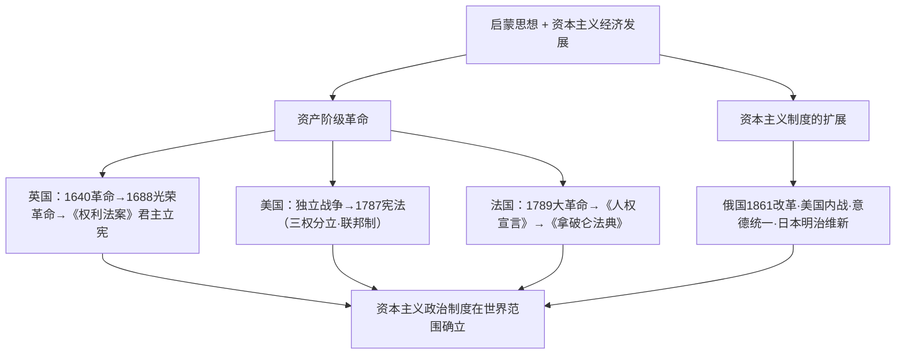

# 第9课 资产阶级革命与资本主义制度的确立

## 时空坐标

- 1640年：英国资产阶级革命爆发；1688年"光荣革命"
- 1689年：英国议会通过《权利法案》，君主立宪制奠基
- 1775—1783年：美国独立战争；1776年《独立宣言》；1787年联邦宪法
- 1789年：法国大革命爆发，颁布《人权宣言》；1804年拿破仑称帝、颁《民法典》
- 1861年：俄国农奴制改革；美国内战（1861—1865）
- 1868年起：日本明治维新；1871年：德意志统一，意大利亦完成统一（1861建国、1870定都罗马）

## 知识梳理

| 国家 | 道路 | 制度成果 |
| --- | --- | --- |
| 英国 | 革命+妥协（光荣革命） | 君主立宪制、责任内阁制（18世纪） |
| 美国 | 独立战争 | 联邦制共和国、三权分立 |
| 法国 | 大革命（激进反复） | 共和制最终确立（1875） |
| 俄/日 | 自上而下改革 | 保留大量封建残余的资本主义 |
| 德/意 | 王朝战争统一 | 君主立宪（德皇权极重） |

## 重点精讲

1. **英国君主立宪的形成**：《权利法案》确立**议会主权**（限制王权的立法、征税、军队权）；18世纪**责任内阁制**形成，"国王统而不治"——以妥协渐进方式完成政治变革。
2. **美国1787年宪法**：三权分立与制衡（国会—总统—最高法院）、联邦制（中央与地方分权）、共和原则；局限：承认奴隶制、印第安人与妇女无平等权利。
3. **法国大革命的彻底性与曲折性**：《人权宣言》宣布自由平等、主权在民、私有财产神圣不可侵犯；政体在共和、帝制间反复，至1875年宪法共和制才最终稳固；《拿破仑法典》把革命成果法典化并影响世界。
4. **改革与统一道路**：俄国废除农奴制、日本明治维新（富国强兵、殖产兴业、文明开化）都是**自上而下**改革，保留封建残余（沙皇专制、天皇制军国主义倾向）；美国内战废除奴隶制、维护统一，为经济起飞扫清障碍。

## 典型例题

**例1（选择题）** 《权利法案》颁布后英国国王仍有行政权，但"未经议会同意，国王无权废止法律、征收赋税"。这表明英国（　）
A. 建立了共和制　B. 确立了议会主权、限制了王权　C. 国王完全丧失权力　D. 实现了普选制
**解析**：《权利法案》核心是以法律限制王权、确立议会至上。选 **B**。

**例2（材料题）** 材料：明治政府提出"富国强兵、殖产兴业、文明开化"三大政策，同时规定"大日本帝国由万世一系之天皇统治"。
问：评价明治维新的性质与影响。
**解析**：性质：自上而下的资产阶级性质改革。积极：摆脱民族危机，走上资本主义道路，成为亚洲强国；建立君主立宪形式的近代国家制度。局限：保留大量封建残余，天皇权力极大，军国主义色彩浓厚，走上对外侵略扩张之路（祸及邻国）。

## 易错点

- 光荣革命（1688）是**不流血政变**；《权利法案》在1689年。
- 美国1787年宪法的"制衡"与孟德斯鸠**三权分立**理论对应，但宪法有承认奴隶制的历史局限。
- 法国共和制**最终确立**以1875年宪法为标志，勿以1792年第一共和国为终点。
- 俄日改革走资本主义道路但**不彻底**，答题须点出"保留封建残余"。

## 背记要点

1. 英：1640→1688→《权利法案》→责任内阁制。
2. 美：1776《独立宣言》；1787宪法（三权分立+联邦制）。
3. 法：1789《人权宣言》；《拿破仑法典》；1875共和确立。
4. 扩展：俄1861改革、美国内战、意德统一、日本明治维新。
5. 共性：确立资本主义制度；个性：革命/改革/统一战争多路径。

## 自测题

1. 简述英国君主立宪制确立的过程与特点。
2. 美国1787年宪法体现了哪些原则？有何局限？
3. 比较法国与英国政治变革道路的差异。
4. 概括资本主义制度在19世纪扩展的四种方式并各举一例。

## 相关知识点

革命的思想武器见 [[第8课 欧洲的思想解放运动]]；制度确立后的经济飞跃见 [[第10课 影响世界的工业革命]]。
