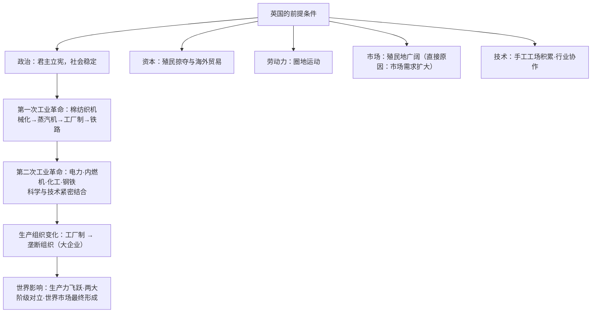

# 第10课 影响世界的工业革命

## 时空坐标

- 18世纪60年代：珍妮纺纱机问世，第一次工业革命自英国棉纺织业开始
- 1785年：瓦特改良蒸汽机投入使用——"蒸汽时代"
- 1825年：史蒂芬孙的蒸汽机车试车成功，铁路时代来临
- 19世纪中期：英国成为"世界工厂"；工业革命扩展至欧美
- 19世纪中后期—20世纪初：第二次工业革命——"电气时代"（电力、内燃机、化学工业、垄断组织）

## 知识梳理

| 项目 | 第一次工业革命 | 第二次工业革命 |
| --- | --- | --- |
| 时间/中心 | 18世纪60年代起，英国一枝独秀 | 19世纪中后期起，美德领先、多国同时 |
| 动力/标志 | 蒸汽机（蒸汽时代） | 电力与内燃机（电气时代） |
| 技术来源 | 工匠经验为主 | 科学理论指导（科学与技术结合） |
| 生产组织 | 工厂制度确立 | 垄断组织出现 |

## 重点精讲

1. **首发英国的原因**：政治前提（资产阶级统治确立）+资本（殖民贸易）+劳动力（圈地运动）+市场（殖民帝国，**市场需求是直接动因**）+技术与资源——诸条件唯英国齐备。
2. **工厂制度**：机器生产集中化的产物——统一厂房、严格纪律、流水协作、雇佣劳动，彻底改变手工工场的分散经营，成为近代企业管理的起点。
3. **第二次工业革命的新特点**：**科学与技术紧密结合**（电磁学→发电机）；几个先进国家**同时展开**；部分国家两次革命**交叉进行**（日、俄、德）；重工业为主导。
4. **深远影响**：①生产力空前发展；②社会结构：工业资产阶级与工业无产阶级**两大阶级对立**，工人运动兴起（衔接第11课）；③社会生活：城市化、教育普及、也带来环境污染与贫富分化；④世界体系：交通通讯革命+商品资本输出，**资本主义世界市场/殖民体系最终形成**（衔接第12课）。

## 典型例题

**例1（选择题）** 第二次工业革命区别于第一次的最显著特点是（　）
A. 从棉纺织业开始　B. 科学理论与技术紧密结合　C. 只发生在英国　D. 以蒸汽为主要动力
**解析**：第二次工业革命以电磁学等科学突破为先导，科学与技术结合。选 **B**。

**例2（材料题）** 材料：19世纪末，美孚石油公司控制美国炼油业的90%；德国电气总公司与西门子瓜分电气市场。
问：材料反映了什么现象？如何评价？
**解析**：现象：第二次工业革命中生产与资本高度集中，**垄断组织**产生。评价：①适应大生产需要，减少无序竞争、利于技术革新与规模效益，是生产力发展的结果；②垄断资本干预国家政治，加紧对外扩张与掠夺，加剧列强瓜分世界的争斗。应辩证看待其进步性与掠夺性。

## 易错点

- 工业革命开始的标志是**珍妮机**（哈格里夫斯），瓦特是**改良**而非发明蒸汽机。
- 市场需求扩大是**直接原因**，资产阶级统治确立是**政治前提**，层次勿混。
- 垄断组织出现于**第二次**工业革命，工厂制属**第一次**。
- 世界市场"初步形成"（一次工业革命后）与"最终形成"（二次工业革命后）表述要准确。

## 背记要点

1. 英国首发五条件：政治、资本、劳动力、市场、技术。
2. 一次：珍妮机→瓦特蒸汽机（1785）→火车（1825）→工厂制。
3. 二次：电力、内燃机、化工；科学与技术结合；垄断组织。
4. 影响：生产力飞跃、两大阶级对立、城市化、世界市场最终形成。

## 自测题

1. 分析工业革命首先发生在英国的条件。
2. 列表比较两次工业革命的动力、技术来源与生产组织。
3. 什么是垄断组织？如何辩证评价？
4. 说明工业革命与世界市场形成的关系。

## 相关知识点

政治前提见 [[第9课 资产阶级革命与资本主义制度的确立]]；阶级对立引发的思想回应见 [[第11课 马克思主义的诞生与传播]]；殖民体系的形成见 [[第12课 资本主义世界殖民体系的形成]]。
