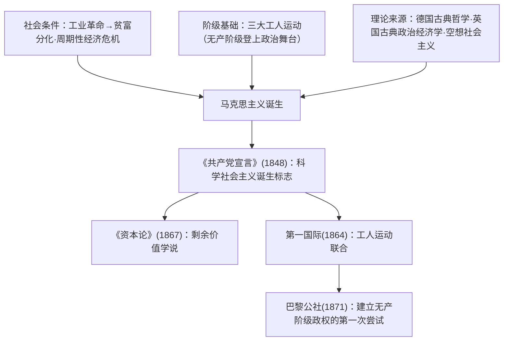

# 第11课 马克思主义的诞生与传播

## 时空坐标

- 19世纪三四十年代：法国里昂工人起义、英国宪章运动、德意志西里西亚织工起义（三大工人运动）
- 1848年2月：《共产党宣言》发表，马克思主义诞生
- 1864年：国际工人协会（第一国际）成立
- 1867年：《资本论》第一卷出版
- 1871年3—5月：巴黎公社——无产阶级建立政权的第一次伟大尝试

## 知识梳理

| 文献/事件 | 核心内容 | 意义 |
| --- | --- | --- |
| 《共产党宣言》 | 阶级斗争学说、资本主义必然灭亡、号召全世界无产者联合 | 标志马克思主义诞生 |
| 《资本论》 | 剩余价值学说，揭示资本主义剥削秘密 | 政治经济学的科学革命 |
| 唯物史观 | 生产力决定生产关系、人民群众是历史创造者 | "两大发现"之一 |
| 巴黎公社 | 民主选举公职、可随时撤换、薪金限制 | 无产阶级专政的伟大尝试 |

## 重点精讲

1. **诞生的条件**：经济条件——工业革命使资本主义弊端（周期性危机、两极分化）暴露；阶级条件——**三大工人运动**表明无产阶级已作为独立政治力量登上历史舞台；理论条件——批判吸收三大思想来源。
2. **《共产党宣言》要义**：肯定资本主义的历史进步作用，又论证其必然被取代；指明无产阶级的**历史使命**（推翻资产阶级统治、建立无产阶级政权）；强调共产党的先进性；"全世界无产者，联合起来！"
3. **马克思主义的科学性**：建立在**唯物史观**与**剩余价值学说**两大发现之上——前者揭示人类历史发展的一般规律，后者揭示资本主义运行的特殊规律；且随实践不断发展，具有开放性。
4. **巴黎公社的经验教训**：措施——打碎旧国家机器，公职人员由**民主选举**产生、受监督可罢免、薪金不得超过熟练工人工资。失败根源——法国资本主义发展尚不充分，无产阶级夺取并保持政权的条件不成熟；缺乏统一的革命政党领导、未能发动农民、未接管法兰西银行。意义——丰富了马克思主义关于无产阶级专政的学说。

## 典型例题

**例1（选择题）** 马克思主义诞生的标志是（　）
A. 《资本论》出版　B. 第一国际成立　C. 《共产党宣言》发表　D. 巴黎公社建立
**解析**：1848年《共产党宣言》系统阐述科学社会主义基本原理。选 **C**。

**例2（材料题）** 材料：巴黎公社规定，一切公职人员由选举产生，人民有权监督和罢免；公职人员薪金不得超过熟练工人的工资。
问：这些措施体现了公社政权的什么性质？其历史意义何在？
**解析**：性质：**无产阶级政权**——权力属于人民，防止公仆变为主人。意义：①第一次尝试打碎旧国家机器、建立无产阶级专政；②其民主原则为后世社会主义民主建设提供借鉴；③虽因条件不成熟而失败，但其经验教训丰富了马克思主义国家学说，公社精神永存。

## 易错点

- 三大工人运动**失败**说明工人运动需要科学理论指导，由此凸显马克思主义诞生的必要。
- "两大发现"：唯物史观+剩余价值学说；《共产党宣言》≠《资本论》的内容。
- 巴黎公社是**自发的**城市起义，并非马克思亲自领导；也不是社会主义制度的建立。
- 空想社会主义（圣西门、傅立叶、欧文）是**理论来源**之一，其"空想"在于找不到实现的社会力量与正确途径。

## 背记要点

1. 三大条件：经济（工业革命弊端）、阶级（三大工人运动）、理论（三大来源）。
2. 1848《共产党宣言》：马克思主义诞生标志。
3. 两大发现：唯物史观、剩余价值学说。
4. 1864第一国际；1871巴黎公社（民主选举、监督罢免、薪金限制）。
5. 公社教训：需要革命政党领导、工农联盟。

## 自测题

1. 从经济、阶级、理论三方面说明马克思主义诞生的条件。
2. 概述《共产党宣言》的主要内容。
3. 马克思主义的两大发现是什么？各自的意义？
4. 巴黎公社采取了哪些措施？为什么失败？

## 相关知识点

工业革命造成的社会分化见 [[第10课 影响世界的工业革命]]；资本主义列强的全球扩张见 [[第12课 资本主义世界殖民体系的形成]]。
