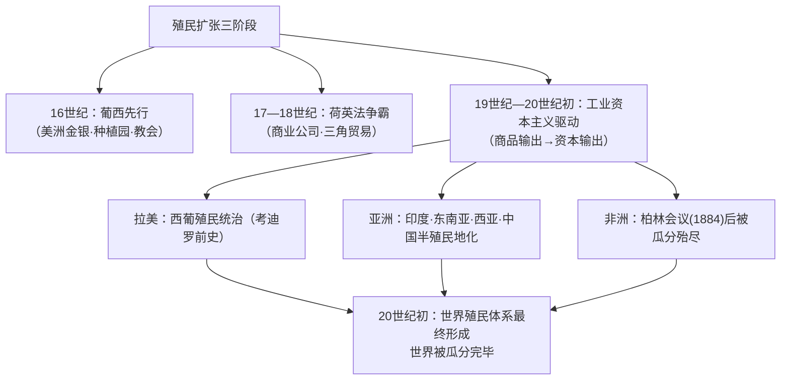

# 第12课 资本主义世界殖民体系的形成

## 时空坐标

- 16世纪：葡萄牙、西班牙率先在美洲、非洲沿岸、亚洲建立殖民地
- 17—18世纪：荷、英、法加入殖民争夺；英国渐成殖民霸主
- 19世纪初：拉丁美洲基本处于西、葡殖民统治之下
- 19世纪中叶：英国完全控制印度；亚洲多国沦为殖民地半殖民地
- 1884年：柏林会议——列强瓜分非洲的"有效占领"原则
- 20世纪初：资本主义世界殖民体系最终形成

## 知识梳理

| 地区 | 殖民状况 | 典型事例 |
| --- | --- | --- |
| 拉丁美洲 | 西属拉美+葡属巴西；掠夺金银、种植园与黑奴 | 波托西银矿、"猪仔"劳工 |
| 亚洲 | 印度（英）、印尼（荷）、印度支那（法）；中国半殖民地 | 东印度公司、鸦片战争 |
| 非洲 | 19世纪后期由沿海深入内陆，柏林会议瓜分 | "有效占领"原则、纵贯与横贯计划冲突 |

## 重点精讲

1. **殖民扩张的阶段性动力**：早期（16—18世纪）以**商业资本**为主——掠夺金银、贩卖奴隶、垄断商路；工业革命后以**工业资本**为主——夺取商品市场与原料产地；第二次工业革命后**资本输出**、瓜分世界成为主流。动力升级源于资本主义发展阶段的变化。
2. **柏林会议（1884）**：列强协调瓜分非洲的规则，确立**"有效占领"**原则（宣布占领须实际控制），此后不到20年非洲几乎被瓜分完毕——"地图上作业"式的强盗分赃。
3. **殖民体系的构成**：殖民地（直接统治，如印度）、半殖民地（保留形式主权，如中国、奥斯曼）、附属国等多种形式；宗主国与殖民地间形成**支配—依附**的世界经济政治结构。
4. **双重影响（辩证评价）**：对殖民地——灾难与破坏（掠夺资源、屠杀奴役、文化摧残），同时客观上传入近代生产方式与思想观念（"双重使命"：破坏旧制度+为新社会创造物质前提）；对世界——世界连为一体但极不平等，孕育了民族解放运动的火种（衔接第13课）。

## 典型例题

**例1（选择题）** 19世纪末列强瓜分非洲的速度骤然加快，其直接的国际背景是（　）
A. 新航路开辟　B. 柏林会议确立瓜分规则　C. 第一次世界大战爆发　D. 非洲内部分裂
**解析**：1884年柏林会议以"有效占领"原则协调瓜分，掀起狂潮。选 **B**。

**例2（材料题）** 材料：马克思指出，英国在印度要完成"双重使命"：一是破坏性的使命，即消灭旧的亚洲式社会；一是建设性的使命，即为西方式社会奠定物质基础。
问：结合史实评析殖民统治对殖民地的影响。
**解析**：破坏性：掠夺财富（东印度公司横征暴敛）、手工业者破产（机织布冲击）、饥荒频仍——发展被打断、灾难深重。客观建设性：铁路电报、近代教育与司法、民族资本与新知识分子出现，为民族觉醒准备条件。总体上殖民主义以掠夺为本质，其"建设"是服务于殖民利益的副产品，不能美化。

## 易错点

- 世界殖民体系**最终形成于20世纪初**（第二次工业革命后），非新航路开辟时。
- 半殖民地（中国）与殖民地（印度）的区别在于是否保留**形式上的主权**。
- 柏林会议瓜分的是**非洲**；"门户开放"针对中国，勿混。
- 评价殖民统治须**破坏为主、双重影响**，防止单向美化或简单否定。

## 背记要点

1. 三阶段动力：商业资本→工业资本（商品输出）→金融资本（资本输出）。
2. 1884柏林会议："有效占领"原则，非洲被瓜分。
3. 体系构成：殖民地、半殖民地、附属国；支配—依附结构。
4. 20世纪初殖民体系最终形成=世界被瓜分完毕。
5. 影响：灾难为主+客观传播近代文明的双重性。

## 自测题

1. 概述殖民扩张三个阶段的特点与驱动力。
2. 柏林会议的内容与影响是什么？
3. 比较殖民地与半殖民地的异同并各举一例。
4. 如何辩证评价殖民主义的"双重使命"？

## 相关知识点

殖民扩张的经济引擎见 [[第10课 影响世界的工业革命]]；被压迫民族的反抗见 [[第13课 亚非拉民族独立运动]]。
