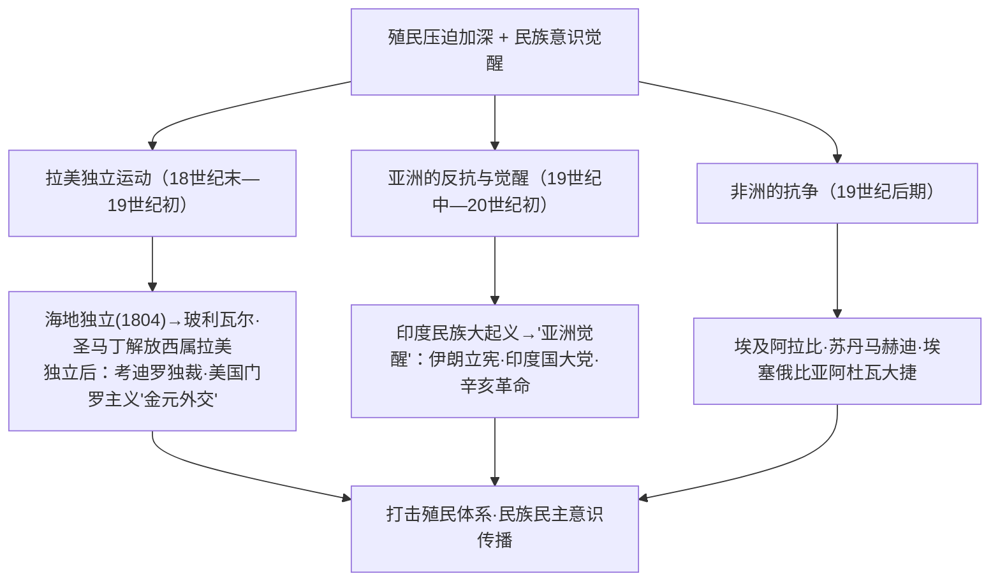

# 第13课 亚非拉民族独立运动

## 时空坐标

- 1791年：海地爆发黑人奴隶起义（杜桑·卢维杜尔领导）；1804年海地独立——拉美独立运动先声
- 1810—1826年：玻利瓦尔、圣马丁领导西属拉美独立战争；1822年巴西独立
- 1857—1859年：印度民族大起义（章西女王）
- 1882年：埃及抗英斗争（阿拉比领导）；1881—1899年：苏丹马赫迪起义
- 1896年：埃塞俄比亚阿杜瓦大捷，击败意大利，保持独立
- 1905—1911年：亚洲的觉醒——伊朗立宪革命、印度民族解放运动高涨、中国辛亥革命

## 知识梳理

| 地区 | 代表事件 | 特点/结果 |
| --- | --- | --- |
| 拉美 | 海地独立、玻利瓦尔与圣马丁远征 | 赢得政治独立，但面临考迪罗主义与美英经济控制 |
| 亚洲 | 印度大起义、亚洲觉醒三大事件 | 从自发抗争转向资产阶级民族民主运动 |
| 非洲 | 埃及、苏丹、埃塞俄比亚抗争 | 以武装抵抗为主；埃塞俄比亚成功保持独立 |

## 重点精讲

1. **拉美独立的原因与局限**：原因——启蒙思想传播、美法革命鼓舞、宗主国西葡衰落（拿破仑战争之机）。局限——独立后政局动荡，**考迪罗**（军事独裁者）统治盛行；经济上受英美控制，美国以**门罗主义**（1823，"美洲是美洲人的美洲"实为"美国人的美洲"）干涉拉美。启示：政治独立后还须完成民族民主革命的深层任务。
2. **印度民族大起义（1857）**：由土兵（雇佣兵）首义、封建王公参与领导的**全民性反英起义**，章西女王英勇殉国；虽败，但沉重打击英国殖民统治（东印度公司被撤销，英王直接管理印度），是印度民族意识觉醒的重要节点。
3. **亚洲的觉醒（20世纪初）**：伊朗立宪革命（1905—1911）、印度国大党提拉克提出自治要求与孟买工人政治罢工、中国辛亥革命——共同标志：从旧式反抗转向**资产阶级领导的民族民主运动**（既反帝又要求民主改革）。
4. **非洲抗争的典型**：埃塞俄比亚皇帝孟尼利克二世发表告人民诏书，全民动员，1896年**阿杜瓦大捷**迫使意大利承认其独立——武装斗争捍卫主权的成功范例。

## 典型例题

**例1（选择题）** 20世纪初"亚洲的觉醒"与19世纪中期亚洲反殖斗争的最大不同在于（　）
A. 参加人数更多　B. 出现资产阶级政党领导的民族民主运动　C. 全部取得胜利　D. 以宗教为旗帜
**解析**："觉醒"的新质在于民族资本主义发展、资产阶级及其政党登台，提出民族独立与民主改革双重目标。选 **B**。

**例2（材料题）** 材料：玻利瓦尔被誉为"解放者"，但他晚年感叹："我们得到的独立是以丧失其他一切为代价的。"
问：如何理解这句话？拉美独立运动留下了哪些未竟课题？
**解析**：理解：拉美赢得**政治独立**，但未实现社会改造与经济自主——大地产制保留、考迪罗独裁频仍、经济命脉受英美资本控制（门罗主义、金元外交）。未竟课题：民主政治建设、土地改革、民族经济独立——说明民族解放是政治独立与社会发展的统一，后者道路更漫长。

## 易错点

- 海地是**拉美第一个独立国家**（1804），由黑人奴隶起义建立。
- 门罗主义（1823）的实质是把拉美变成**美国的势力范围**，非保护拉美。
- 印度大起义的主力是**土兵与农民**，领导权多在封建王公手中（旧式起义）；"觉醒"阶段领导者才是资产阶级。
- 埃塞俄比亚与利比里亚是瓜分狂潮后非洲仅存的**独立国家**。

## 背记要点

1. 拉美：海地(1804)→玻利瓦尔、圣马丁→独立后考迪罗+门罗主义。
2. 亚洲：1857印度大起义（章西女王）；20世纪初亚洲觉醒三事件。
3. 非洲：埃及阿拉比、苏丹马赫迪、埃塞俄比亚阿杜瓦大捷(1896)。
4. 总意义：冲击殖民体系，民族民主意识觉醒，为20世纪民族解放运动奠基。

## 自测题

1. 分析拉美独立运动兴起的条件及其历史局限。
2. 印度民族大起义的性质与影响是什么？
3. "亚洲的觉醒"包含哪些事件？"新"在何处？
4. 埃塞俄比亚为何能保持独立？

## 相关知识点

殖民体系的建立见 [[第12课 资本主义世界殖民体系的形成]]；无产阶级革命理论的传播见 [[第11课 马克思主义的诞生与传播]]。
