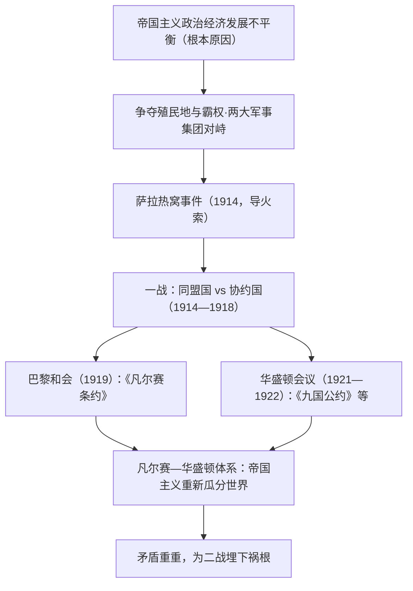

# 第14课 第一次世界大战与战后国际秩序

## 课标要求

通过了解第一次世界大战，理解20世纪上半期国际秩序的变动；认识一战的帝国主义性质，理解凡尔赛—华盛顿体系的实质与不稳定性。

## 时空坐标与背景

- 19世纪末20世纪初：第二次工业革命推动列强向帝国主义过渡，政治经济发展不平衡加剧
- 1882年/1907年：三国同盟（德奥意）与三国协约（英法俄）两大军事集团最终形成
- 1914年6月：萨拉热窝事件（导火索）；7月28日大战爆发
- 1916年：凡尔登战役（"绞肉机"）、索姆河战役、日德兰海战
- 1917年：美国参战、中国参战（以工代兵）；俄国爆发革命，次年退出战争
- 1918年11月11日：德国投降，一战结束
- 1919—1922年：巴黎和会与华盛顿会议，凡尔赛—华盛顿体系确立

## 知识梳理

| 时间 | 事件 | 影响 |
| --- | --- | --- |
| 1914.6 | 萨拉热窝事件 | 一战导火索，奥匈对塞宣战 |
| 1916 | 凡尔登、索姆河战役 | 消耗巨大，德国由攻转守 |
| 1917 | 美国、中国参战 | 协约国力量增强，战局根本变化 |
| 1919 | 巴黎和会《凡尔赛条约》 | 严惩德国，确立欧洲中东新秩序 |
| 1920 | 国际联盟成立 | 第一个普遍性国际组织，被英法操纵 |
| 1921—1922 | 华盛顿会议《九国公约》 | 确立亚太秩序，中国回到列强共同支配局面 |

## 重点探究

1. **为什么说一战是帝国主义战争？** 交战双方的主要目的都是重新瓜分殖民地、争夺世界霸权（德国要求"阳光下的地盘"，英法维护殖民霸权）；战后带有分赃性质的巴黎和会印证了这一点。塞尔维亚抗击侵略具有民族解放性质，但不能改变战争整体的非正义性。
2. **如何评价凡尔赛—华盛顿体系？** ①暂时协调了帝国主义在欧洲与亚太的矛盾，带来20年代相对稳定；②实质是帝国主义重新瓜分世界的分赃体系；③隐含三重矛盾：战胜国与战败国（对德严苛）、战胜国之间（美日争夺亚太）、帝国主义与殖民地半殖民地（山东问题引发五四运动），注定不能持久。国联"全体一致"原则使其难以制止侵略，实际成为英法维护既得利益的工具。

## 易错点

- 萨拉热窝事件是**导火索（直接原因）**，根本原因是帝国主义政治经济发展不平衡。
- 意大利参战后**倒向协约国**一方作战，勿按同盟国阵营答题。
- 国际联盟由**巴黎和会**决定建立，美国倡导却因国会否决**未加入**。
- 《九国公约》使中国**回到列强共同支配**的局面，并非维护中国主权。

## 背记要点

1. 根本原因与导火索的层次辨析是高考常考点：不平衡→集团对峙→萨拉热窝事件。
2. 三条战线中西线具决定性；1916年三大战役（凡尔登、索姆河、日德兰）是转折。
3. 凡尔赛体系管欧洲中东，华盛顿体系管亚太；《凡尔赛条约》与《九国公约》为两大支柱。
4. 国联"全体一致"原则致其无力制止侵略，高考常与联合国安理会大国一致原则对比。
5. 一战影响：欧洲优势削弱、美日崛起、民族觉醒、催生十月革命——国际格局开始变动。

## 自测题

1. 简述第一次世界大战爆发的背景与根本原因。
2. 列举凡尔赛—华盛顿体系的主要会议、条约及其核心内容。
3. 分析凡尔赛—华盛顿体系不能长久维持和平的原因。
4. 说明一战对欧洲国际地位与殖民地半殖民地民族运动的影响。

## 相关知识点

帝国主义形成的经济根源见 [[第10课 影响世界的工业革命]]；列强瓜分世界见 [[第12课 资本主义世界殖民体系的形成]]；战争引发的革命见 [[第15课 十月革命的胜利与苏联的社会主义实践]]；民族觉醒见 [[第16课 亚非拉民族民主运动的高涨]]。
