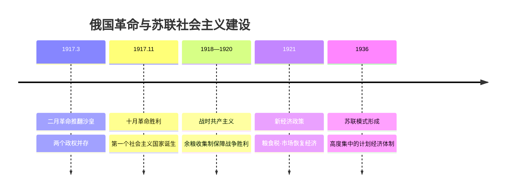

# 第15课 十月革命的胜利与苏联的社会主义实践

## 课标要求

了解列宁领导的十月革命爆发的原因、过程及意义；认识战时共产主义政策、新经济政策与苏联模式（斯大林模式）的内容、成就与弊端。

## 时空坐标与背景

- 1917年3月（俄历二月）：二月革命推翻沙皇专制，出现两个政权并存局面
- 1917年4月：列宁发表《四月提纲》，提出向社会主义革命过渡
- 1917年11月7日（俄历十月）：彼得格勒武装起义胜利，建立苏维埃政权
- 1918—1920年：国内战争时期，实行战时共产主义政策
- 1921年：俄共（布）十大通过新经济政策
- 1922年底：苏联成立；1924年列宁逝世
- 1928—1937年：两个五年计划，实现工业化；1936年宪法标志苏联模式形成

## 知识梳理

| 政策 | 时间/背景 | 主要内容 | 影响 |
| --- | --- | --- | --- |
| 战时共产主义 | 1918—1920，国内战争 | 余粮收集制、工业国有化、取消自由贸易 | 保障战争胜利；损害农民利益，引发危机 |
| 新经济政策 | 1921，经济政治危机 | 固定粮食税、允许私营与外资、恢复商品交换 | 经济恢复，政权巩固；利用市场过渡到社会主义 |
| 苏联模式 | 1928—1936 | 单一公有制、指令性计划、优先发展重工业 | 快速工业化、奠定卫国战争基础；农轻重比例失调，压抑活力 |

## 重点探究

1. **十月革命的历史意义？** ①建立了世界上第一个无产阶级领导的社会主义国家，打破资本主义一统天下的局面；②将马克思主义关于无产阶级革命的理论变为现实，开辟了人类探索社会主义道路的新纪元；③沉重打击帝国主义，极大鼓舞殖民地半殖民地人民的解放斗争（给中国送来马克思主义）。
2. **新经济政策"新"在何处？** 与战时共产主义直接过渡的思路不同，它承认商品货币关系，**利用市场和商品交换**、在国家掌握经济命脉前提下允许多种经济成分存在，间接、迂回地向社会主义过渡——是列宁对落后国家建设社会主义道路的重大理论与实践创新。

## 易错点

- 二月革命是**资产阶级民主革命**，十月革命才是社会主义革命，性质勿混。
- 新经济政策的核心是**粮食税代替余粮收集制**，并非放弃社会主义方向。
- 苏联模式的形成标志是**1936年苏联新宪法**，不是一五计划开始。
- "苏俄"（1917—1922）与"苏联"（1922年底后）称谓要按时间准确使用。

## 背记要点

1. 十月革命路线：二月革命→《四月提纲》→七月流血事件→十月武装起义（高考重视革命进程的阶段性）。
2. 三大政策链条"战时共产主义→新经济政策→苏联模式"是等级考对比类主观题高频命题点。
3. 新经济政策实质：利用市场和商品货币关系发展生产，可与中国改革开放对比。
4. 苏联模式评价须一分为二：短期内实现工业化、支撑反法西斯战争；长期看体制僵化埋下解体隐患。
5. 十月革命对中国的影响：马克思主义传播→五四运动→中国共产党成立。

## 自测题

1. 简述十月革命胜利的历史条件与世界意义。
2. 比较战时共产主义政策与新经济政策的背景、内容与作用。
3. 概括苏联模式的主要特征并辩证评价。
4. 说明新经济政策对社会主义建设道路探索的启示。

## 相关知识点

理论来源见 [[第11课 马克思主义的诞生与传播]]；一战为革命创造条件见 [[第14课 第一次世界大战与战后国际秩序]]；苏联后来的改革与剧变见 [[第20课 社会主义国家的发展与变化]]；对亚非拉的鼓舞见 [[第16课 亚非拉民族民主运动的高涨]]。
