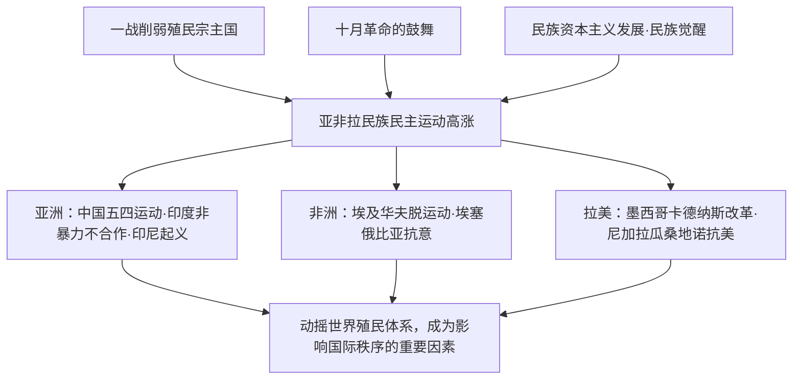

# 第16课 亚非拉民族民主运动的高涨

## 课标要求

了解两次世界大战之间亚非拉民族民主运动高涨的史实，理解其对国际秩序的影响；认识不同国家民族民主运动的多样性道路。

## 时空坐标与背景

- 背景：一战削弱帝国主义殖民力量；十月革命鼓舞被压迫民族；民族资本主义发展、民族民主意识觉醒
- 1919年：中国五四运动；埃及华夫脱运动开始
- 1920—1922年：甘地领导印度第一次非暴力不合作运动
- 1926—1927年：印度尼西亚共产党领导反荷武装起义
- 1910—1917年：墨西哥资产阶级革命，1917年颁布资产阶级宪法
- 20世纪30年代：埃塞俄比亚抗击意大利法西斯入侵（1935—1936）；桑地诺领导尼加拉瓜抗美斗争

## 知识梳理

| 地区 | 时间 | 事件/领导者 | 影响 |
| --- | --- | --- | --- |
| 中国 | 1919起 | 五四运动、国民革命 | 新民主主义革命开端，沉重打击帝国主义 |
| 印度 | 1920起 | 甘地非暴力不合作运动 | 打击英国殖民统治，增强民族自尊与团结 |
| 印尼 | 1926—1927 | 印尼共产党反荷起义 | 亚洲第一次由共产党领导的民族大起义 |
| 埃及 | 1919起 | 扎格鲁尔、华夫脱运动 | 1922年英国被迫承认埃及为独立主权国家（有保留条件） |
| 埃塞俄比亚 | 1935—1936 | 抗击意大利入侵 | 坚持游击战争，最终恢复独立 |
| 墨西哥 | 1934—1940 | 卡德纳斯改革 | 石油国有化、土地改革，走上现代化之路 |
| 尼加拉瓜 | 1926—1933 | 桑地诺抗美游击战争 | 迫使美军撤出，桑地诺被誉为"人民的良心" |

## 重点探究

1. **两次大战之间民族民主运动高涨的原因与特点？** 原因：一战削弱英法等宗主国；十月革命与马克思主义传播提供思想武器和榜样；殖民地民族工业与民族资产阶级、无产阶级力量壮大。特点：①范围广，遍及亚非拉；②领导力量多元（资产阶级政党、共产党、封建王公乃至部落酋长）；③道路多样（非暴力不合作、武装斗争、宪政改革）；④普遍出现政党领导，运动组织化程度提高。
2. **如何评价甘地的非暴力不合作运动？** 进步性：发动群众广泛参与，沉重打击英国殖民统治，增强印度人民自信与团结；局限性：把斗争限制在非暴力框架内，防止革命超出资产阶级容许的范围，多次在群众运动高涨时妥协停止运动。

## 易错点

- 埃及1922年获得的是**有保留条件的独立**，英国仍控制苏伊士运河等，非完全独立。
- 卡德纳斯改革是**资产阶级性质**的民主改革，不是社会主义革命。
- 印尼1926—1927年起义由**共产党**领导，失败后民族党（苏加诺）继起领导。
- 桑地诺抗击的是**美国**扶植的傀儡政权与美军，勿写成西班牙。

## 背记要点

1. 总背景三条：一战削弱宗主国、十月革命鼓舞、民族力量成长——高考背景类题标准答案框架。
2. 亚洲代表：中国五四与国民革命、印度非暴力不合作、印尼反荷起义。
3. 非洲代表：埃及华夫脱运动（1922有条件独立）、埃塞俄比亚抗意复国。
4. 拉美代表：墨西哥1917年宪法与卡德纳斯改革、桑地诺抗美。
5. 总影响：动摇凡尔赛—华盛顿体系下的殖民秩序，成为影响国际格局的重要力量（高考视角：与第13课19世纪民族独立运动纵向比较其新特点）。

## 自测题

1. 概括两次世界大战之间亚非拉民族民主运动高涨的历史背景。
2. 比较印度非暴力不合作运动与印尼反荷起义在领导力量和斗争方式上的差异。
3. 列举拉丁美洲民族民主运动的两个典型事件并说明其性质。
4. 分析这一时期民族民主运动对世界殖民体系和国际秩序的影响。

## 相关知识点

19世纪的第一轮独立运动见 [[第13课 亚非拉民族独立运动]]；殖民体系的形成见 [[第12课 资本主义世界殖民体系的形成]]；思想鼓舞来源见 [[第15课 十月革命的胜利与苏联的社会主义实践]]；殖民体系最终瓦解见 [[第21课 世界殖民体系的瓦解与新兴国家的发展]]。
