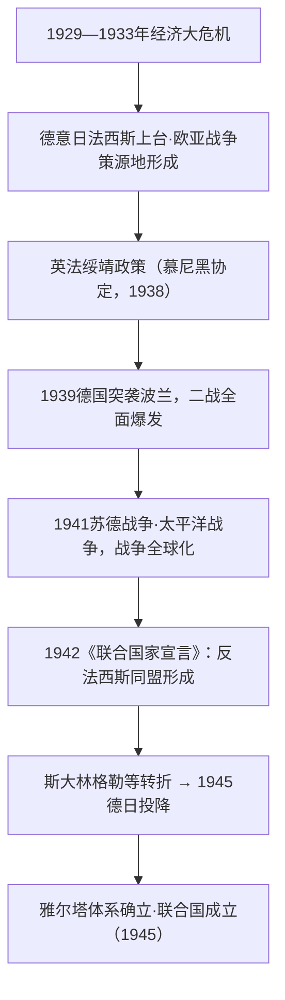

# 第17课 第二次世界大战与战后国际秩序的形成

## 课标要求

通过了解第二次世界大战，理解20世纪上半期国际秩序的变动；认识法西斯主义的危害、世界反法西斯战争胜利的意义与雅尔塔体系、联合国的建立。

## 时空坐标与背景

- 20世纪二三十年代：经济大危机（1929—1933）冲击下，德意日法西斯势力上台，形成欧亚战争策源地
- 1931年：九一八事变，中国开始局部抗战（二战序幕）；1937年七七事变，中国全面抗战（东方主战场）
- 1938年：慕尼黑协定——绥靖政策顶峰
- 1939年9月1日：德国突袭波兰，二战全面爆发
- 1941年：6月苏德战争、12月太平洋战争爆发，二战达到全球规模
- 1942年1月：《联合国家宣言》签署，世界反法西斯同盟正式形成
- 1943—1945年：斯大林格勒战役转折；开罗、德黑兰、雅尔塔、波茨坦会议
- 1945年：5月8日德国投降；9月2日日本签署投降书，二战结束；10月24日联合国成立

## 知识梳理

| 时间 | 事件 | 影响 |
| --- | --- | --- |
| 1931/1937 | 九一八事变/七七事变 | 二战序幕/中国全面抗战，开辟东方主战场 |
| 1938.9 | 慕尼黑协定 | 绥靖顶峰，助长法西斯侵略气焰 |
| 1939.9 | 德国突袭波兰 | 二战在欧洲全面爆发 |
| 1942.1 | 《联合国家宣言》 | 26国结成反法西斯同盟，胜利的根本保证 |
| 1945.2 | 雅尔塔会议 | 战后秩序安排：分区占领德国、成立联合国、苏联对日作战 |
| 1945.10 | 联合国成立 | 安理会"大国一致"原则，维护战后和平 |

## 重点探究

1. **世界反法西斯战争胜利的原因与意义？** 原因：法西斯侵略的非正义性；世界反法西斯同盟的建立（根本保证）；各国人民的浴血奋战（苏联是欧洲主战场、中国是东方主战场）。意义：是正义对邪恶的胜利，深刻改变国际力量对比——欧洲衰落、美苏崛起，殖民体系加速瓦解，社会主义力量壮大，雅尔塔体系与联合国构成战后国际秩序框架。
2. **如何评价雅尔塔体系？** 以雅尔塔等会议确立的战后国际秩序：①原则上倡导和平民主、惩处战犯、承认民族自决，成立联合国，具有进步性；②实质上是美苏主导、按实力划分势力范围的产物，带有明显大国强权政治色彩（如损害中国主权的《雅尔塔协定》相关条款）；③为两极格局的形成奠定框架。

## 易错点

- 二战全面爆发的标志是**1939年德国突袭波兰**；中国战场1931年已开始局部抗战，注意"序幕—全面爆发—全球规模"的阶段表述。
- 绥靖政策的实质是**牺牲弱小国家利益换取自身安全并祸水东引**，不是单纯的和平主义。
- 联合国安理会实行"**大国一致**"原则，与国联"全体一致"原则不同，这是对国联教训的改进。
- 反法西斯同盟正式形成的标志是**《联合国家宣言》（1942年1月）**，不是雅尔塔会议。

## 背记要点

1. 二战根源链条：大危机→法西斯上台→绥靖纵容→局部战争扩大为世界大战（高考因果链高频考点）。
2. 四大会议：开罗（对日处置、归还中国领土）、德黑兰（开辟第二战场）、雅尔塔（战后安排）、波茨坦（敦促日本投降）。
3. 中国是世界反法西斯战争的**东方主战场**，持续时间最长、牵制日军最多——北京卷重视中国抗战的世界意义。
4. 雅尔塔体系两面性：和平民主原则 + 大国强权政治。
5. 联合国与国联对比：普遍性、安理会大国一致、维和机制更有效——制度类比较题常考。

## 自测题

1. 分析第二次世界大战爆发的原因，并说明它与经济大危机的关系。
2. 简述世界反法西斯同盟形成的过程及其作用。
3. 比较国际联盟与联合国在宗旨、原则、作用上的异同。
4. 评价雅尔塔体系的进步性与局限性。

## 相关知识点

一战后秩序的隐患见 [[第14课 第一次世界大战与战后国际秩序]]；苏联的工业化为卫国战争奠基见 [[第15课 十月革命的胜利与苏联的社会主义实践]]；战后两极对峙见 [[第18课 冷战与国际格局的演变]]；殖民体系瓦解见 [[第21课 世界殖民体系的瓦解与新兴国家的发展]]。
