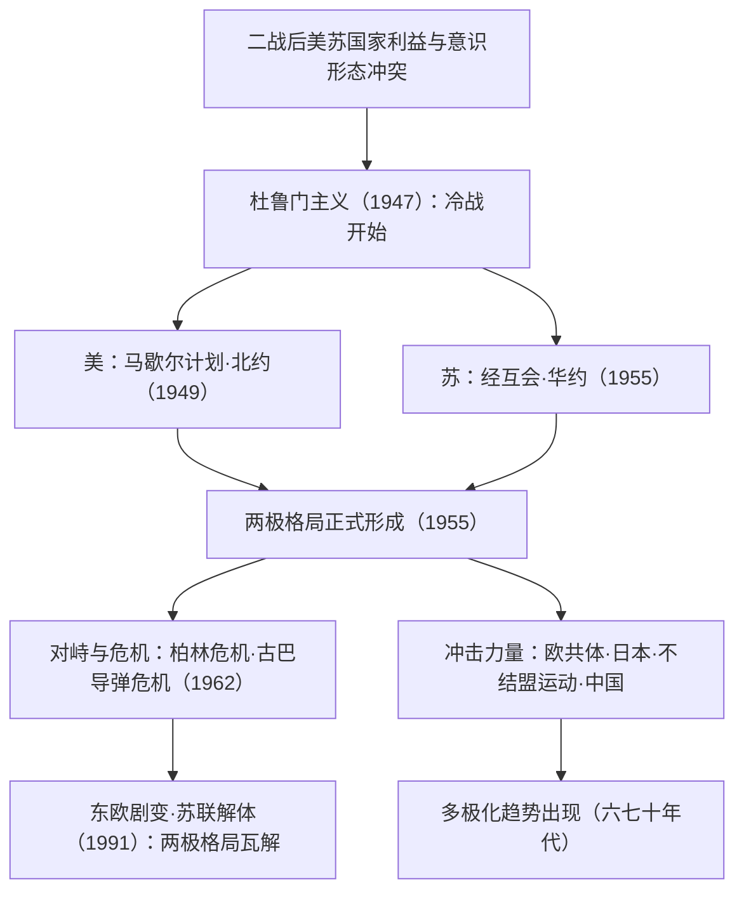

# 第18课 冷战与国际格局的演变

## 课标要求

通过了解冷战时期的典型事件，认识冷战的基本特征，理解冷战的发生、发展与世界格局变化之间的相互影响；认识多极化趋势的出现。

## 时空坐标与背景

- 1946年：丘吉尔"铁幕演说"，发出冷战信号
- 1947年3月：杜鲁门主义出台——冷战开始的标志
- 1947—1949年：马歇尔计划、经互会、北约（1949）相继建立
- 1949年：德国分裂为联邦德国与民主德国
- 1955年：华约建立——两极格局正式形成
- 1962年：古巴导弹危机——冷战最危险时刻
- 20世纪六七十年代：欧共体、日本崛起，不结盟运动兴起，中国振兴——多极化趋势出现
- 1989年东欧剧变，1991年苏联解体——两极格局崩溃，冷战结束

## 知识梳理

| 时间 | 事件 | 影响 |
| --- | --- | --- |
| 1947 | 杜鲁门主义 | 冷战开始的标志，美国遏制苏联 |
| 1947 | 马歇尔计划 | 经济上控制西欧，巩固资本主义阵营 |
| 1949/1955 | 北约/华约建立 | 两大军事集团对峙，两极格局正式形成 |
| 1962 | 古巴导弹危机 | 核战边缘，此后美苏既对抗又寻求缓和 |
| 1961 | 不结盟运动兴起 | 第三世界登上国际舞台，冲击两极 |
| 1991 | 苏联解体 | 两极格局瓦解，冷战结束 |

## 重点探究

1. **冷战的原因与基本特征？** 原因：战时同盟基础（共同敌人）消失；美苏在国家利益、社会制度与意识形态上根本对立；美国凭借实力谋求世界霸权，苏联努力扩大影响。特征：在政治、经济、军事、意识形态等领域全面对抗，但**避免直接大规模热战**；伴随局部"热战"（朝鲜战争、越南战争）与代理人战争；核威慑下形成"恐怖平衡"。
2. **多极化趋势为何在两极格局中孕育？** 六七十年代：西欧走向联合（欧共体）、日本经济起飞并谋求政治大国地位、不结盟运动使第三世界崛起、中国恢复联合国合法席位并成为重要国际力量、苏联实力相对衰落——世界力量结构多元化，两极格局受到冲击但尚未瓦解。

## 易错点

- 冷战开始的标志是**杜鲁门主义（1947）**，两极格局正式形成的标志是**华约建立（1955）**，两者勿混。
- "铁幕演说"只是冷战的**信号/序幕**，不是开始标志。
- 冷战期间存在朝鲜战争、越南战争等**局部热战**，"冷战"指美苏之间未直接开战。
- 多极化至今仍是**趋势**，尚未形成多极**格局**；两极瓦解后呈"一超多强"局面。

## 背记要点

1. 冷战三部曲：杜鲁门主义（政治）、马歇尔计划（经济）、北约（军事）；苏联对应：情报局/经互会/华约——高考常考对应结构。
2. 时间轴锚点：1947开始→1955两极形成→1962导弹危机→1991结束。
3. 冲击两极的四股力量：欧共体、日本、不结盟运动（1961）、中国——多极化趋势出现的标准答案要点。
4. 冷战影响两面看：造成分裂对抗与局部战争；客观上避免了新的世界大战，推动科技发展。
5. 北京卷常以柏林墙、古巴导弹危机等史料考查"冷战中的自我控制机制"。

## 自测题

1. 简述冷战兴起的原因及美国在政治、经济、军事上的表现。
2. 说明两极格局正式形成的标志及其基本特征。
3. 概括20世纪六七十年代冲击两极格局的主要力量。
4. 辩证分析冷战对战后世界的影响。

## 相关知识点

战后秩序框架见 [[第17课 第二次世界大战与战后国际秩序的形成]]；对峙双方的内部变化见 [[第19课 资本主义国家的新变化]] 与 [[第20课 社会主义国家的发展与变化]]；第三世界崛起见 [[第21课 世界殖民体系的瓦解与新兴国家的发展]]；冷战后格局见 [[第22课 世界多极化与经济全球化]]。
