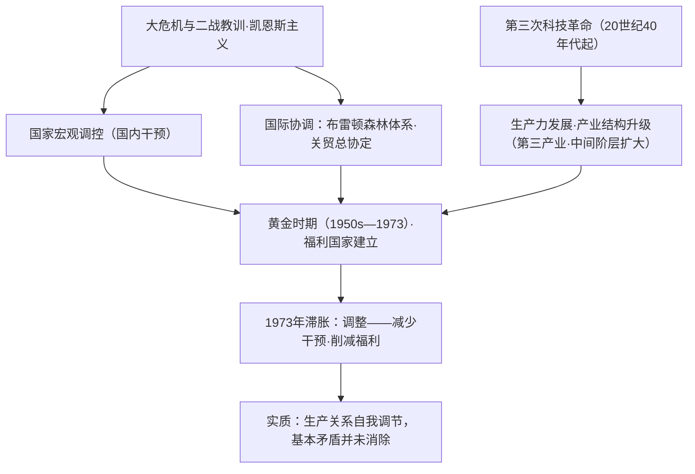

# 第19课 资本主义国家的新变化

## 课标要求

通过认识第二次世界大战后资本主义国家在国家宏观调控、科学技术、社会结构、"福利国家"与社会运动等方面的变化，理解其实质是资本主义生产关系的自我调节。

## 时空坐标与背景

- 背景：1929—1933年大危机与二战教训，自由放任政策破产；凯恩斯主义兴起；社会主义的冲击与借鉴
- 1933年起：罗斯福新政开创国家干预经济先河
- 1944年：布雷顿森林体系建立（国际货币基金组织、世界银行）；1947年关贸总协定签署
- 20世纪40—60年代：第三次科技革命兴起（原子能、电子计算机、航天、生物工程）
- 战后至70年代初：资本主义经济高速增长的"黄金时期"，"福利国家"普遍建立
- 1973年：石油危机引发"滞胀"，各国减少干预，调整福利政策

## 知识梳理

| 方面 | 时间 | 内容 | 影响 |
| --- | --- | --- | --- |
| 宏观调控 | 战后至1973 | 财政货币政策调节、国有化、经济计划指导 | 经济高速增长的"黄金时期" |
| 国际协调 | 1944—1947 | 布雷顿森林体系、关贸总协定 | 稳定金融与贸易秩序，美国主导 |
| 科技革命 | 40年代起 | 原子能、计算机、航天、生物工程 | 生产力飞跃，社会进入信息时代 |
| 社会结构 | 战后 | 第三产业比重上升，"中间阶层"扩大 | 阶级结构多层次化 |
| 福利国家 | 战后普遍建立 | 社会保障覆盖"从摇篮到坟墓" | 缓和矛盾；财政负担重、滋生惰性 |
| 政策调整 | 1973后 | 减少干预、削减福利（新自由主义） | 应对滞胀，贫富分化再度加剧 |

## 重点探究

1. **战后资本主义国家为什么加强国家干预？效果如何？** 原因：大危机暴露自由放任弊端；二战中政府管制经济的成功经验；凯恩斯主义提供理论依据；社会主义计划经济的冲击与借鉴。效果：50—70年代初出现增长的"黄金时期"；但1973年石油危机后出现经济停滞与通货膨胀并存的"滞胀"，证明国家干预不能根除资本主义基本矛盾，此后各国转向减少干预。
2. **如何评价"福利国家"？** 积极：国家通过社会保障与收入再分配，缓和收入分配不平等，保持社会稳定，是社会文明进步的体现。消极：加重国家财政负担；过度福利助长惰性、降低效率。70年代后各国普遍在维持基本保障的前提下削减福利规模——体现效率与公平的动态平衡。

## 易错点

- 战后新变化的实质是**资本主义生产关系的局部调整（自我调节）**，没有也不可能改变资本主义制度的本质。
- "滞胀"= 经济**停滞**+通货**膨胀**并存，凯恩斯主义对此失灵，故转向减少干预，勿答成加强干预。
- 布雷顿森林体系确立的是**以美元为中心**的国际货币体系，与关贸总协定（贸易）职能不同。
- "中间阶层"扩大是社会结构的**新变化**，不等于阶级对立消失。

## 背记要点

1. 新变化五方面：宏观调控、科技革命、社会结构、福利国家、社会运动（黑人民权、妇女运动）——高考概括类题标准框架。
2. 国家干预的理论是凯恩斯主义，实践起点是罗斯福新政，战后普遍化。
3. 一条主线：干预加强（战后）→滞胀（1973）→减少干预（80年代里根、撒切尔改革）。
4. 第三次科技革命使社会进入信息时代，是产业与阶级结构变动的根源。
5. 高考视角：常以福利制度材料考查"政府与市场关系""效率与公平"，可联系中国社会主义市场经济体制作对比。

## 自测题

1. 概括二战后资本主义国家新变化的主要表现。
2. 分析战后资本主义国家加强宏观调控的原因与结果。
3. 辩证评价"福利国家"制度。
4. 为什么说战后新变化没有克服资本主义的基本矛盾？

## 相关知识点

工业革命以来生产组织的演进见 [[第10课 影响世界的工业革命]]；基本矛盾理论见 [[第11课 马克思主义的诞生与传播]]；与之对照的社会主义阵营变化见 [[第20课 社会主义国家的发展与变化]]；世界经济体系化见 [[第22课 世界多极化与经济全球化]]。
