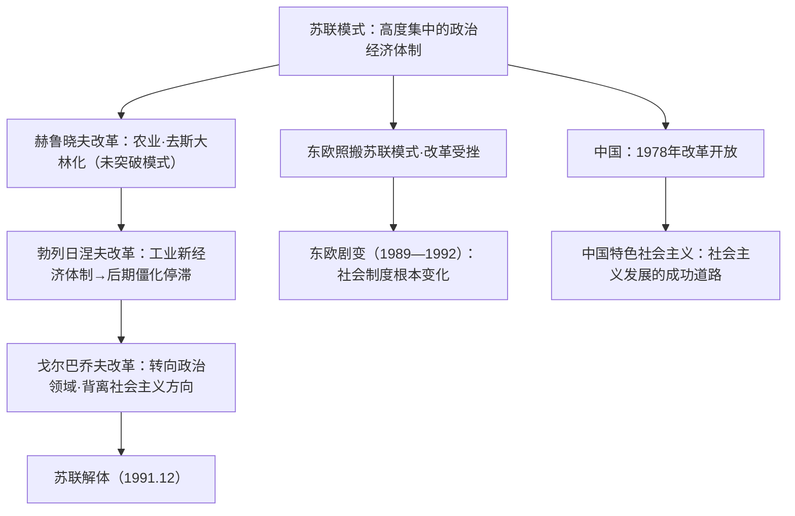

# 第20课 社会主义国家的发展与变化

## 课标要求

通过了解第二次世界大战后社会主义国家的变化，认识其发展中的成就与曲折；理解苏联改革失败、东欧剧变的教训与中国特色社会主义的世界意义。

## 时空坐标与背景

- 战后初期：苏联恢复发展，但苏联模式弊端日益显露；东欧多国照搬苏联模式
- 1953—1964年：赫鲁晓夫改革（农业为重点，批判个人崇拜）
- 1964—1982年：勃列日涅夫改革（工业"新经济体制"，后期停滞，军备竞赛）
- 1985—1991年：戈尔巴乔夫改革（经济改革受挫后转向政治改革，取消党的领导地位）
- 1956年：波兹南事件、匈牙利事件；1968年"布拉格之春"被镇压
- 1989—1992年：东欧剧变；1991年12月苏联解体
- 中国：1949年建国→1956年确立社会主义制度→1978年改革开放→中国特色社会主义道路

## 知识梳理

| 时间 | 事件 | 影响 |
| --- | --- | --- |
| 1953—1964 | 赫鲁晓夫改革 | 有一定成效（垦荒、批判个人崇拜），未突破苏联模式 |
| 1964—1982 | 勃列日涅夫改革 | 军事实力增强，后期经济停滞、体制僵化 |
| 1985—1991 | 戈尔巴乔夫改革 | 放弃党的领导与马克思主义指导，直接导致解体 |
| 1968 | "布拉格之春" | 捷克斯洛伐克改革被苏联镇压，东欧改革受挫 |
| 1989—1992 | 东欧剧变 | 东欧各国社会制度发生根本性变化 |
| 1991.12 | 苏联解体 | 两极格局瓦解，世界社会主义遭受重大挫折 |
| 1978至今 | 中国改革开放 | 开创中国特色社会主义，深刻影响世界历史进程 |

## 重点探究

1. **苏联三次改革失败的共同原因？** ①都没有从根本上突破高度集中的苏联模式（赫、勃）或改革背离了社会主义方向（戈）；②优先发展重工业、农轻重比例失调的痼疾未解决；③缺乏正确理论指导与配套措施，改革带有随意性；④勃列日涅夫时期与美国军备竞赛拖垮经济。教训：改革必须坚持社会主义方向、以经济建设为中心、从本国国情出发。
2. **东欧剧变、苏联解体的实质与启示？** 实质：社会制度发生根本性变化，是社会主义的严重挫折，但只是苏联模式的失败，**不是社会主义制度本身的失败**。启示：中国坚持党的领导、坚持改革开放、把马克思主义与本国实际相结合，中国特色社会主义的成功证明社会主义具有强大生命力。

## 易错点

- 赫鲁晓夫改革重点在**农业**，勃列日涅夫改革重点在**工业（尤其军工）**，勿颠倒。
- 苏联解体的根本原因是**苏联模式的弊端长期得不到纠正**；戈尔巴乔夫改革是直接原因，西方"和平演变"是外部原因，层次要分清。
- 东欧剧变"剧变"指**社会制度**的根本变化，不只是政权更迭。
- 南斯拉夫较早探索**社会主义自治制度**，并非照搬苏联模式的典型。

## 背记要点

1. 苏联改革三阶段口诀：赫（农业、秘密报告）→勃（工业、军备）→戈（政治化、解体）——高考排序与比较题高频。
2. 解体三层原因：根本（模式僵化）、直接（戈氏改革方向错误）、外部（和平演变）。
3. 东欧剧变先后：波兰最先，德国以两德统一方式完成，罗马尼亚流血冲突。
4. 中国对照线：1978年十一届三中全会→社会主义市场经济体制→中国特色社会主义进入新时代。
5. 高考视角：常将新经济政策、苏联改革、中国改革开放作跨课比较，落点在"社会主义建设道路必须符合国情"。

## 自测题

1. 概述赫鲁晓夫、勃列日涅夫、戈尔巴乔夫改革的重点与结局。
2. 分析苏联解体的根本原因、直接原因与外部原因。
3. 简述东欧剧变的表现及其实质。
4. 结合中国改革开放的成就，谈谈社会主义国家改革的基本启示。

## 相关知识点

苏联模式的由来见 [[第15课 十月革命的胜利与苏联的社会主义实践]]；理论源头见 [[第11课 马克思主义的诞生与传播]]；冷战对峙背景见 [[第18课 冷战与国际格局的演变]]；解体后的世界格局见 [[第22课 世界多极化与经济全球化]]。
