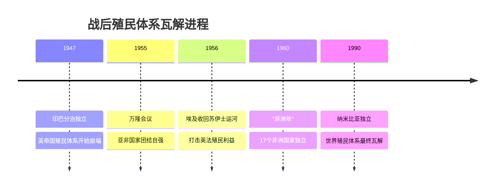

# 第21课 世界殖民体系的瓦解与新兴国家的发展

## 课标要求

通过了解第二次世界大战后世界殖民体系的瓦解与第三世界的兴起，理解世界历史发展的多样性；认识新兴民族国家发展的成就与面临的挑战。

## 时空坐标与背景

- 背景：二战沉重打击帝国主义殖民力量；殖民地人民在战争中觉醒壮大；联合国宪章确认民族自决原则；社会主义力量支持
- 1947年：印巴分治，印度、巴基斯坦独立
- 1953年：埃及成立共和国；1956年纳赛尔宣布苏伊士运河收归国有
- 1955年：万隆会议（亚非会议）——第三世界形成的开端
- 1960年："非洲年"，17个非洲国家独立
- 1962年：阿尔及利亚经过民族解放战争获得独立
- 1990年：纳米比亚独立——世界殖民体系最终瓦解的标志
- 1999年：巴拿马收回运河区全部主权

## 知识梳理

| 时间 | 事件 | 影响 |
| --- | --- | --- |
| 1947 | 印巴分治 | 南亚独立，遗留克什米尔等问题 |
| 1955 | 万隆会议 | "团结、友谊、合作"的万隆精神，第三世界兴起 |
| 1956 | 苏伊士运河国有化 | 埃及维护主权，英法殖民势力受重挫 |
| 1960 | "非洲年" | 非洲独立浪潮高峰 |
| 1961 | 不结盟运动成立 | 第三世界成为独立政治力量 |
| 1990 | 纳米比亚独立 | 殖民体系最终瓦解 |

## 重点探究

1. **战后世界殖民体系为什么迅速瓦解？** ①二战使英法等宗主国实力大衰；②战争锻炼了殖民地人民，民族解放意识与武装力量成长；③联合国民族自决原则与社会主义国家的支持提供有利国际环境；④亚非拉国家相互支援（万隆会议、不结盟运动）形成合力。殖民体系的瓦解是20世纪伟大的历史变化，深刻改变了世界政治版图。
2. **新兴民族国家发展面临哪些机遇与挑战？** 成就：印度建成较完整工业体系与信息产业优势；新加坡、韩国等成为新兴工业化国家；海湾产油国石油致富。挑战：①殖民主义遗留的边界、民族、宗教矛盾（印巴冲突、中东问题）；②不平等的国际经济旧秩序制约发展；③自身发展不平衡、政局动荡、债务与人口问题——发展中国家要求建立国际经济新秩序。

## 易错点

- 世界殖民体系**最终瓦解**的标志是1990年**纳米比亚独立**，勿写成"非洲年"。
- 万隆会议（1955）是**没有殖民国家参加**的第一次亚非国际会议，周恩来提出"求同存异"方针。
- 印巴分治依据《蒙巴顿方案》按**宗教**划分，埋下印巴冲突祸根。
- "第三世界""不结盟"不等于中立无为，而是独立自主、反对霸权的积极力量。

## 背记要点

1. 瓦解进程四节点：1947印巴独立→1955万隆会议→1960非洲年→1990纳米比亚独立（高考时序题常考）。
2. 拉美主权斗争代表：古巴革命（1959，走上社会主义道路）、巴拿马收回运河主权（1999）。
3. 万隆精神与"求同存异"是北京卷结合中国外交史的高频结合点。
4. 发展中国家的核心诉求：建立公正合理的国际经济新秩序。
5. 高考视角：与第12、13课"殖民体系形成—抗争—瓦解"构成完整线索，注意首尾呼应式命题。

## 自测题

1. 分析二战后世界殖民体系迅速瓦解的原因。
2. 按时间顺序列出殖民体系瓦解的关键事件及标志。
3. 说明万隆会议的内容、精神及其历史意义。
4. 概括新兴民族国家发展取得的成就与面临的共同挑战。

## 相关知识点

殖民体系的建立见 [[第12课 资本主义世界殖民体系的形成]]；早期抗争见 [[第13课 亚非拉民族独立运动]]；战间期运动见 [[第16课 亚非拉民族民主运动的高涨]]；二战的推动见 [[第17课 第二次世界大战与战后国际秩序的形成]]；第三世界与多极化见 [[第22课 世界多极化与经济全球化]]。
