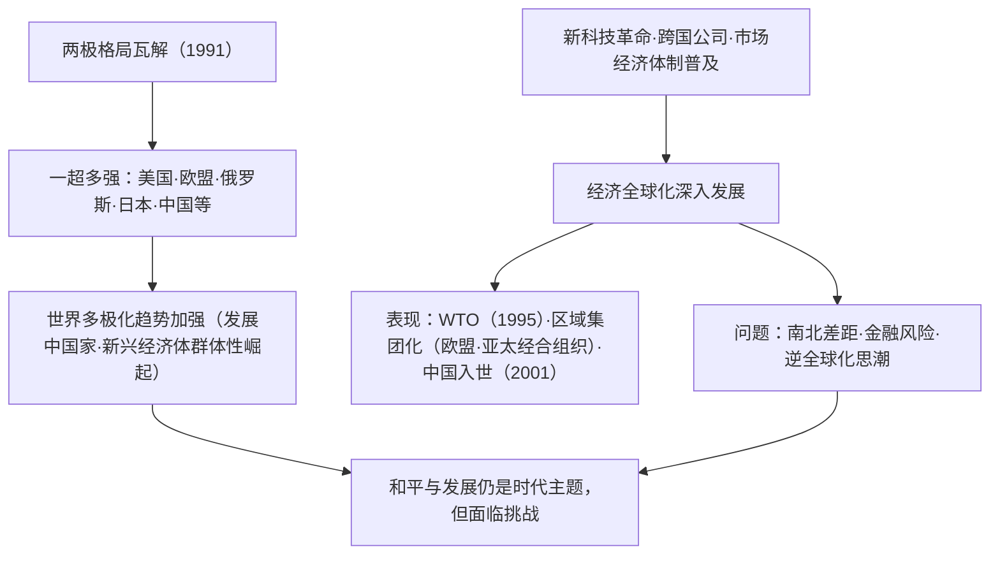

# 第22课 世界多极化与经济全球化

## 课标要求

通过了解冷战结束后世界多极化、经济全球化、社会信息化、文化多样性的发展，理解当代世界发展的特点与主要趋势。

## 时空坐标与背景

- 1991年：苏联解体，两极格局瓦解，世界暂时呈现"一超多强"局面
- 1993年：欧洲联盟成立（1999年启用欧元）
- 1995年：世界贸易组织（WTO）取代关贸总协定正式运行
- 2001年：中国加入世界贸易组织；"9·11"事件后国际安全形势复杂化
- 2008年：国际金融危机，二十国集团（G20）峰会机制兴起
- 2009年起：金砖国家合作机制（中俄印巴西南非）发展
- 21世纪以来：新一轮科技革命（互联网、人工智能）加速社会信息化

## 知识梳理

| 时间 | 事件 | 影响 |
| --- | --- | --- |
| 1991 | 苏联解体 | 两极格局终结，多极化趋势不可逆转 |
| 1993 | 欧盟成立 | 区域一体化程度最高的组织，重要一极 |
| 1995 | WTO成立 | 经济全球化的制度化、体系化保障 |
| 2001 | 中国加入WTO | 中国深度融入世界经济，推动全球化 |
| 2008 | 国际金融危机 | 暴露全球化风险，G20等全球治理机制兴起 |
| 2016前后 | 逆全球化思潮抬头 | 保护主义上升，全球治理面临考验 |

## 重点探究

1. **如何认识经济全球化的双重影响？** 动力：科技革命（根本动力）、跨国公司（主要载体）、市场经济体制的普遍建立、WTO等国际协调机制。积极：优化资源全球配置，促进世界经济增长，为发展中国家提供机遇（如中国入世后的腾飞）。消极：利益分配不均加剧南北差距；金融风险跨国传导（2008危机）；发达国家主导规则。正确态度：全球化是历史潮流，应趋利避害、共建普惠包容的全球化，而非因噎废食走保护主义老路。
2. **世界多极化与两极格局下多极化趋势有何不同？** 六七十年代多极化在两极框架**内部孕育**（欧共体、日本、不结盟、中国）；冷战后多极化在**一超多强**基础上曲折发展，突出表现为新兴市场国家与发展中国家群体性崛起，国际力量对比更趋均衡，但多极格局尚未最终形成，单边主义与多边主义斗争持续。

## 易错点

- 多极化至今是**趋势**而非既成格局；"一超多强"是两极瓦解后的过渡性态势。
- 经济全球化的**根本动力是科技进步与生产力发展**，跨国公司是主要推动者/载体，层次勿混。
- WTO成立于**1995年**（前身为1947年关贸总协定），中国**2001年**加入。
- 欧盟是**经济政治一体化**组织，亚太经合组织（APEC）是松散的**经济论坛**，性质不同。

## 背记要点

1. 当代世界四大趋势：多极化、经济全球化、社会信息化、文化多样性——课标原文，概括题必背。
2. 多极力量清单：美国、欧盟、日本、俄罗斯、中国及广大发展中国家（金砖、G20）。
3. 全球化三支柱机构：WTO（贸易）、IMF（货币）、世界银行（发展援助），源头可追至布雷顿森林体系。
4. 全球化利弊分析+中国方案（共建"一带一路"、普惠包容）是北京卷开放性试题高频落点。
5. 时间锚点：1991、1993、1995、2001、2008——按序记忆事件链。

## 自测题

1. 简述两极格局瓦解后世界多极化趋势加强的表现。
2. 分析经济全球化的动力、载体及制度保障。
3. 辩证评价经济全球化对发展中国家的影响。
4. 结合中国加入WTO以来的史实，说明中国与经济全球化的互动关系。

## 相关知识点

世界市场的形成见 [[第10课 影响世界的工业革命]]；两极格局及其中的多极化萌芽见 [[第18课 冷战与国际格局的演变]]；战后经济体系见 [[第19课 资本主义国家的新变化]]；发展中国家崛起见 [[第21课 世界殖民体系的瓦解与新兴国家的发展]]；中国方案见 [[第23课 和平发展合作共赢的时代潮流]]。
