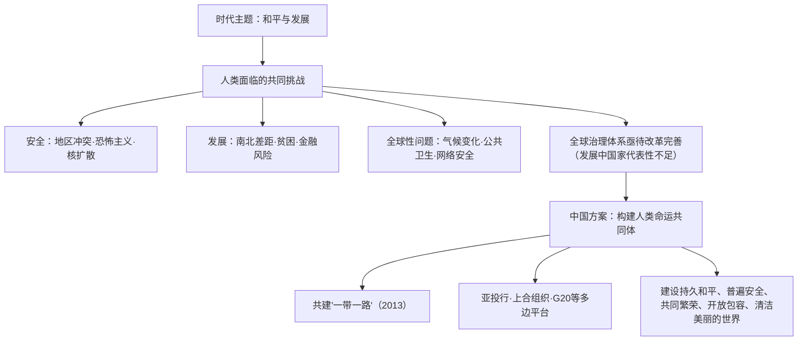

# 第23课 和平发展合作共赢的时代潮流

## 课标要求

理解和平、发展、合作、共赢是当今时代的潮流；认识人类面临的共同挑战，理解构建人类命运共同体的中国方案及其世界意义。

## 时空坐标与背景

- 20世纪80年代：邓小平提出"和平与发展是当代世界的两大问题"的科学论断
- 冷战结束后：世界大战危险下降，但地区冲突、恐怖主义、南北差距等问题突出
- 2001年：上海合作组织成立——新型区域合作组织
- 2013年：习近平提出共建"一带一路"倡议；首次提出构建人类命运共同体理念
- 2015年：联合国通过《2030年可持续发展议程》；亚洲基础设施投资银行协定签署（2016年开业）
- 2017年："构建人类命运共同体"理念写入联合国有关决议
- 当前：气候变化、公共卫生安全、粮食与能源安全等全球性问题凸显，全球治理体系改革呼声高涨

## 知识梳理

| 时间 | 事件 | 影响 |
| --- | --- | --- |
| 1980年代 | "和平与发展"两大问题论断 | 为中国改革开放与外交政策提供依据 |
| 2001 | 上海合作组织成立 | 互信互利、平等协商的新型区域合作典范 |
| 2013 | "一带一路"倡议提出 | 构建人类命运共同体的重要实践平台 |
| 2015—2016 | 亚投行成立 | 补充国际多边金融体系，提升发展中国家话语权 |
| 2017 | 人类命运共同体写入联合国决议 | 中国理念获得国际社会广泛认同 |

## 重点探究

1. **为什么说和平与发展是当今时代的主题？** ①世界多极化与经济全球化使各国相互依存空前加深，大战可以避免；②要和平、求发展、促合作是各国人民的普遍愿望；③但霸权主义、强权政治、地区冲突与南北发展失衡表明，和平与发展两大问题**一个也没有真正解决**——因此需要各国合作应对，完善全球治理。
2. **构建人类命运共同体的内涵与世界意义？** 内涵：建设持久和平、普遍安全、共同繁荣、开放包容、清洁美丽的世界，坚持对话协商、共建共享、合作共赢、交流互鉴、绿色低碳。意义：超越零和博弈与冷战思维，为解决全球性问题、改革全球治理体系提供中国智慧和中国方案；通过"一带一路"、亚投行等落地生根，是对传统国际关系理论的重大创新，顺应和平发展合作共赢的时代潮流。

## 易错点

- "和平与发展是时代主题"不等于世界已经太平：两大问题**至今一个也没有解决**，表述要完整。
- 人类命运共同体理念于**2013年提出、2017年写入联合国决议**，两个时间点勿混。
- "一带一路"是**开放包容的国际合作倡议**，不是中国版"马歇尔计划"，性质辨析常考。
- 全球治理体系改革的方向是**共商共建共享**、提高发展中国家代表性，不是推倒重来另起炉灶。

## 背记要点

1. 时代主题判断依据：多极化+全球化+各国相互依存→和平发展合作共赢成为潮流（高考论述题立论基础）。
2. 人类面临挑战三类：传统安全（战争冲突）、发展失衡（南北差距）、非传统安全（气候、疫情、恐怖主义）。
3. 中国方案关键词：人类命运共同体、"一带一路"、共商共建共享的全球治理观、新型国际关系（相互尊重、公平正义、合作共赢）。
4. 实践平台四例：一带一路、亚投行、上合组织、G20——史实支撑必备。
5. 北京卷高频命题：以联合国决议、"一带一路"成果等材料考查"中国智慧对全球治理的贡献"，注意史论结合、古今关联（可上溯丝绸之路）。

## 自测题

1. 说明和平与发展成为时代主题的原因及其面临的挑战。
2. 概括当今人类面临的主要全球性问题。
3. 阐述构建人类命运共同体理念的基本内涵。
4. 结合"一带一路"等史实，论述中国为世界和平与发展作出的贡献。

## 相关知识点

时代潮流的格局基础见 [[第22课 世界多极化与经济全球化]]；全球治理机制源流见 [[第17课 第二次世界大战与战后国际秩序的形成]] 与 [[第18课 冷战与国际格局的演变]]；发展中国家诉求见 [[第21课 世界殖民体系的瓦解与新兴国家的发展]]；世界联系的起点可追溯至 [[第10课 影响世界的工业革命]]。
