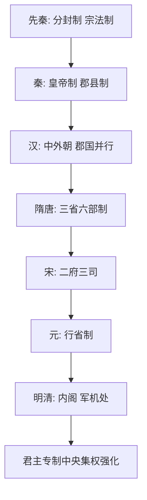

# 第1课 中国古代政治制度的形成与发展

## 核心概念 / 课标要求
- 课标要求：了解中国古代政治制度（中央官制、地方行政制度）的演变历程，理解君主专制中央集权制度的发展趋势。
- 时空坐标：先秦（分封制、宗法制）→ 秦（皇帝制、郡县制）→ 汉至元（中央集权强化）→ 明清（君主专制顶峰）。

## 知识梳理

| 时期 | 中央官制 | 地方行政 | 特点 |
|------|---------|---------|------|
| 先秦 | 世卿世禄制 | 分封制、宗法制 | 贵族政治 |
| 秦朝 | 三公九卿制 | 郡县制 | 君主专制中央集权确立 |
| 汉朝 | 中外朝制度 | 郡国并行→刺史 | 中央集权加强 |
| 隋唐 | 三省六部制 | 州县制 | 相权分割，皇权加强 |
| 宋元 | 二府三司/中书省 | 路州县/行省制 | 中央集权强化 |
| 明清 | 内阁/军机处 | 省府县 | 君主专制顶峰 |

## 重点探究
1. **君主专制中央集权的发展趋势**：中央官制上，相权不断削弱、皇权不断加强（三公九卿→三省六部→内阁→军机处）；地方行政上，中央对地方的控制不断加强（分封→郡县→行省）。
2. **秦朝制度的确立**：秦朝确立皇帝制度、三公九卿制和郡县制，标志着君主专制中央集权制度的正式确立，为后世奠定基础。
3. **明清君主专制的顶峰**：明朝废丞相、设内阁，清朝设军机处，君主专制达到顶峰，但也导致决策的独断与政治的僵化。

## 易错点
- 分封制是"贵族政治"，郡县制是"官僚政治"，勿混淆。
- 三省六部制分割相权，加强皇权，勿误为削弱皇权。
- 军机处是"皇帝秘书机构"，不是正式行政机构。
- 行省制是元朝地方行政制度，勿误为中央官制。

## 背记要点
1. 秦朝确立皇帝制、三公九卿制、郡县制。
2. 隋唐三省六部制分割相权，加强皇权。
3. 元朝行省制加强中央对地方的控制。
4. 明朝废丞相、设内阁。
5. 清朝设军机处，君主专制达到顶峰。
6. 发展趋势：相权削弱、皇权加强，中央集权强化。

## 自测题
1. 简述秦朝确立的政治制度。
2. 三省六部制如何加强皇权？
3. 行省制有何历史意义？
4. 明清君主专制达到顶峰的表现是什么？
5. 中国古代政治制度的发展趋势是什么？

## 相关知识点
- 关联第3课"中国近代至当代政治制度的演变"。
- 与第4课"中国历代变法和改革"相衔接。
- 为理解中国古代国家治理奠定基础。
