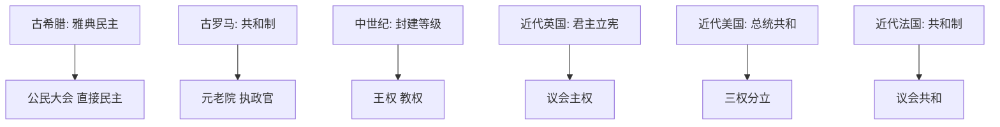

# 第2课 西方国家古代和近代政治制度的演变

## 核心概念 / 课标要求
- 课标要求：了解古希腊、古罗马的政治制度，理解近代西方民主政治（君主立宪制、共和制）的确立与特点。
- 时空坐标：古希腊（城邦民主）→ 古罗马（共和制、帝制）→ 中世纪（封建等级）→ 近代（英法美政治制度）。

## 知识梳理

| 时期 | 政治制度 | 特点 |
|------|---------|------|
| 古希腊 | 雅典民主政治 | 公民大会、抽签选举、直接民主 |
| 古罗马 | 共和制→帝制 | 元老院、执政官、法律体系 |
| 中世纪 | 封建等级制度 | 王权与教权、封君封臣 |
| 近代英国 | 君主立宪制 | 议会主权、责任内阁 |
| 近代美国 | 总统共和制 | 三权分立、联邦制 |
| 近代法国 | 共和制 | 议会共和、多党制 |

## 重点探究
1. **雅典民主政治**：雅典实行直接民主，公民大会是最高权力机关，通过抽签选举、陶片放逐法等保障公民权利，但民主仅限于成年男性公民。
2. **近代英国君主立宪制**：1689年《权利法案》确立议会主权，国王权力受法律限制，形成君主立宪制，责任内阁制使行政权归于内阁。
3. **近代美国共和制**：1787年宪法确立三权分立、联邦制，总统、国会、最高法院相互制衡，是近代民主共和制的典范。

## 易错点
- 雅典民主是"直接民主"，近代西方是"代议制民主"，勿混淆。
- 雅典民主仅限于成年男性公民，勿误为全民民主。
- 英国是"君主立宪制"，美国是"总统共和制"，勿混淆。
- 1787年宪法确立三权分立，勿误为英国。

## 背记要点
1. 雅典实行直接民主，公民大会是最高权力机关。
2. 1689年《权利法案》确立英国议会主权。
3. 英国是君主立宪制，责任内阁制。
4. 1787年宪法确立美国三权分立、联邦制。
5. 近代西方民主是代议制民主。
6. 雅典民主仅限于成年男性公民。

## 自测题
1. 雅典民主政治有何特点？
2. 《权利法案》的意义是什么？
3. 英国君主立宪制与美国总统共和制有何不同？
4. 1787年宪法确立了哪些原则？
5. 近代西方民主与雅典民主有何区别？

## 相关知识点
- 关联第6课"西方的文官制度"。
- 与第9课"近代西方的法律与教化"相衔接。
- 为理解近代西方政治制度奠定基础。
