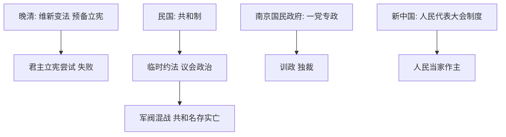

# 第3课 中国近代至当代政治制度的演变

## 核心概念 / 课标要求
- 课标要求：了解中国近代政治制度的探索（君主立宪、共和制）与当代政治制度（人民代表大会制度）的确立，理解中国政治制度的历史选择。
- 时空坐标：晚清（维新变法、预备立宪）→ 民国（共和制、军阀混战）→ 新中国（人民代表大会制度）。

## 知识梳理

| 时期 | 政治制度 | 特点 |
|------|---------|------|
| 晚清 | 维新变法、预备立宪 | 君主立宪尝试，失败 |
| 民国初年 | 共和制 | 临时约法、议会政治 |
| 北洋军阀 | 军阀割据 | 共和名存实亡 |
| 南京国民政府 | 一党专政 | 训政、独裁 |
| 新中国 | 人民代表大会制度 | 人民当家作主 |

## 重点探究
1. **近代政治制度的探索**：从维新变法的君主立宪尝试，到辛亥革命建立共和制，再到南京国民政府的独裁，中国近代政治制度经历了曲折的探索，最终证明资产阶级共和道路在中国行不通。
2. **人民代表大会制度的确立**：新中国成立后，1954年宪法确立人民代表大会制度，这是我国的根本政治制度，体现人民当家作主。
3. **历史选择**：中国政治制度的发展表明，只有坚持中国共产党的领导，坚持社会主义制度，才能实现国家富强与人民幸福。

## 易错点
- 维新变法是"君主立宪"尝试，辛亥革命是"共和制"，勿混淆。
- 临时约法是民国初年颁布，勿误为晚清。
- 人民代表大会制度是"根本政治制度"，勿误为基本政治制度。
- 南京国民政府是"一党专政"，勿误为民主政治。

## 背记要点
1. 维新变法尝试君主立宪，最终失败。
2. 辛亥革命建立共和制，颁布临时约法。
3. 北洋军阀时期共和名存实亡。
4. 1954年宪法确立人民代表大会制度。
5. 人民代表大会制度是根本政治制度。
6. 中国政治制度的历史选择是社会主义道路。

## 自测题
1. 中国近代政治制度经历了哪些探索？
2. 临时约法的意义是什么？
3. 人民代表大会制度为何是根本政治制度？
4. 南京国民政府实行怎样的政治制度？
5. 中国政治制度的历史选择说明了什么？

## 相关知识点
- 关联第1课"中国古代政治制度的形成与发展"。
- 与第4课"中国历代变法和改革"相衔接。
- 为理解当代中国政治制度奠定基础。
