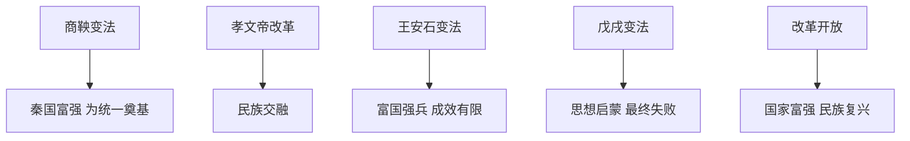

# 第4课 中国历代变法和改革

## 核心概念 / 课标要求
- 课标要求：了解中国历代变法和改革的背景、内容与影响，理解改革是推动社会进步的重要动力。
- 时空坐标：春秋战国（商鞅变法）→ 北魏（孝文帝改革）→ 北宋（王安石变法）→ 晚清（戊戌变法）→ 当代（改革开放）。

## 知识梳理

| 改革 | 时期 | 主要内容 | 影响 |
|------|------|---------|------|
| 商鞅变法 | 战国 | 废井田、奖励耕战、郡县制 | 秦国富强，为统一奠基 |
| 孝文帝改革 | 北魏 | 汉化政策、均田制 | 促进民族交融 |
| 王安石变法 | 北宋 | 富国强兵、青苗法 | 缓解危机，成效有限 |
| 戊戌变法 | 晚清 | 政治、经济、文教改革 | 思想启蒙，最终失败 |
| 改革开放 | 当代 | 经济体制改革、对外开放 | 国家富强、民族复兴 |

## 重点探究
1. **商鞅变法**：废井田、开阡陌，奖励耕战，推行县制，使秦国富强，为秦统一六国奠定基础，是战国时期最彻底的改革。
2. **孝文帝改革**：推行汉化政策（改汉姓、说汉语、通婚）、实行均田制，促进北方民族交融，推动北魏封建化。
3. **改革开放**：1978年十一届三中全会开启改革开放，建立社会主义市场经济体制，推动中国经济腾飞，是实现中华民族伟大复兴的关键。

## 易错点
- 商鞅变法使秦国富强，勿误为其他诸侯国。
- 孝文帝改革是"汉化"，促进民族交融，勿误为削弱汉文化。
- 王安石变法"富国强兵"，但成效有限，勿夸大。
- 戊戌变法失败，但起思想启蒙作用，勿误为成功。

## 背记要点
1. 商鞅变法使秦国富强，为统一奠基。
2. 孝文帝改革促进民族交融。
3. 王安石变法富国强兵，成效有限。
4. 戊戌变法起思想启蒙作用，最终失败。
5. 1978年开启改革开放。
6. 改革是推动社会进步的重要动力。

## 自测题
1. 商鞅变法的主要内容与影响是什么？
2. 孝文帝改革如何促进民族交融？
3. 王安石变法为何成效有限？
4. 戊戌变法有何历史意义？
5. 改革开放的历史意义是什么？

## 相关知识点
- 关联第1课、第3课"政治制度的演变"。
- 与第3课"中国近代至当代政治制度的演变"相衔接。
- 为理解改革与社会进步的关系奠定基础。
