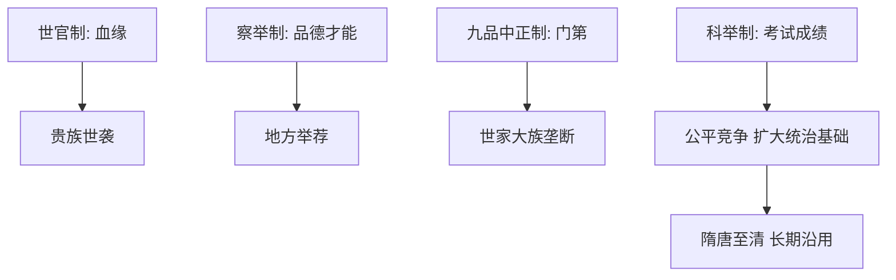

# 第5课 中国古代官员的选拔与管理

## 核心概念 / 课标要求
- 课标要求：了解中国古代官员选拔制度（世官制、察举制、九品中正制、科举制）的演变，理解官员管理制度。
- 时空坐标：先秦（世官制）→ 汉（察举制）→ 魏晋（九品中正制）→ 隋唐至清（科举制）。

## 知识梳理

| 制度 | 时期 | 选拔标准 | 特点 |
|------|------|---------|------|
| 世官制 | 先秦 | 血缘 | 贵族世袭 |
| 察举制 | 汉朝 | 品德、才能 | 地方举荐 |
| 九品中正制 | 魏晋南北朝 | 门第 | 世家大族垄断 |
| 科举制 | 隋唐至清 | 考试成绩 | 公平竞争、扩大统治基础 |

## 重点探究
1. **科举制的确立与意义**：隋朝创立科举制，以考试成绩选拔官员，打破世家大族对仕途的垄断，扩大统治基础，提高官员素质，是古代最公平的选官制度。
2. **选官制度的演变趋势**：从世官制（血缘）到察举制（品德）到九品中正制（门第）再到科举制（成绩），选拔标准由血缘门第转向才能，体现社会进步。
3. **官员管理制度**：古代通过考核（考课）、监察（御史台）等制度管理官员，保障官僚体系的正常运转。

## 易错点
- 科举制创立于隋朝，勿误为唐朝。
- 九品中正制以"门第"为标准，勿误为才能。
- 察举制以"品德才能"为标准，勿误为考试成绩。
- 科举制扩大统治基础，勿误为只利于贵族。

## 背记要点
1. 世官制以血缘为标准，贵族世袭。
2. 察举制以品德才能为标准，地方举荐。
3. 九品中正制以门第为标准，世家垄断。
4. 科举制创立于隋朝，以考试成绩选拔。
5. 科举制扩大统治基础，提高官员素质。
6. 选官标准由血缘门第转向才能。

## 自测题
1. 中国古代选官制度经历了怎样的演变？
2. 科举制有何历史意义？
3. 九品中正制为何被科举制取代？
4. 察举制与科举制有何不同？
5. 古代如何管理官员？

## 相关知识点
- 关联第7课"近代以来中国的官员选拔与管理"。
- 与第6课"西方的文官制度"相衔接。
- 为理解官员选拔制度奠定基础。
