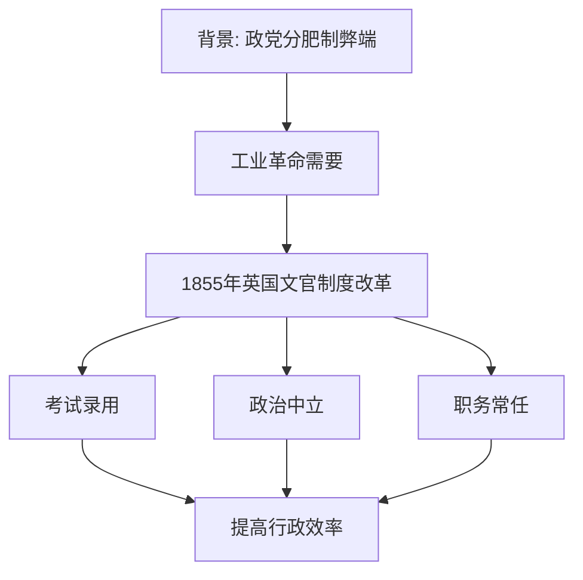

# 第6课 西方的文官制度

## 核心概念 / 课标要求
- 课标要求：了解西方文官制度的建立背景、内容与特点，理解文官制度对西方政治的影响。
- 时空坐标：19世纪英国文官制度改革 → 美国等国的文官制度 → 现代文官制度。

## 知识梳理

| 内容 | 要点 |
|------|------|
| 背景 | 政党分肥制弊端、工业革命需要 |
| 确立 | 1855年英国文官制度改革 |
| 原则 | 考试录用、政治中立、职务常任 |
| 特点 | 公开考试、择优录用、终身任职 |
| 影响 | 提高行政效率、稳定政局 |

## 重点探究
1. **文官制度建立的背景**：19世纪英国政党分肥制导致官员腐败、政局不稳，工业革命后需要专业高效的行政人员，推动文官制度改革。
2. **文官制度的原则**：文官通过公开考试择优录用，保持政治中立，职务常任，不受政党更替影响，保障行政的连续性与稳定性。
3. **文官制度的影响**：文官制度提高行政效率，稳定政局，促进国家治理现代化，被西方各国广泛采用。

## 易错点
- 文官制度确立于19世纪英国，勿误为美国。
- 文官"政治中立"，不随政党更替，勿误为参与政治。
- 文官通过"考试录用"，勿误为任命制。
- 文官制度提高行政效率，勿误为削弱政府。

## 背记要点
1. 文官制度确立于19世纪英国。
2. 背景是政党分肥制弊端与工业革命需要。
3. 文官通过公开考试择优录用。
4. 文官保持政治中立、职务常任。
5. 文官制度提高行政效率、稳定政局。
6. 文官制度被西方各国广泛采用。

## 自测题
1. 西方文官制度建立的背景是什么？
2. 文官制度有哪些原则？
3. 文官制度有何影响？
4. 文官为何要保持政治中立？
5. 文官制度与政党分肥制有何不同？

## 相关知识点
- 关联第5课"中国古代官员的选拔与管理"。
- 与第7课"近代以来中国的官员选拔与管理"相衔接。
- 为理解现代文官制度奠定基础。
