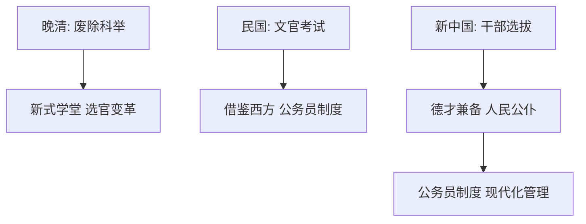

# 第7课 近代以来中国的官员选拔与管理

## 核心概念 / 课标要求
- 课标要求：了解近代以来中国官员选拔制度的变革（科举废除、新式选官、公务员制度），理解官员管理的现代化。
- 时空坐标：晚清（废除科举）→ 民国（新式选官）→ 新中国（公务员制度）。

## 知识梳理

| 时期 | 选官制度 | 特点 |
|------|---------|------|
| 晚清 | 废除科举、新式学堂 | 选官制度变革 |
| 民国 | 文官考试、公务员制度 | 借鉴西方 |
| 新中国 | 干部选拔、公务员制度 | 德才兼备、人民公仆 |

## 重点探究
1. **科举制度的废除**：1905年清政府废除科举，标志着延续千年的科举制度终结，推动新式教育与选官制度的变革。
2. **民国时期的选官制度**：民国借鉴西方，实行文官考试与公务员制度，但受政局动荡影响，实施有限。
3. **新中国公务员制度**：新中国坚持德才兼备原则，选拔人民公仆，1993年颁布《国家公务员暂行条例》，2005年颁布《公务员法》，实现官员管理的现代化、法制化。

## 易错点
- 科举制度于1905年废除，勿误为其他年份。
- 民国文官考试借鉴西方，勿误为延续科举。
- 新中国公务员制度坚持德才兼备，勿误为只重才能。
- 公务员制度实现法制化，勿误为无法律依据。

## 背记要点
1. 1905年清政府废除科举。
2. 民国借鉴西方实行文官考试。
3. 新中国坚持德才兼备选拔干部。
4. 1993年颁布《国家公务员暂行条例》。
5. 2005年颁布《公务员法》。
6. 官员管理实现现代化、法制化。

## 自测题
1. 科举制度何时废除？有何影响？
2. 民国时期的选官制度有何特点？
3. 新中国公务员制度坚持什么原则？
4. 《公务员法》颁布于何时？
5. 近代以来中国选官制度有何变革？

## 相关知识点
- 关联第5课"中国古代官员的选拔与管理"。
- 与第6课"西方的文官制度"相衔接。
- 为理解当代中国官员管理制度奠定基础。
