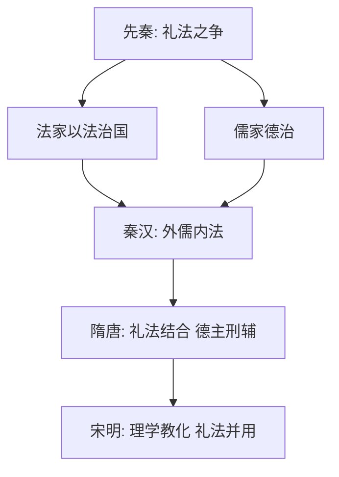

# 第8课 中国古代的法治与教化

## 核心概念 / 课标要求
- 课标要求：了解中国古代法治（礼法结合、德主刑辅）与教化（儒家伦理）的特点，理解礼法并用的治理模式。
- 时空坐标：先秦（礼法之争）→ 秦汉（以法治国）→ 隋唐（礼法结合）→ 宋明（理学教化）。

## 知识梳理

| 时期 | 法治 | 教化 | 特点 |
|------|------|------|------|
| 先秦 | 法家"以法治国" | 儒家"德治" | 礼法之争 |
| 秦汉 | 以法治国 | 儒家思想 | 外儒内法 |
| 隋唐 | 礼法结合 | 儒家伦理 | 德主刑辅 |
| 宋明 | 律令体系 | 理学教化 | 礼法并用 |

## 重点探究
1. **礼法结合的特点**：中国古代法治与教化相结合，以儒家伦理为教化内容，以法律为治理工具，形成"德主刑辅""礼法并用"的治理模式。
2. **外儒内法**：秦汉以来，统治者表面尊崇儒家，实际以法家之术治国，形成"外儒内法"的统治策略。
3. **理学教化**：宋明理学将儒家伦理系统化，通过乡约、族规等教化手段，将伦理规范渗透到基层社会，强化社会控制。

## 易错点
- 中国古代是"礼法结合"，勿误为纯法治或纯德治。
- "外儒内法"指表面尊儒、实际用法，勿误读。
- 理学教化通过乡约、族规渗透基层，勿误为只靠法律。
- 德主刑辅是"以德为主、以刑为辅"，勿颠倒。

## 背记要点
1. 中国古代法治与教化相结合。
2. 礼法并用、德主刑辅是治理特点。
3. 秦汉以来"外儒内法"。
4. 宋明理学通过乡约、族规教化。
5. 儒家伦理是教化的重要内容。
6. 礼法结合强化社会控制。

## 自测题
1. 中国古代法治与教化有何特点？
2. 什么是"外儒内法"？
3. 理学教化如何渗透基层社会？
4. "德主刑辅"的含义是什么？
5. 礼法结合对古代治理有何作用？

## 相关知识点
- 关联第9课"近代西方的法律与教化"。
- 与第10课"当代中国的法治与精神文明建设"相衔接。
- 为理解中国古代国家治理奠定基础。
