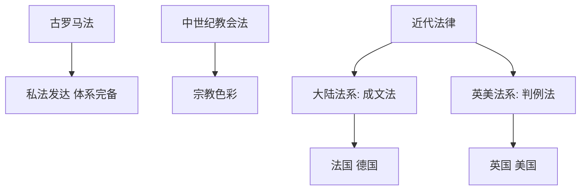

# 第9课 近代西方的法律与教化

## 核心概念 / 课标要求
- 课标要求：了解近代西方法律体系（大陆法系、英美法系）的形成与特点，理解法律与教化在西方社会的作用。
- 时空坐标：古罗马法 → 中世纪教会法 → 近代（大陆法系、英美法系）→ 现代法治。

## 知识梳理

| 法系 | 代表 | 特点 |
|------|------|------|
| 大陆法系 | 法国、德国 | 成文法、法典化 |
| 英美法系 | 英国、美国 | 判例法、遵循先例 |
| 罗马法 | 古罗马 | 私法发达、体系完备 |
| 教会法 | 中世纪 | 宗教色彩 |

## 重点探究
1. **大陆法系与英美法系**：大陆法系以成文法、法典化为特点，代表为法国、德国；英美法系以判例法、遵循先例为特点，代表为英国、美国。
2. **罗马法的影响**：古罗马法私法发达、体系完备，是近代西方法律的重要渊源，对大陆法系影响深远。
3. **法律与教化**：近代西方通过法律规范社会秩序，同时通过宗教、教育等教化手段维护社会道德，法律与教化共同维护社会秩序。

## 易错点
- 大陆法系是"成文法"，英美法系是"判例法"，勿混淆。
- 大陆法系代表是法国、德国，英美法系代表是英国、美国。
- 罗马法是近代西方法律的渊源，勿误为近代法律。
- 教会法有宗教色彩，勿误为世俗法律。

## 背记要点
1. 大陆法系以成文法、法典化为特点。
2. 英美法系以判例法、遵循先例为特点。
3. 大陆法系代表是法国、德国。
4. 英美法系代表是英国、美国。
5. 罗马法是近代西方法律的重要渊源。
6. 法律与教化共同维护社会秩序。

## 自测题
1. 大陆法系与英美法系有何不同？
2. 罗马法对近代西方法律有何影响？
3. 大陆法系的代表国家有哪些？
4. 英美法系的特点是什么？
5. 法律与教化在西方社会有何作用？

## 相关知识点
- 关联第8课"中国古代的法治与教化"。
- 与第10课"当代中国的法治与精神文明建设"相衔接。
- 为理解近代西方法治奠定基础。
