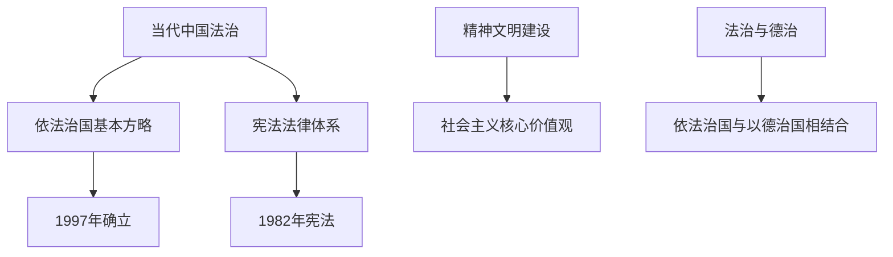

# 第10课 当代中国的法治与精神文明建设

## 核心概念 / 课标要求
- 课标要求：了解当代中国法治建设（依法治国）与精神文明建设（社会主义核心价值观）的成就，理解法治与德治相结合。
- 时空坐标：新中国成立 → 改革开放（法治建设）→ 新时代（全面依法治国）。

## 知识梳理

| 内容 | 要点 |
|------|------|
| 法治建设 | 依法治国、宪法法律体系 |
| 依法治国 | 1997年确立基本方略 |
| 宪法 | 1982年宪法、多次修正 |
| 精神文明 | 社会主义核心价值观 |
| 法治与德治 | 依法治国与以德治国相结合 |

## 重点探究
1. **依法治国基本方略**：1997年党的十五大确立依法治国基本方略，推动中国特色社会主义法治体系建设，实现国家治理的法治化。
2. **宪法法律体系**：1982年宪法是现行宪法，经过多次修正，逐步完善中国特色社会主义法律体系，保障人民权利。
3. **法治与德治相结合**：当代中国坚持依法治国与以德治国相结合，以社会主义核心价值观引领精神文明建设，实现法治与德治的有机统一。

## 易错点
- 依法治国基本方略确立于1997年，勿误为其他年份。
- 现行宪法是1982年宪法，勿误为1949年。
- 依法治国与以德治国相结合，勿误为只靠法治。
- 社会主义核心价值观是精神文明建设的重要内容。

## 背记要点
1. 1997年确立依法治国基本方略。
2. 现行宪法是1982年宪法。
3. 中国特色社会主义法律体系逐步完善。
4. 依法治国与以德治国相结合。
5. 社会主义核心价值观引领精神文明建设。
6. 实现国家治理的法治化。

## 自测题
1. 依法治国基本方略何时确立？
2. 现行宪法是哪一年颁布的？
3. 当代中国如何实现法治与德治相结合？
4. 社会主义核心价值观有何作用？
5. 中国特色社会主义法治体系有何特点？

## 相关知识点
- 关联第8课、第9课"法律与教化"。
- 与第3课"中国近代至当代政治制度的演变"相衔接。
- 为理解当代中国法治建设奠定基础。
