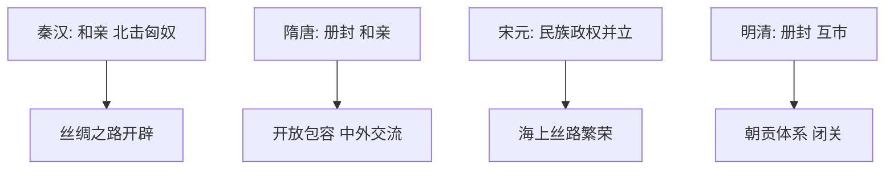

# 第11课 中国古代的民族关系与对外交往

## 核心概念 / 课标要求
- 课标要求：了解中国古代民族关系（和亲、册封、互市）与对外交往（丝绸之路、朝贡体系）的特点，理解民族交融与中外交流。
- 时空坐标：秦汉（匈奴、丝绸之路）→ 隋唐（突厥、开放交流）→ 宋元（民族政权、海上丝路）→ 明清（朝贡体系）。

## 知识梳理

| 时期 | 民族关系 | 对外交往 |
|------|---------|---------|
| 秦汉 | 和亲、北击匈奴 | 丝绸之路开辟 |
| 隋唐 | 册封、和亲 | 开放包容、中外交流 |
| 宋元 | 民族政权并立 | 海上丝绸之路繁荣 |
| 明清 | 册封、互市 | 朝贡体系、闭关 |

## 重点探究
1. **民族交融的方式**：中国古代通过和亲、册封、互市、战争等方式处理民族关系，促进民族交融，如汉匈和亲、唐蕃和亲、明清册封。
2. **丝绸之路与对外交往**：张骞出使西域开辟丝绸之路，促进中外经济文化交流；宋元时期海上丝绸之路繁荣，明清形成朝贡体系。
3. **开放与封闭的演变**：从汉唐的开放包容到明清的闭关锁国，中国古代对外交往由开放走向封闭，影响国家发展。

## 易错点
- 丝绸之路由张骞出使西域开辟，勿误为其他人。
- 唐蕃和亲（文成公主）促进汉藏交融，勿误为汉匈。
- 海上丝绸之路在宋元繁荣，勿误为陆上丝路。
- 明清闭关锁国，勿误为始终开放。

## 背记要点
1. 张骞出使西域开辟丝绸之路。
2. 和亲、册封、互市是处理民族关系的方式。
3. 唐蕃和亲促进汉藏交融。
4. 宋元时期海上丝绸之路繁荣。
5. 明清形成朝贡体系、闭关锁国。
6. 对外交往由开放走向封闭。

## 自测题
1. 中国古代如何处理民族关系？
2. 丝绸之路有何历史意义？
3. 唐蕃和亲有何影响？
4. 明清对外交往有何特点？
5. 中国古代对外交往经历了怎样的演变？

## 相关知识点
- 关联第13课"当代中国的民族政策"。
- 与第14课"当代中国的外交"相衔接。
- 为理解民族关系与对外交往奠定基础。
