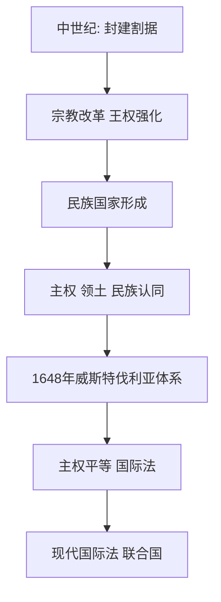

# 第12课 近代西方民族国家与国际法的发展

## 核心概念 / 课标要求
- 课标要求：了解近代西方民族国家的形成与国际法（威斯特伐利亚体系）的发展，理解主权国家与国际秩序。
- 时空坐标：中世纪（封建割据）→ 近代（民族国家形成）→ 威斯特伐利亚体系 → 现代国际法。

## 知识梳理

| 内容 | 要点 |
|------|------|
| 民族国家 | 主权、领土、民族认同 |
| 形成 | 宗教改革、王权强化 |
| 威斯特伐利亚体系 | 1648年，主权平等 |
| 国际法 | 主权国家间规则 |
| 发展 | 从威斯特伐利亚到联合国 |

## 重点探究
1. **民族国家的形成**：宗教改革与王权强化推动近代民族国家形成，民族国家以主权、领土、民族认同为特征，取代封建割据。
2. **威斯特伐利亚体系**：1648年《威斯特伐利亚和约》确立主权平等原则，开创近代国际关系体系，是国际法发展的重要里程碑。
3. **国际法的发展**：从威斯特伐利亚体系到联合国宪章，国际法不断发展，规范主权国家间关系，维护国际秩序。

## 易错点
- 威斯特伐利亚体系确立于1648年，勿误为其他年份。
- 民族国家以主权、领土、民族认同为特征，勿误为封建国家。
- 威斯特伐利亚体系确立主权平等，勿误为霸权。
- 国际法规范主权国家间关系，勿误为国内法。

## 背记要点
1. 宗教改革与王权强化推动民族国家形成。
2. 民族国家以主权、领土、民族认同为特征。
3. 1648年威斯特伐利亚体系确立主权平等。
4. 威斯特伐利亚体系是国际法发展的重要里程碑。
5. 国际法规范主权国家间关系。
6. 从威斯特伐利亚到联合国，国际法不断发展。

## 自测题
1. 近代民族国家是如何形成的？
2. 威斯特伐利亚体系有何意义？
3. 民族国家有哪些特征？
4. 国际法如何发展？
5. 主权平等原则有何作用？

## 相关知识点
- 关联第14课"当代中国的外交"。
- 与第2课"西方国家政治制度的演变"相衔接。
- 为理解国际关系与国际法奠定基础。
