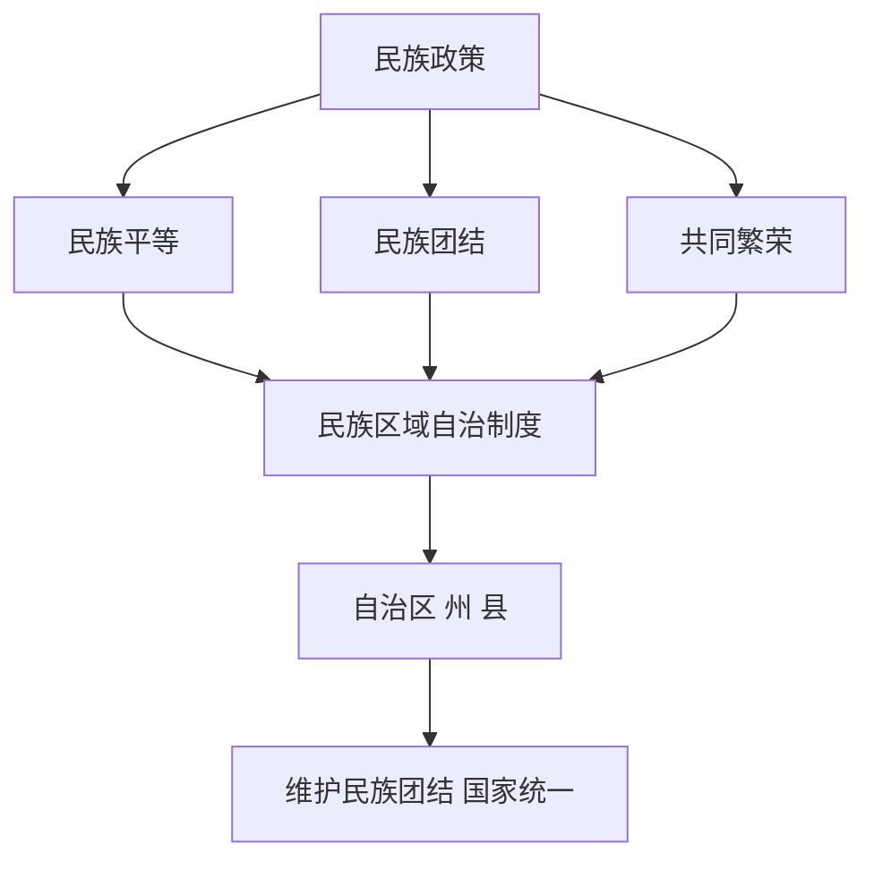

# 第13课 当代中国的民族政策

## 核心概念 / 课标要求
- 课标要求：了解当代中国的民族政策（民族区域自治制度）的内容与意义，理解民族平等、团结、共同繁荣。
- 时空坐标：新中国成立 → 民族区域自治制度确立 → 新时代民族工作。

## 知识梳理

| 内容 | 要点 |
|------|------|
| 基本原则 | 民族平等、团结、共同繁荣 |
| 民族区域自治 | 基本政治制度 |
| 自治机关 | 自治区、州、县 |
| 民族政策 | 尊重民族风俗、语言文字 |
| 意义 | 维护民族团结、国家统一 |

## 重点探究
1. **民族区域自治制度**：民族区域自治制度是我国的基本政治制度，在少数民族聚居地区设立自治区、自治州、自治县，由少数民族行使自治权。
2. **民族政策的基本原则**：坚持民族平等、民族团结、各民族共同繁荣，尊重少数民族的风俗习惯与语言文字，促进民族交融。
3. **民族政策的意义**：民族区域自治制度保障少数民族当家作主，维护民族团结与国家统一，促进各民族共同发展。

## 易错点
- 民族区域自治制度是"基本政治制度"，勿误为根本政治制度。
- 自治机关是自治区、州、县，勿误为乡。
- 民族区域自治是"区域自治"，勿误为民族自治。
- 民族政策坚持民族平等，勿误为民族特殊。

## 背记要点
1. 民族区域自治制度是基本政治制度。
2. 自治机关是自治区、州、县。
3. 坚持民族平等、团结、共同繁荣。
4. 尊重少数民族风俗与语言文字。
5. 民族区域自治保障少数民族当家作主。
6. 维护民族团结与国家统一。

## 自测题
1. 民族区域自治制度的内容是什么？
2. 民族政策的基本原则有哪些？
3. 民族区域自治制度有何意义？
4. 自治机关包括哪些？
5. 如何促进各民族共同繁荣？

## 相关知识点
- 关联第11课"中国古代的民族关系与对外交往"。
- 与第14课"当代中国的外交"相衔接。
- 为理解当代中国民族工作奠定基础。
