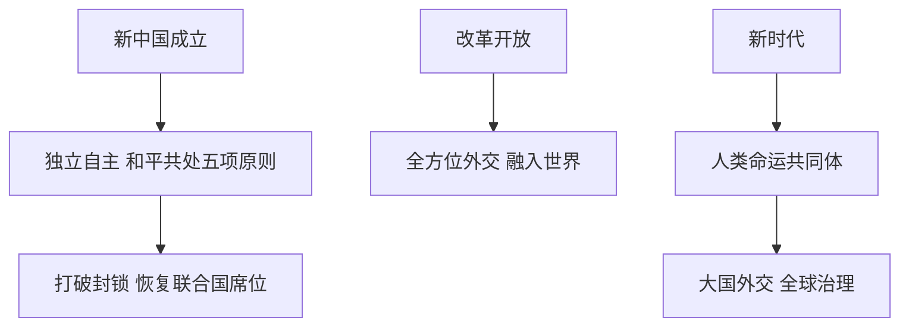

# 第14课 当代中国的外交

## 核心概念 / 课标要求
- 课标要求：了解当代中国外交政策（独立自主、和平共处五项原则）的演变，理解中国外交的成就与贡献。
- 时空坐标：新中国成立（独立自主）→ 改革开放（全方位外交）→ 新时代（人类命运共同体）。

## 知识梳理

| 时期 | 外交政策 | 特点 |
|------|---------|------|
| 新中国成立 | 独立自主、和平共处五项原则 | 打破封锁 |
| 改革开放 | 全方位外交 | 融入世界 |
| 新时代 | 人类命运共同体 | 大国外交 |

## 重点探究
1. **独立自主的和平外交**：新中国成立后坚持独立自主的和平外交政策，提出和平共处五项原则，打破西方封锁，恢复联合国合法席位。
2. **全方位外交**：改革开放后，中国开展全方位外交，融入世界，参与全球治理，推动构建人类命运共同体。
3. **中国外交的贡献**：中国坚持和平发展道路，倡导合作共赢，为世界和平与发展作出重要贡献，展现负责任大国形象。

## 易错点
- 和平共处五项原则由新中国提出，勿误为其他国家。
- 中国恢复联合国合法席位是1971年，勿误为其他年份。
- 独立自主是外交政策的核心，勿误为依附他国。
- 人类命运共同体是新时代外交理念，勿误为旧理念。

## 背记要点
1. 新中国坚持独立自主的和平外交政策。
2. 提出和平共处五项原则。
3. 1971年恢复联合国合法席位。
4. 改革开放后开展全方位外交。
5. 新时代倡导构建人类命运共同体。
6. 中国为世界和平与发展作出贡献。

## 自测题
1. 新中国外交政策的核心是什么？
2. 和平共处五项原则有何意义？
3. 中国何时恢复联合国合法席位？
4. 改革开放后中国外交有何变化？
5. 人类命运共同体理念有何意义？

## 相关知识点
- 关联第12课"近代西方民族国家与国际法的发展"。
- 与第13课"当代中国的民族政策"相衔接。
- 为理解当代中国外交奠定基础。
