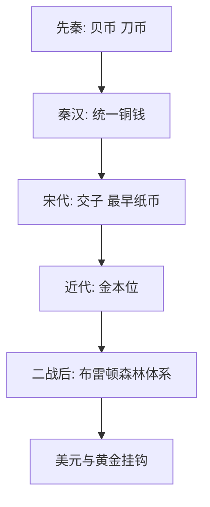

# 第15课 货币的使用与世界货币体系的形成

## 核心概念 / 课标要求
- 课标要求：了解中国货币的演变与世界货币体系（金本位、布雷顿森林体系）的形成，理解货币与经济发展的关系。
- 时空坐标：先秦（贝币）→ 秦汉（铜钱）→ 宋（纸币）→ 近代（金本位）→ 二战后（布雷顿森林体系）。

## 知识梳理

| 时期 | 货币 | 特点 |
|------|------|------|
| 先秦 | 贝币、刀币 | 多种货币 |
| 秦汉 | 铜钱（半两、五铢） | 统一货币 |
| 宋代 | 交子 | 最早纸币 |
| 近代 | 金本位 | 国际货币体系 |
| 二战后 | 布雷顿森林体系 | 美元与黄金挂钩 |

## 重点探究
1. **中国货币的演变**：从先秦的贝币、刀币，到秦汉统一铜钱，再到宋代出现世界上最早的纸币"交子"，中国货币不断发展，反映商品经济的繁荣。
2. **金本位与布雷顿森林体系**：近代西方实行金本位制，二战后建立布雷顿森林体系，美元与黄金挂钩，确立美元的国际货币地位。
3. **货币与经济发展**：货币的演变反映经济发展水平，统一货币促进经济交流，国际货币体系影响世界经济格局。

## 易错点
- 交子是宋代出现的世界上最早的纸币，勿误为其他朝代。
- 布雷顿森林体系确立于二战后，勿误为战前。
- 布雷顿森林体系是"美元与黄金挂钩"，勿误为英镑。
- 金本位是近代国际货币体系，勿误为古代。

## 背记要点
1. 秦汉统一铜钱（半两、五铢）。
2. 宋代出现世界上最早的纸币"交子"。
3. 近代西方实行金本位制。
4. 二战后建立布雷顿森林体系。
5. 布雷顿森林体系是美元与黄金挂钩。
6. 货币演变反映经济发展。

## 自测题
1. 中国货币经历了怎样的演变？
2. 交子有何历史意义？
3. 布雷顿森林体系的内容是什么？
4. 金本位制有何特点？
5. 货币与经济发展有何关系？

## 相关知识点
- 关联第16课"中国赋税制度的演变"。
- 与第18课"世界主要国家的基层治理与社会保障"相衔接。
- 为理解货币与世界经济奠定基础。
