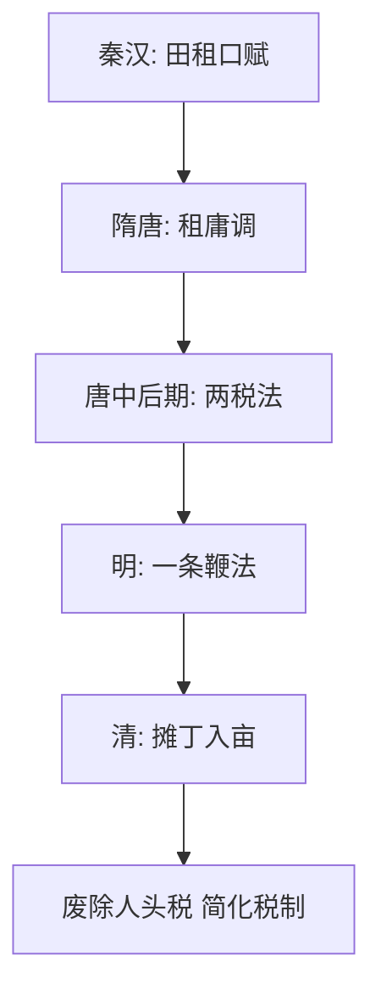

# 第16课 中国赋税制度的演变

## 核心概念 / 课标要求
- 课标要求：了解中国赋税制度（租庸调、两税法、一条鞭法、摊丁入亩）的演变，理解赋税制度与经济发展的关系。
- 时空坐标：秦汉（田租口赋）→ 隋唐（租庸调、两税法）→ 明清（一条鞭法、摊丁入亩）。

## 知识梳理

| 制度 | 时期 | 内容 | 特点 |
|------|------|------|------|
| 租庸调 | 隋唐 | 田租、户调、力役 | 以人丁为主 |
| 两税法 | 唐中后期 | 按资产征税 | 以资产为主 |
| 一条鞭法 | 明 | 赋役合并、折银 | 简化税制 |
| 摊丁入亩 | 清 | 丁银并入田赋 | 废除人头税 |

## 重点探究
1. **两税法**：唐中后期实行两税法，按资产征税，改变以人丁为主的征税标准，减轻农民负担，是赋税制度的重要变革。
2. **一条鞭法**：明朝实行一条鞭法，将赋役合并、折银征收，简化税制，促进商品经济发展。
3. **摊丁入亩**：清朝实行摊丁入亩，将丁银并入田赋，废除人头税，减轻无地农民负担，促进人口增长与经济发展。

## 易错点
- 两税法按"资产"征税，勿误为按人丁。
- 一条鞭法是明朝实行，勿误为清朝。
- 摊丁入亩废除"人头税"，勿误为废除田赋。
- 租庸调以人丁为主，两税法以资产为主，勿混淆。

## 背记要点
1. 租庸调以人丁为主，隋唐实行。
2. 两税法按资产征税，唐中后期实行。
3. 一条鞭法赋役合并、折银，明朝实行。
4. 摊丁入亩废除人头税，清朝实行。
5. 赋税制度由以人丁为主转向以资产为主。
6. 摊丁入亩促进人口增长与经济发展。

## 自测题
1. 两税法有何特点？
2. 一条鞭法有何历史意义？
3. 摊丁入亩如何废除人头税？
4. 中国赋税制度经历了怎样的演变？
5. 赋税制度与经济发展有何关系？

## 相关知识点
- 关联第15课"货币的使用与世界货币体系的形成"。
- 与第17课"中国古代的户籍制度与社会治理"相衔接。
- 为理解中国古代经济制度奠定基础。
