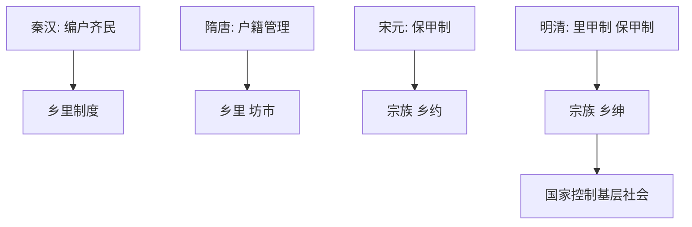

# 第17课 中国古代的户籍制度与社会治理

## 核心概念 / 课标要求
- 课标要求：了解中国古代户籍制度（编户齐民、保甲制）与社会治理（乡里制度、宗族）的特点，理解国家对基层的控制。
- 时空坐标：秦汉（编户齐民）→ 隋唐（户籍管理）→ 宋元（保甲制）→ 明清（里甲制、保甲制）。

## 知识梳理

| 时期 | 户籍制度 | 社会治理 |
|------|---------|---------|
| 秦汉 | 编户齐民 | 乡里制度 |
| 隋唐 | 户籍管理 | 乡里、坊市 |
| 宋元 | 保甲制 | 宗族、乡约 |
| 明清 | 里甲制、保甲制 | 宗族、乡绅 |

## 重点探究
1. **户籍制度的作用**：中国古代通过编户齐民、保甲制等户籍制度，掌握人口、征收赋税、征发徭役，加强对基层社会的控制。
2. **社会治理的方式**：古代通过乡里制度、宗族、乡约、乡绅等治理基层社会，形成"皇权不下县"的治理模式，宗族与乡绅发挥重要作用。
3. **国家与基层的关系**：户籍制度与社会治理相结合，国家通过户籍掌握人口，通过宗族、乡约教化民众，实现国家对基层的有效控制。

## 易错点
- 编户齐民是秦汉户籍制度，勿误为其他朝代。
- 保甲制是宋元明清的基层制度，勿误为秦汉。
- 古代"皇权不下县"，基层靠宗族、乡绅治理，勿误为皇权直达。
- 户籍制度用于征收赋税、征发徭役，勿误为只登记人口。

## 背记要点
1. 秦汉实行编户齐民。
2. 宋元明清实行保甲制、里甲制。
3. 户籍制度用于征收赋税、征发徭役。
4. 古代基层靠宗族、乡约、乡绅治理。
5. "皇权不下县"是古代基层治理特点。
6. 户籍制度与社会治理结合，控制基层。

## 自测题
1. 中国古代户籍制度有何作用？
2. 保甲制的内容是什么？
3. 古代基层社会如何治理？
4. "皇权不下县"是什么意思？
5. 户籍制度与社会治理有何关系？

## 相关知识点
- 关联第16课"中国赋税制度的演变"。
- 与第18课"世界主要国家的基层治理与社会保障"相衔接。
- 为理解中国古代基层治理奠定基础。
