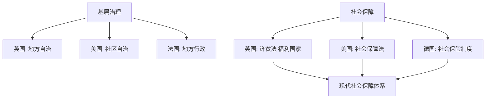

# 第18课 世界主要国家的基层治理与社会保障

## 核心概念 / 课标要求
- 课标要求：了解世界主要国家（英国、美国、法国等）的基层治理与社会保障制度，理解现代社会保障体系的建立。
- 时空坐标：近代（基层自治）→ 19世纪（社会保障萌芽）→ 二战后（福利国家）→ 现代（社会保障体系）。

## 知识梳理

| 国家 | 基层治理 | 社会保障 |
|------|---------|---------|
| 英国 | 地方自治 | 济贫法、福利国家 |
| 美国 | 社区自治 | 社会保障法 |
| 法国 | 地方行政 | 社会保障制度 |
| 德国 | 地方自治 | 社会保险制度 |

## 重点探究
1. **基层治理模式**：世界主要国家实行地方自治、社区自治等基层治理模式，如英国的地方自治、美国的社区自治，保障基层社会的自我管理。
2. **社会保障制度的建立**：从英国的济贫法、德国的社会保险制度，到美国的《社会保障法》，再到二战后福利国家的建立，现代社会保障体系逐步形成。
3. **社会保障的意义**：社会保障制度保障公民基本生活，缓解社会矛盾，促进社会公平，是现代国家治理的重要内容。

## 易错点
- 德国最早建立社会保险制度，勿误为英国。
- 美国《社会保障法》颁布于1935年，勿误为其他年份。
- 福利国家是二战后建立，勿误为战前。
- 基层治理是地方自治、社区自治，勿误为中央集权。

## 背记要点
1. 英国实行地方自治。
2. 美国实行社区自治。
3. 德国最早建立社会保险制度。
4. 美国1935年颁布《社会保障法》。
5. 二战后建立福利国家。
6. 社会保障保障公民基本生活、促进社会公平。

## 自测题
1. 世界主要国家的基层治理有何特点？
2. 社会保障制度是如何建立的？
3. 德国社会保险制度有何意义？
4. 福利国家是何时建立的？
5. 社会保障制度有何作用？

## 相关知识点
- 关联第17课"中国古代的户籍制度与社会治理"。
- 与第15课"货币的使用与世界货币体系的形成"相衔接。
- 为理解现代社会保障体系奠定基础。
