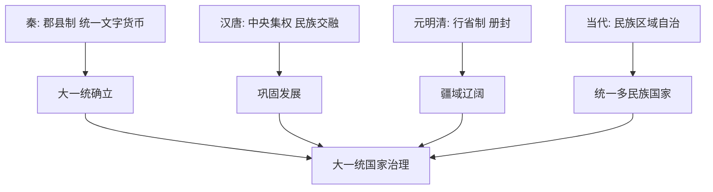

# 活动课 中国历史上的大一统国家治理

## 核心概念 / 课标要求
- 课标要求：综合运用所学知识，探究中国历史上大一统国家治理的智慧与经验，理解统一多民族国家的发展。
- 时空坐标：秦（大一统确立）→ 汉唐（巩固发展）→ 元明清（疆域辽阔）→ 当代（统一多民族国家）。

## 知识梳理

| 时期 | 治理措施 | 特点 |
|------|---------|------|
| 秦朝 | 郡县制、统一文字货币 | 大一统确立 |
| 汉唐 | 中央集权、民族交融 | 巩固发展 |
| 元明清 | 行省制、册封 | 疆域辽阔 |
| 当代 | 民族区域自治 | 统一多民族国家 |

## 重点探究
1. **大一统的确立**：秦朝通过郡县制、统一文字货币度量衡，确立大一统国家治理模式，为后世奠定基础。
2. **大一统的巩固**：汉唐通过中央集权、民族交融、开疆拓土，巩固和发展大一统国家；元明清通过行省制、册封等，维护辽阔疆域。
3. **大一统的当代发展**：当代中国坚持民族区域自治，维护国家统一与民族团结，实现统一多民族国家的繁荣发展，体现大一统治理的延续与创新。

## 易错点
- 大一统确立于秦朝，勿误为其他朝代。
- 行省制是元朝地方制度，勿误为中央官制。
- 大一统包括政治、经济、文化统一，勿只理解为疆域。
- 当代大一统体现为统一多民族国家，勿误为古代模式。

## 背记要点
1. 秦朝通过郡县制确立大一统。
2. 秦朝统一文字、货币、度量衡。
3. 汉唐通过中央集权、民族交融巩固大一统。
4. 元明清通过行省制、册封维护疆域。
5. 当代坚持民族区域自治，维护国家统一。
6. 大一统治理体现统一多民族国家的发展。

## 自测题
1. 秦朝如何确立大一统？
2. 汉唐如何巩固大一统？
3. 元明清如何维护辽阔疆域？
4. 当代如何实现统一多民族国家治理？
5. 大一统国家治理有何历史智慧？

## 相关知识点
- 综合关联第1课至第17课内容。
- 与第13课"当代中国的民族政策"相衔接。
- 为理解统一多民族国家治理奠定基础。
