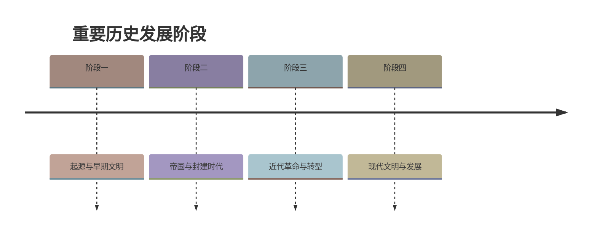

# 第1课 远古时期的人类活动

标签：#史前时期 #元谋人 #北京人 #山顶洞人

## 一、本知识点定位

统编版中国历史七年级上册 **第一单元 史前时期 · 第1课**。本课学习我国境内的远古人类：元谋人、郧县人、蓝田人、北京人、山顶洞人，重点掌握北京人的生产生活状况。

## 二、时间与人物

| 古人类 | 距今时间 | 发现地点 | 地位 |
|---|---|---|---|
| 元谋人 | 约170万年 | 云南元谋 | 我国境内目前已知最早的古人类之一 |
| 蓝田人 | 约160万年 | 陕西蓝田 | 早期直立人代表 |
| 郧县人 | 约100万年 | 湖北郧阳 | 发现较完整的古人类头骨化石 |
| 北京人 | 约70万—20万年 | 北京周口店龙骨山 | 世界上最重要的原始人类遗址之一 |
| 山顶洞人 | 约3万年 | 北京周口店龙骨山顶部 | 已具有现代人特征 |

## 三、知识梳理

### 1. 我国境内的早期人类

- 我国是世界上发现古人类遗址**最多**的国家之一，遗址遍布南北。
- 元谋人遗址出土了古人类的牙齿化石以及粗糙的石器，表明他们已经能够**制作和使用工具**。
- **化石**是研究远古人类历史的重要证据。

### 2. 北京人（重点）

- **发现**：1929年，我国学者裴文中发现第一个北京人头盖骨化石。
- **体貌特征**：前额低平、眉骨粗大、嘴部前伸，能直立行走，上肢与现代人相似。
- **生产工具**：使用**打制石器**（旧石器时代），制作砍砸器、刮削器等不同类型的工具。
- **用火**：北京人已经学会使用**天然火**，还会保存火种。用火烧烤食物、驱兽、御寒、照明，改善了生存条件。**学会用火是人类进化史上的里程碑**。
- **生活方式**：环境险恶，工具简陋，北京人往往**几十个人结成群体**生活在一起，共同劳动、分享食物。

### 3. 山顶洞人

- 距今约3万年，模样和现代人基本相同。
- 依然使用打制石器，但已掌握**磨光和钻孔技术**，会用骨针缝制衣物、制作装饰品，有爱美意识。
- 可能已经知道**人工取火**。
- 靠采集、狩猎为生，还会捕鱼；有埋葬死者的行为。

## 四、重要概念

| 术语 | 定义 |
|---|---|
| 直立行走 | 人类进化的重要标志之一 |
| 打制石器 | 用石块敲打而成的粗糙石器，旧石器时代的主要工具 |
| 天然火 | 雷电、火山等自然原因产生的火，北京人会使用和保存 |
| 群居 | 原始人类为对抗险恶环境而结成群体共同生活的方式 |

## 五、易混辨析

| 对比项 | 北京人 | 山顶洞人 |
|---|---|---|
| 距今时间 | 约70万—20万年 | 约3万年 |
| 体貌 | 保留猿的特征 | 和现代人基本相同 |
| 工具技术 | 打制石器 | 打制石器，掌握磨光、钻孔技术 |
| 用火 | 使用天然火、保存火种 | 可能已会人工取火 |
| 精神生活 | —— | 佩戴装饰品，埋葬死者 |

## 六、背记要点

1. 元谋人：约170万年前，云南元谋，我国境内目前已知最早的古人类之一。
2. 北京人：约70万—20万年前，北京周口店龙骨山。
3. 1929年裴文中发现第一个北京人头盖骨化石。
4. 北京人使用打制石器，会使用天然火并保存火种。
5. 学会用火是人类进化史上的里程碑。
6. 山顶洞人：约3万年前，掌握磨光和钻孔技术，可能会人工取火。
7. 化石是研究远古人类历史的重要证据。

## 七、自测小题

1. 我国境内目前已知最早的古人类之一是______，发现于______省。
2. 北京人遗址位于北京______龙骨山。
3. 北京人使用的石器属于（A. 磨制石器 B. 打制石器 C. 青铜器）。
4. 北京人过群居生活的主要原因是（A. 喜欢热闹 B. 环境险恶、工具简陋 C. 便于分配食物）。
5. 已掌握磨光和钻孔技术的古人类是______人。
6. 1929年发现第一个北京人头盖骨化石的学者是______。
7. 判断：北京人已经会人工取火。（对/错）

**答案**：1. 元谋人；云南 2. 周口店 3. B 4. B 5. 山顶洞 6. 裴文中 7. 错（使用天然火；山顶洞人可能会人工取火）

相关：[[原始社会与中华文明的起源]] ｜ [[第2课 原始农业与史前社会]]

### 历史时间轴

