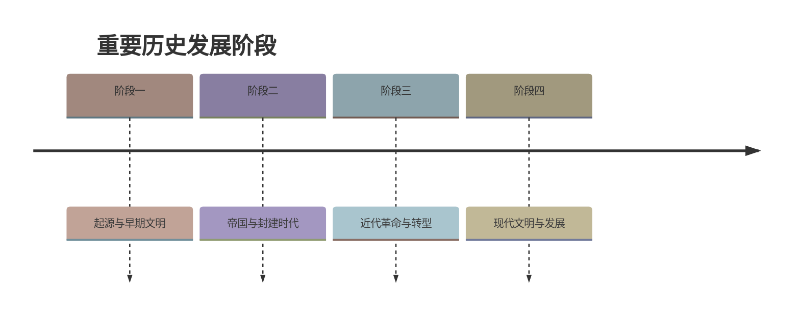

# 第2课 原始农业与史前社会

标签：#史前时期 #原始农业 #河姆渡 #半坡

## 一、本知识点定位

统编版中国历史七年级上册 **第一单元 史前时期 · 第2课**。本课学习原始农业的兴起以及河姆渡、半坡等农耕聚落，理解农业起源对人类社会的深远影响。

## 二、时间与代表遗址

| 遗址/居民 | 距今时间 | 地点（流域） | 主要成就 |
|---|---|---|---|
| 玉蟾岩遗址 | 约1万多年 | 湖南道县 | 出土早期栽培稻遗存 |
| 贾湖遗址 | 约9000—7500年 | 河南舞阳（淮河流域） | 骨笛、契刻符号、栽培粟和稻 |
| 河姆渡遗址 | 约7000年 | 浙江余姚（长江流域） | 种植水稻、干栏式建筑 |
| 半坡遗址 | 约6000年 | 陕西西安（黄河流域） | 种植粟、半地穴式房屋、彩陶 |

## 三、知识梳理

### 1. 原始农业的兴起（约1万年前）

- 我国是世界上农业起源地之一：**长江中下游先民开始栽培稻，北方地区先民开始栽培粟和黍**。
- 我国是世界上最早栽培**水稻、粟、黍**的国家。
- 原始农业兴起的标志：**农作物种植、家畜饲养、聚落、磨制石器**的出现。
- 意义：原始农业为古代文明社会的形成奠定了重要基础；人类从食物的**采集者**变为食物的**生产者**，开始定居生活。

### 2. 河姆渡人（长江流域代表）

- 距今约7000年，浙江余姚河姆渡。
- 住**干栏式建筑**（防潮、通风，适应南方湿热气候），是中国最早的木结构建筑之一；会挖掘水井。
- 种植**水稻**，农业工具以**骨耜**最为典型。
- 饲养猪、狗为主；会制作陶器、玉器和简单乐器骨哨，出土中国最早的象牙雕刻之一。

### 3. 半坡人（黄河流域代表）

- 距今约6000年，陕西西安半坡村。
- 住**半地穴式圆形房屋**（保暖，适应北方干冷气候）。
- 种植**粟**，使用磨制石器；饲养猪、狗；用弓箭渔猎。
- 会制作**彩陶**（代表：人面鱼纹彩陶盆），会纺织、制衣。

### 4. 从聚落到氏族社会

- 农业发展使人们定居下来，形成**聚落**。
- 史前社会经历了以血缘关系结成的**氏族**阶段；大汶口文化晚期，随着生产力发展，出现了**贫富分化**。

## 四、重要概念

| 术语 | 定义 |
|---|---|
| 原始农业 | 人类通过栽培作物、饲养家畜获取食物的早期生产方式 |
| 磨制石器 | 磨光加工的石器，新石器时代的标志性工具 |
| 干栏式建筑 | 下部架空的木结构房屋，防潮通风，流行于南方 |
| 半地穴式房屋 | 一半挖入地下的房屋，保暖防寒，流行于北方 |
| 聚落 | 人类定居后形成的村落 |

## 五、易混辨析

| 对比项 | 河姆渡人 | 半坡人 |
|---|---|---|
| 距今时间 | 约7000年 | 约6000年 |
| 流域 | 长江流域 | 黄河流域 |
| 农作物 | 水稻 | 粟 |
| 房屋 | 干栏式建筑 | 半地穴式圆形房屋 |
| 典型器物 | 骨耜、象牙雕刻 | 人面鱼纹彩陶盆 |

房屋差异的根本原因：**自然环境（气候）不同**——南方湿热要防潮，北方干冷要保暖。

## 六、背记要点

1. 约1万年前，我国进入新石器时代，原始农业兴起。
2. 我国是世界上最早栽培水稻、粟、黍的国家。
3. 原始农业兴起标志：农作物种植、家畜饲养、聚落、磨制石器。
4. 河姆渡人：约7000年前，长江流域，种水稻，住干栏式建筑，用骨耜。
5. 半坡人：约6000年前，黄河流域，种粟，住半地穴式房屋，制彩陶。
6. 农业起源使人类从食物采集者变为食物生产者。
7. 大汶口文化晚期出现贫富分化。

## 七、自测小题

1. 我国最早栽培的三种农作物是水稻、______和______。
2. 河姆渡人生活在______流域，种植______。
3. 半坡人居住的房屋样式是（A. 干栏式建筑 B. 半地穴式圆形房屋 C. 窑洞）。
4. 河姆渡人最典型的农业工具是（A. 骨耜 B. 铁犁 C. 曲辕犁）。
5. 人面鱼纹彩陶盆出土于______遗址。
6. 原始农业兴起的重要标志包括农作物种植、家畜饲养、______和______的出现。
7. 判断：河姆渡人和半坡人房屋不同主要是因为审美不同。（对/错）

**答案**：1. 粟；黍 2. 长江；水稻 3. B 4. A 5. 半坡 6. 聚落；磨制石器 7. 错（自然环境不同）

相关：[[第1课 远古时期的人类活动]] ｜ [[第3课 中华文明的起源]]

### 历史时间轴

