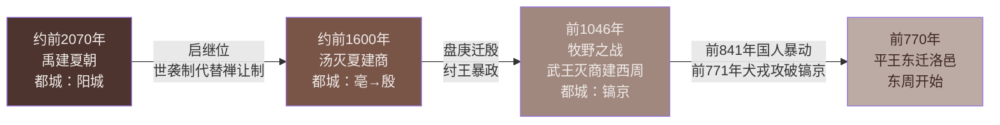

# 第4课 夏商西周王朝的更替

标签：#夏商周时期 #世袭制 #分封制 #王朝更替

## 一、本知识点定位

统编版中国历史七年级上册 **第二单元 夏商周时期 · 第4课**。本课学习夏、商、西周三个王朝的建立与更替，重点掌握世袭制、分封制以及王朝兴亡的规律。

## 二、时间与人物

| 王朝 | 建立时间 | 建立者 | 都城 | 亡国之君 |
|---|---|---|---|---|
| 夏 | 约公元前2070年 | 禹 | 阳城等地 | 桀 |
| 商 | 约公元前1600年 | 汤 | 亳，后盘庚迁殷 | 纣 |
| 西周 | 公元前1046年 | 周武王 | 镐京 | 周幽王 |

## 三、知识梳理

### 1. 夏朝：中国历史上第一个奴隶制王朝

- 约公元前2070年，**禹**建立夏朝。
- 禹死后，其子**启**继承王位，**世袭制代替禅让制**，"公天下"变成"家天下"。
- 夏朝建立了军队，制定刑法，设置监狱——国家机构的雏形。
- **二里头遗址**（河南洛阳偃师）：出土宫殿建筑群、青铜器、玉器等，很可能是夏朝后期都城，反映了夏朝的文明进程。
- 夏朝最后一个王**桀**统治残暴，约公元前1600年被商汤所灭。

### 2. 商朝

- 约公元前1600年，**汤**建立商朝，都城建在亳。
- 商王**盘庚**迁都到**殷**，此后保持了相对稳定，所以商朝又称"殷商"。
- 商朝甲骨文是我国已知最早的成熟文字（详见第8课），青铜铸造业发达。
- 商朝最后一个王**纣**荒淫残暴（炮烙之刑），失去民心。

### 3. 西周

- 公元前1046年，周武王联合各地势力在**牧野之战**中大败商军，商朝灭亡，西周建立，定都**镐京**（今陕西西安）。
- **分封制**：
  - 目的：稳定周初政治形势，巩固疆土。
  - 内容：周王将宗亲和功臣分封到各地建立诸侯国；诸侯需向周王进献贡物，服从周王调兵。
  - 等级：**周天子—诸侯—卿大夫—士**。
  - 作用：保证了周王朝对地方的控制，扩大了统治范围。
- 公元前841年，周厉王与民争利，引发**"国人暴动"**。
- 公元前771年，西周被犬戎攻破镐京，周幽王被杀，西周灭亡。公元前770年周平王东迁洛邑，史称**东周**。

### 4. 王朝更替的启示

夏桀、商纣、周幽王都因**统治残暴、失去民心**而亡国——"得民心者得天下"。

## 四、重要概念

| 术语 | 定义 |
|---|---|
| 世袭制 | 王位在一家一姓中传承，代替了禅让制 |
| 家天下 | 国家政权成为一家一姓的私产 |
| 分封制 | 周王分封宗亲功臣建立诸侯国以拱卫王室的制度 |
| 国人暴动 | 公元前841年镐京平民起义驱逐周厉王的事件 |

**知识结构图：夏商西周王朝更替与分封制等级**

**知识结构图：西周分封制等级体系**

<svg xmlns="http://www.w3.org/2000/svg" viewBox="0 0 600 280" style="max-width:100%;height:auto">
  <rect width="600" height="280" fill="#EFEBE9" rx="10"/>
  <text x="300" y="26" text-anchor="middle" font-size="14" font-weight="bold" fill="#3E2723">西周分封制等级体系</text>
  <!-- 层级梯形 -->
  <!-- 天子层 -->
  <polygon points="220,45 380,45 360,90 240,90" fill="#4E342E"/>
  <text x="300" y="73" text-anchor="middle" font-size="13" fill="#EFEBE9" font-weight="bold">周天子</text>
  <!-- 诸侯层 -->
  <polygon points="180,98 420,98 390,148 210,148" fill="#795548"/>
  <text x="300" y="128" text-anchor="middle" font-size="13" fill="#EFEBE9" font-weight="bold">诸侯（宗亲·功臣）</text>
  <!-- 卿大夫层 -->
  <polygon points="140,156 460,156 420,206 180,206" fill="#A1887F"/>
  <text x="300" y="186" text-anchor="middle" font-size="13" fill="#EFEBE9" font-weight="bold">卿大夫</text>
  <!-- 士层 -->
  <polygon points="100,214 500,214 460,260 140,260" fill="#D7CCC8"/>
  <text x="300" y="242" text-anchor="middle" font-size="13" fill="#3E2723" font-weight="bold">士</text>
  <!-- 右侧说明 -->
  <text x="510" y="73" text-anchor="middle" font-size="10" fill="#3E2723">最高统治者</text>
  <text x="510" y="128" text-anchor="middle" font-size="10" fill="#3E2723">进献贡物·服从调兵</text>
  <text x="510" y="186" text-anchor="middle" font-size="10" fill="#3E2723">诸侯分封</text>
  <text x="510" y="242" text-anchor="middle" font-size="10" fill="#3E2723">最低贵族</text>
  <!-- 连线 -->
  <line x1="460" y1="73" x2="490" y2="73" stroke="#795548" stroke-width="1"/>
  <line x1="460" y1="128" x2="490" y2="128" stroke="#795548" stroke-width="1"/>
  <line x1="460" y1="186" x2="490" y2="186" stroke="#795548" stroke-width="1"/>
  <line x1="460" y1="242" x2="490" y2="242" stroke="#795548" stroke-width="1"/>
</svg>

## 五、易混辨析

| 对比项 | 禅让制 | 世袭制 |
|---|---|---|
| 传承依据 | 贤德才能 | 血缘关系 |
| 实质 | 公天下 | 家天下 |
| 起止 | 尧舜禹时期 | 从启开始，延续至清 |

注意区分：**建立夏朝的是禹，开始世袭制的是启**。

## 六、背记要点

1. 约公元前2070年，禹建立夏朝——第一个奴隶制王朝。
2. 启继位，世袭制代替禅让制，"公天下"变"家天下"。
3. 二里头遗址反映夏朝文明。
4. 约公元前1600年汤灭夏建商；盘庚迁殷。
5. 公元前1046年牧野之战，武王灭商，西周建立，定都镐京。
6. 分封制等级：天子—诸侯—卿大夫—士。
7. 公元前841年国人暴动；公元前771年西周灭亡。
8. 夏桀、商纣、周幽王皆因暴政失民心而亡。

## 七、自测小题

1. 夏朝建立于约公元前______年，建立者是______。
2. 使"公天下"变成"家天下"的是（A. 禹 B. 启 C. 汤）。
3. 商王______迁都到殷，商朝又称"殷商"。
4. 西周建立的决定性战役是______之战，时间是公元前______年。
5. 分封制下，周王分封的对象主要是______和功臣。
6. 公元前841年发生的事件是（A. 牧野之战 B. 国人暴动 C. 平王东迁）。
7. 判断：西周灭亡后，周平王迁都镐京。（对/错）

**答案**：1. 2070；禹 2. B 3. 盘庚 4. 牧野；1046 5. 宗亲 6. B 7. 错（东迁洛邑）

相关：[[第3课 中华文明的起源]] ｜ [[第5课 动荡变化中的春秋时期]]
