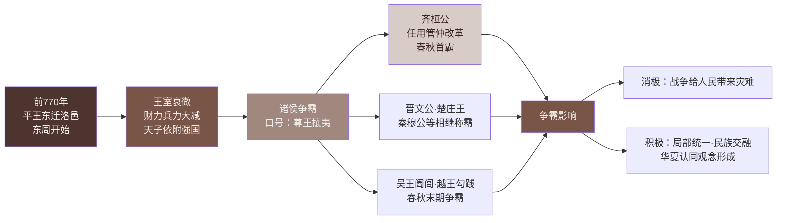

# 第5课 动荡变化中的春秋时期

标签：#夏商周时期 #春秋争霸 #铁器牛耕 #王室衰微

## 一、本知识点定位

统编版中国历史七年级上册 **第二单元 夏商周时期 · 第5课**。本课学习春秋时期（公元前770—前476年）的政治动荡与经济发展：王室衰微、诸侯争霸、铁器牛耕的出现。

## 二、时间与人物

| 时间/人物 | 要点 |
|---|---|
| 公元前770年 | 周平王东迁洛邑，东周开始 |
| 公元前770—前476年 | 春秋时期（因孔子编订的《春秋》而得名） |
| 齐桓公 | 春秋时期第一位霸主，任用管仲改革，"尊王攘夷" |
| 晋文公、楚庄王、秦穆公等 | 相继称霸的诸侯（"春秋五霸"说法之一） |
| 春秋后期 | 铁制农具和牛耕出现 |

## 三、知识梳理

### 1. 王室衰微

- 平王东迁后，周王室直接管辖的地区仅在洛邑一带，**财力、兵力大减**。
- 分封制逐步瓦解，诸侯不再定期朝觐纳贡，周天子**失去对诸侯的控制**，天子反而依附于强大的诸侯。
- 政治格局："礼乐征伐自天子出" 变为 "礼乐征伐自诸侯出"。

### 2. 诸侯争霸

- **背景**：王室衰微，各诸侯国政治、经济发展不平衡；各国为争夺土地、人口和支配权展开争斗。
- **口号**："尊王攘夷"——打着尊崇周王的旗号扩张势力。
- **首霸齐桓公**：任用**管仲**为相，改革内政，发展生产，训练军队，成为春秋时期第一位霸主。
- 此后晋文公、楚庄王、秦穆公等先后称霸；春秋末期，长江下游的吴国、越国也先后北上争霸（吴王阖闾、越王勾践）。
- **影响**：
  - 消极：给人民带来灾难。
  - 客观积极：诸侯国数量减少，出现**局部统一**，为全国统一创造条件；中原"诸夏"与周边民族频繁接触，促进了**民族交融**，产生华夏认同观念。

### 3. 春秋时期的经济发展

- **农业**：春秋后期，**铁制农具和牛耕**出现，是春秋时期**农业生产力水平提高的重要标志**。
- **手工业**：规模扩大，青铜业、冶铁业、纺织业、煮盐业等发展。
- **商业**：产品交换增多，出现商品交换市场，**金属货币**得到较为广泛的使用。

## 四、重要概念

| 术语 | 定义 |
|---|---|
| 东周 | 公元前770年平王东迁后的周朝，分春秋、战国两个阶段 |
| 春秋 | 公元前770—前476年，得名于孔子编订的编年体史书《春秋》 |
| 尊王攘夷 | 诸侯打着拥护周王、抵御外族的旗号号令诸侯、扩张势力 |
| 霸主 | 通过会盟等方式取得诸侯领导地位的强国国君 |
| 华夏认同 | 春秋时期中原各国与周边民族交融中产生的民族认同观念 |

**知识结构图：春秋时期王室衰微与诸侯争霸**

**知识结构图：春秋时期经济发展**

<svg xmlns="http://www.w3.org/2000/svg" viewBox="0 0 700 160" style="max-width:100%;height:auto">
  <rect width="700" height="160" fill="#EFEBE9" rx="10"/>
  <text x="350" y="26" text-anchor="middle" font-size="14" font-weight="bold" fill="#3E2723">春秋时期经济发展（三大领域）</text>
  <!-- 农业 -->
  <rect x="30" y="45" width="190" height="100" rx="6" fill="#4E342E"/>
  <text x="125" y="70" text-anchor="middle" font-size="13" fill="#EFEBE9" font-weight="bold">农业</text>
  <text x="125" y="90" text-anchor="middle" font-size="11" fill="#D7CCC8">铁制农具出现</text>
  <text x="125" y="106" text-anchor="middle" font-size="11" fill="#D7CCC8">牛耕出现</text>
  <text x="125" y="122" text-anchor="middle" font-size="10" fill="#BCAAA4">→生产力提高的重要标志</text>
  <text x="125" y="136" text-anchor="middle" font-size="10" fill="#BCAAA4">（春秋后期出现）</text>
  <!-- 手工业 -->
  <rect x="255" y="45" width="190" height="100" rx="6" fill="#795548"/>
  <text x="350" y="70" text-anchor="middle" font-size="13" fill="#EFEBE9" font-weight="bold">手工业</text>
  <text x="350" y="90" text-anchor="middle" font-size="11" fill="#D7CCC8">青铜业·冶铁业</text>
  <text x="350" y="106" text-anchor="middle" font-size="11" fill="#D7CCC8">纺织业·煮盐业</text>
  <text x="350" y="122" text-anchor="middle" font-size="10" fill="#BCAAA4">规模扩大</text>
  <!-- 商业 -->
  <rect x="480" y="45" width="190" height="100" rx="6" fill="#A1887F"/>
  <text x="575" y="70" text-anchor="middle" font-size="13" fill="#EFEBE9" font-weight="bold">商业</text>
  <text x="575" y="90" text-anchor="middle" font-size="11" fill="#D7CCC8">商品交换市场出现</text>
  <text x="575" y="106" text-anchor="middle" font-size="11" fill="#D7CCC8">金属货币广泛使用</text>
  <text x="575" y="122" text-anchor="middle" font-size="10" fill="#BCAAA4">产品交换增多</text>
</svg>

## 五、易混辨析

| 对比项 | 西周 | 春秋 |
|---|---|---|
| 周王地位 | 天下共主，权威至上 | 王室衰微，依附强国 |
| 分封制 | 有效运转 | 逐步瓦解 |
| 政治特征 | 天子号令诸侯 | 诸侯争霸 |

注意：**铁器牛耕出现于春秋后期，推广于战国**——"出现"与"推广"不要混淆。

## 六、背记要点

1. 公元前770年平王东迁洛邑，东周开始。
2. 春秋时期：公元前770—前476年。
3. 春秋政治特点：王室衰微、诸侯争霸。
4. 齐桓公任用管仲改革，以"尊王攘夷"为号召，成为春秋首霸。
5. 争霸客观上促进局部统一和民族交融。
6. 春秋后期铁制农具和牛耕出现——生产力提高的重要标志。
7. 春秋时期金属货币得到较广泛使用。

## 七、自测小题

1. 东周开始于公元前______年，都城在______。
2. 春秋时期第一位霸主是（A. 晋文公 B. 齐桓公 C. 楚庄王）。
3. 齐桓公任用______为相进行改革。
4. 诸侯争霸打出的旗号是"______"。
5. 春秋时期农业生产力水平提高的重要标志是______和______的出现。
6. 春秋争霸客观上的积极影响是促进局部统一和______。
7. 判断：铁制农具在春秋后期已在全国普遍推广。（对/错）

**答案**：1. 770；洛邑 2. B 3. 管仲 4. 尊王攘夷 5. 铁制农具；牛耕 6. 民族交融 7. 错（战国时期才推广）

相关：[[第4课 夏商西周王朝的更替]] ｜ [[第6课 战国时期的社会变革]]
