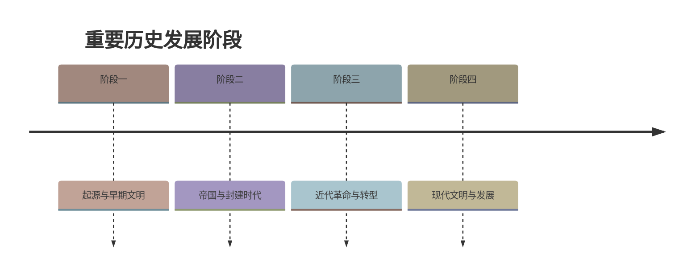

# 第6课 战国时期的社会变革

标签：#夏商周时期 #战国七雄 #商鞅变法 #都江堰

## 一、本知识点定位

统编版中国历史七年级上册 **第二单元 夏商周时期 · 第6课**。本课学习战国时期（公元前475—前221年）的兼并战争、商鞅变法和都江堰工程，理解中国社会向封建社会的过渡。

## 二、时间与人物

| 时间/人物 | 要点 |
|---|---|
| 公元前475—前221年 | 战国时期 |
| 战国七雄 | 齐、楚、燕、韩、赵、魏、秦 |
| 公元前356年 | 秦孝公任用商鞅主持变法 |
| 桂陵之战、马陵之战、长平之战 | 战国著名战役（长平之战后东方六国再无力抵御秦国） |
| 公元前256年（战国后期） | 秦国蜀郡郡守李冰主持修建都江堰 |

## 三、知识梳理

### 1. 战国七雄与兼并战争

- 战国初年，晋国被韩、赵、魏三家大夫瓜分（**三家分晋**），齐国由大夫田氏取代（**田氏代齐**）。
- 形成**齐、楚、燕、韩、赵、魏、秦**七国争雄的局面。方位速记：**齐东、楚南、秦西、燕北，韩赵魏在中间**。
- 战争性质由春秋的**争霸**转变为**兼并**，规模大、参战兵力多、时间长、伤亡大。
- 影响：人民苦于战乱、渴望统一；诸侯国减少，**统一趋势**日益明显。

### 2. 商鞅变法（重点）

- **背景**：铁制农具和牛耕推广，生产力发展，新兴地主阶级势力壮大，各国纷纷变法图强。
- **时间与支持者**：公元前356年，**秦孝公**任用**商鞅**主持变法。
- **主要内容**：

| 方面 | 措施 |
|---|---|
| 政治 | 确立**县制**，由国君直接派官吏治理；废除贵族世袭特权；严明法度 |
| 经济 | 废除旧的土地制度；鼓励耕织，生产粮食布帛多的可免除徭役；统一度量衡 |
| 军事 | 奖励军功，对有军功者授予爵位并赏赐土地 |

- **作用**：秦国政治、经济、军事实力大增，成为**战国后期最强盛的诸侯国**，为以后秦统一中国奠定了基础。
- **启示**：改革是推动社会进步的动力；顺应历史潮流的改革终会推行下去（"商鞅虽死，秦法未败"）。

### 3. 都江堰

- **战国后期**（约公元前256年），秦国蜀郡郡守**李冰**主持，在**成都平原的岷江**上修建。
- 由**渠首**（鱼嘴、飞沙堰、宝瓶口）和灌溉网组成，发挥**防洪、灌溉、水运**等作用。
- 使成都平原成为沃野，被称为"**天府之国**"；是一座综合性水利枢纽，至今仍在发挥作用，体现了我国人民的智慧。

## 四、重要概念

| 术语 | 定义 |
|---|---|
| 兼并战争 | 以吞并他国领土为目的的战争 |
| 变法 | 改革旧制度，实现富国强兵 |
| 县制 | 由国君直接派官吏治理地方的制度，加强中央对地方的控制 |
| 军功爵制 | 按军功大小授予爵位和土地的制度 |

## 五、易混辨析

| 对比项 | 春秋争霸 | 战国兼并 |
|---|---|---|
| 目的 | 争当霸主、号令诸侯 | 吞并土地、统一天下 |
| 规模 | 相对较小 | 兵力多、伤亡大 |
| 结果 | 大国称霸 | 统一趋势加强 |

注意：商鞅变法**成功的根本原因是顺应了历史发展潮流**，而不是个人才能或君主支持本身。

## 六、背记要点

1. 战国七雄：齐楚燕韩赵魏秦（齐东楚南秦西燕北，韩赵魏中间）。
2. 三家分晋、田氏代齐标志战国序幕。
3. 公元前356年秦孝公任用商鞅变法。
4. 商鞅变法核心：确立县制、废除贵族特权、鼓励耕织、奖励军功。
5. 变法使秦国成为战国后期最强盛的诸侯国，为统一奠基。
6. 长平之战后六国无力抵御秦国。
7. 李冰修都江堰（岷江），成都平原成"天府之国"。

## 七、自测小题

1. 战国七雄是齐、楚、燕、韩、赵、______、______。
2. 商鞅变法开始于公元前______年，得到______（国君）支持。
3. 商鞅变法中加强中央对地方控制的措施是（A. 奖励军功 B. 确立县制 C. 统一度量衡）。
4. 商鞅变法的最重要影响是（A. 秦国成为最强诸侯国，为统一奠基 B. 废除了世袭制 C. 消灭了六国）。
5. 都江堰由______主持修建，位于______江上。
6. 都江堰使______平原获得"天府之国"的美称。
7. 判断：战国时期战争的性质是争霸战争。（对/错）

**答案**：1. 魏；秦 2. 356；秦孝公 3. B 4. A 5. 李冰；岷 6. 成都 7. 错（兼并战争）

相关：[[第5课 动荡变化中的春秋时期]] ｜ [[第7课 百家争鸣]] ｜ [[第9课 秦统一中国]]

### 历史时间轴

