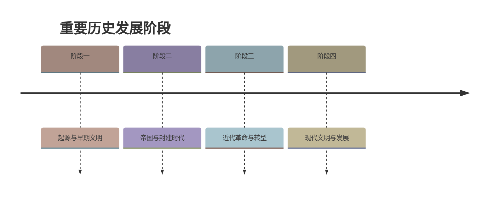

# 统一多民族封建国家的建立和巩固（单元导学）

标签：#秦汉时期 #单元导学 #大一统

## 一、本知识点定位

统编版中国历史七年级上册 **第三单元 秦汉时期：统一多民族封建国家的建立和巩固** 的单元导学。本单元包括第9—15课，从秦统一中国讲到秦汉的科技文化，是中国历史上第一个"大一统"时代。

## 二、单元时间轴与关键坐标

| 时间 | 大事 |
|---|---|
| 公元前230—前221年 | 秦灭六国 |
| 公元前221年 | 秦统一中国，建立我国历史上第一个统一多民族的封建国家 |
| 公元前209年 | 陈胜、吴广大泽乡起义 |
| 公元前207年 | 巨鹿之战；秦朝灭亡 |
| 公元前202年 | 刘邦建立汉朝（西汉），定都长安 |
| 公元前138年、前119年 | 张骞两次出使西域 |
| 公元前60年 | 西汉设置西域都护 |
| 公元9年 | 王莽夺权，西汉灭亡 |
| 公元25年 | 刘秀建立东汉，定都洛阳 |
| 184年 | 黄巾起义 |

## 三、单元知识框架

### 1. 七课内容的逻辑线索

- **第9课**：秦灭六国、建立中央集权制度、巩固统一的措施——"建立"。
- **第10课**：秦的暴政与秦末农民大起义、楚汉之争——"速亡"。
- **第11课**：西汉建立、休养生息、"文景之治"——"恢复"。
- **第12课**：汉武帝在政治、思想、经济、军事上巩固大一统——"鼎盛"。
- **第13课**：东汉的建立、"光武中兴"、外戚宦官交替专权、黄巾起义——"兴衰"。
- **第14课**：张骞通西域、丝绸之路、对西域的管理——"开拓"。
- **第15课**：造纸术、医学、数学、宗教、史学（司马迁《史记》）——"文化"。

### 2. 大一统的主线

- 政治：皇帝制度、中央集权、郡县制 → 汉承秦制并加以完善（推恩令）。
- 思想：秦"焚书坑儒"（失败教训）→ 汉武帝尊崇儒术（儒学成为正统）。
- 经济：统一货币、度量衡 → 盐铁官营、统一铸五铢钱。
- 疆域与交流：北击匈奴、修长城 → 通西域、丝绸之路、设西域都护。

## 四、重要概念

| 术语 | 定义 |
|---|---|
| 统一多民族封建国家 | 多民族在中央政权统一管辖下的封建国家，始于秦 |
| 中央集权 | 地方服从中央、权力集中于中央和皇帝的制度 |
| 大一统 | 中央加强对政治、经济、思想文化等各方面的统一领导 |
| 休养生息 | 轻徭薄赋、恢复生产、安定民生的政策 |

## 五、易混辨析

| 对比项 | 秦朝 | 西汉（武帝时） |
|---|---|---|
| 对待儒学 | 焚书坑儒 | 尊崇儒术 |
| 地方制度 | 郡县制 | 郡国并行→推恩令削藩 |
| 结局启示 | 暴政速亡 | 大一统鼎盛 |

## 六、背记要点

1. 公元前221年秦统一中国——第一个统一多民族的封建国家。
2. 秦亡于暴政：公元前209年大泽乡起义是我国历史上第一次农民大起义。
3. 公元前202年刘邦建立西汉；文景之治是我国封建社会第一个治世。
4. 汉武帝从政治、思想、经济、军事上巩固大一统。
5. 公元前60年设西域都护，标志西域正式归属中央政权。
6. 公元25年刘秀建立东汉，出现"光武中兴"。
7. 丝绸之路是古代东西方往来的大动脉。

## 七、自测小题

1. 我国历史上第一个统一多民族的封建国家是______，建立于公元前______年。
2. 我国历史上第一次农民大起义是（A. 黄巾起义 B. 大泽乡起义 C. 国人暴动）。
3. 西汉的建立者是______，都城在______。
4. 标志西域正式归属中央政权的事件是公元前60年设置______。
5. 东汉的建立者是______，史称其统治为"______"。
6. 判断：秦朝和西汉都推崇儒家思想治国。（对/错）

**答案**：1. 秦朝；221 2. B 3. 刘邦；长安 4. 西域都护 5. 刘秀；光武中兴 6. 错（秦朝以法家思想治国，焚书坑儒）

相关：[[第9课 秦统一中国]] ｜ [[第12课 大一统王朝的巩固]] ｜ [[第14课 丝绸之路的开通与经营西域]]

### 历史时间轴

