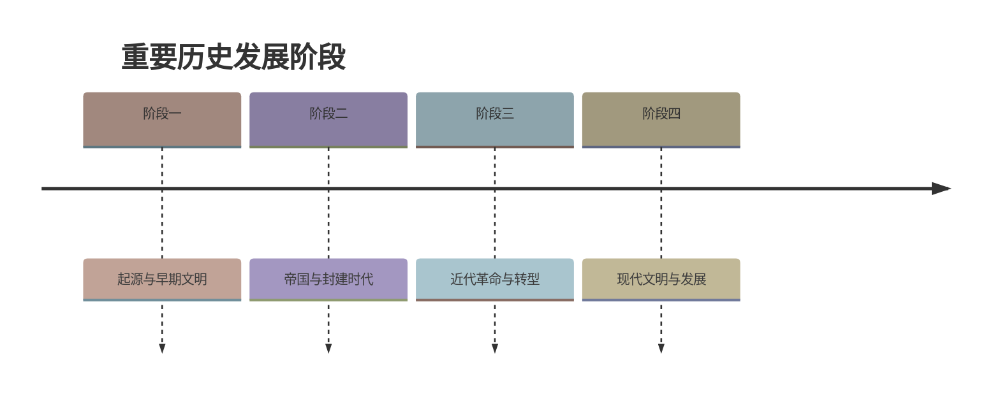

# 第12课 大一统王朝的巩固

标签：#秦汉时期 #汉武帝 #推恩令 #尊崇儒术

## 一、本知识点定位

统编版中国历史七年级上册 **第三单元 秦汉时期 · 第12课**。本课学习汉武帝从政治、思想、经济、军事四个方面巩固大一统的措施，是本单元的核心重点课。

## 二、时间与人物

| 人物/时间 | 要点 |
|---|---|
| 汉武帝刘彻 | 西汉第七位皇帝，在位期间西汉进入鼎盛 |
| 主父偃 | 建议实施"推恩令" |
| 董仲舒 | 建议"尊崇儒术" |
| 卫青、霍去病 | 公元前119年漠北战役大败匈奴 |

## 三、知识梳理

### 1. 政治上：削弱地方势力

- **问题**：汉初分封的诸侯王势力强大，地方豪强兼并土地、横行乡里，威胁中央。
- **推恩令**（采纳主父偃建议）：诸侯王除嫡长子继承王位外，可将封地再分给其他子弟建立侯国。诸侯国越分越小，**中央大大加强了对地方的控制**（"不费一兵一卒削弱诸侯"）。
- 此后又找借口削爵、夺地、除国；建立**刺史制度**，监视地方官吏、豪强。

### 2. 思想上：尊崇儒术

- **问题**：汉初"无为而治"，诸子百家学说流行，士人依附诸侯王批评朝政。
- **措施**（采纳董仲舒建议）：把儒家学说立为正统思想，**尊崇儒术**；在长安兴办**太学**，以儒家经典（五经）为教材，培养治国人才。
- **影响**：从此**儒学居于主导地位**，成为中国封建社会的正统思想，影响深远。

### 3. 经济上：加强朝廷对经济的掌控

- 铸币权收归中央，统一铸造**五铢钱**。
- 实行**盐铁官营**、专卖。
- 统一调配物资，**平抑物价**（均输平准）。
- 注重发展农业，重视兴修水利（治理黄河）；对商人征收车船税。
- 作用：中央财政状况大为改善，为其他政策的推行奠定了经济基础。

### 4. 军事上：北击匈奴

- 汉初对匈奴被迫**和亲**；武帝时国力强盛，转为反击。
- 公元前119年，**卫青、霍去病**率军在**漠北战役**中大败匈奴。此后匈奴再无力与西汉对抗。
- 配合张骞通西域（详见第14课），大一统局面得到进一步巩固和发展。

### 5. 总评

汉武帝从**政治、思想、经济、军事**等方面巩固了大一统的局面，使西汉王朝进入**鼎盛时期**。

## 四、重要概念

| 术语 | 定义 |
|---|---|
| 大一统 | 中央对政治、经济、思想文化等各方面的统一领导 |
| 推恩令 | 诸侯王分封子弟为侯、封地越分越小的政策 |
| 刺史制度 | 中央派刺史监察地方官吏和豪强的制度 |
| 太学 | 汉武帝在长安设立的最高学府 |
| 盐铁官营 | 盐和铁由国家垄断经营 |

## 五、易混辨析

| 对比项 | 秦始皇 | 汉武帝 |
|---|---|---|
| 思想 | 焚书坑儒（压制） | 尊崇儒术（利用） |
| 地方 | 郡县制 | 推恩令+刺史制度 |
| 货币 | 半两钱 | 五铢钱 |
| 共同点 | 都加强中央集权，巩固统一多民族国家 | |

注意：推恩令的高明之处在于**不动用武力而使诸侯国自行缩小**；"尊崇儒术"是把儒学立为正统，并非消灭其他学派的一切内容。

## 六、背记要点

1. 推恩令（主父偃）：削弱诸侯国，加强中央集权。
2. 刺史制度：监察地方。
3. 尊崇儒术（董仲舒）：儒学成为封建社会正统思想。
4. 兴办太学，以五经为教材。
5. 经济：统一铸五铢钱、盐铁官营、平抑物价。
6. 公元前119年漠北战役：卫青、霍去病大败匈奴。
7. 汉武帝时西汉进入鼎盛时期。

## 七、自测小题

1. 建议汉武帝实施"推恩令"的是______，建议尊崇儒术的是______。
2. "推恩令"的直接作用是（A. 增加税收 B. 削弱诸侯国势力 C. 发展农业）。
3. 汉武帝把______家学说立为正统思想，在长安兴办______。
4. 汉武帝统一铸造的货币是（A. 半两钱 B. 五铢钱 C. 刀币）。
5. 盐和铁由国家垄断经营的政策称为______。
6. 公元前119年率军在漠北大败匈奴的将领是______和______。
7. 判断：汉武帝和秦始皇对儒家学说的态度完全相同。（对/错）

**答案**：1. 主父偃；董仲舒 2. B 3. 儒；太学 4. B 5. 盐铁官营 6. 卫青；霍去病 7. 错（一个焚书坑儒，一个尊崇儒术）

相关：[[第11课 西汉建立和"文景之治"]] ｜ [[第14课 丝绸之路的开通与经营西域]] ｜ [[第7课 百家争鸣]]

### 历史时间轴

