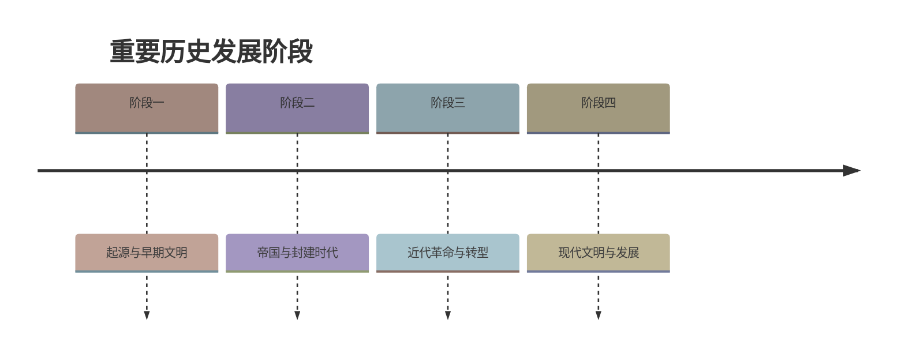

# 政权分立与民族交融（单元导学）

标签：#三国两晋南北朝 #单元导学 #民族交融

## 一、本知识点定位

统编版中国历史七年级上册 **第四单元 三国两晋南北朝时期：政权分立与民族交融** 的单元导学。本单元包括第16—20课及活动课第21课，讲述从三国鼎立到南北朝对峙的近400年分裂时期，主线是**政权分立**与**民族交融**。

## 二、单元时间轴与关键坐标

| 时间 | 大事 |
|---|---|
| 200年 | 官渡之战，曹操大败袁绍 |
| 208年 | 赤壁之战，孙刘联军大败曹操 |
| 220年 | 曹丕称帝建魏，东汉灭亡 |
| 221年 | 刘备建汉（蜀汉）；229年孙权称帝建吴——三国鼎立形成 |
| 266年 | 司马炎建立西晋 |
| 280年 | 西晋灭吴，统一全国 |
| 316年 | 西晋灭亡 |
| 317年 | 司马睿建立东晋，都建康 |
| 383年 | 淝水之战，东晋大败前秦 |
| 420—589年 | 南朝（宋齐梁陈） |
| 439年 | 北魏统一北方 |
| 494年 | 北魏孝文帝迁都洛阳，推行汉化改革 |

## 三、单元知识框架

### 1. 政权更替线索

- **北方**：东汉→魏→西晋（短暂统一）→十六国→北魏→东魏/西魏→北齐/北周（北朝）。
- **南方**：吴→东晋→宋、齐、梁、陈（南朝，都城都在建康）。

### 2. 两条主线

- **政权分立**：三国鼎立→西晋短暂统一→东晋十六国→南北朝对峙；分裂中孕育统一因素。
- **民族交融**：北方各族内迁→前秦、北魏等少数民族政权学习汉族制度→孝文帝改革→北方民族大交融，为隋唐统一多民族国家的发展奠定基础。
- 另一重要线索：**江南地区的开发**——北人南迁带去劳动力和先进技术，为经济重心南移奠基。

### 3. 各课定位

- 第16课：三国鼎立；第17课：西晋短暂统一与北方各族内迁；第18课：东晋南朝与江南开发；第19课：北朝政治与民族大交融；第20课：科技与文化；第21课：活动课（考古与文明起源）。

## 四、重要概念

| 术语 | 定义 |
|---|---|
| 政权分立 | 多个政权并立对峙的政治局面 |
| 民族交融 | 各民族在生产生活、习俗文化等方面相互影响、逐渐融合 |
| 北朝 | 北魏及分裂出的东魏、西魏、北齐、北周等北方政权 |
| 南朝 | 420—589年南方相继出现的宋、齐、梁、陈四个王朝 |
| 江南开发 | 东晋南朝时期江南地区经济迅速发展的过程 |

## 五、易混辨析

| 对比项 | 三国鼎立 | 南北朝对峙 |
|---|---|---|
| 时间 | 220—280年 | 420—589年 |
| 格局 | 魏、蜀、吴三方 | 南朝与北朝南北对峙 |
| 结束 | 西晋统一 | 隋朝统一 |

注意：这一时期虽然分裂动荡，但**民族交融和江南开发**为后来的统一与繁荣积蓄了力量——"分裂中孕育统一"。

## 六、背记要点

1. 单元主题：政权分立与民族交融。
2. 220年曹丕建魏、221年刘备建蜀汉、229年孙权建吴。
3. 280年西晋统一全国，但短暂；316年灭亡。
4. 317年东晋建立；420年起进入南朝（宋齐梁陈）。
5. 439年北魏统一北方；孝文帝改革促进民族交融。
6. 江南地区的开发为经济重心南移奠定基础。
7. 民族大交融为隋唐盛世奠定基础。

## 七、自测小题

1. 三国两晋南北朝时期的时代特征是______与______。
2. 三国鼎立局面最终被______（朝代）统一。
3. 南朝四个王朝的先后顺序是宋、______、______、陈。
4. 439年统一北方的政权是（A. 前秦 B. 北魏 C. 西晋）。
5. 江南地区得到开发的最主要原因是（A. 气候温暖 B. 北方人口南迁带来劳动力和技术 C. 统治者勤政）。
6. 判断：三国两晋南北朝时期全程处于分裂状态，没有出现过统一。（对/错）

**答案**：1. 政权分立；民族交融 2. 西晋 3. 齐；梁 4. B 5. B 6. 错（西晋曾短暂统一）

相关：[[第16课 三国鼎立]] ｜ [[第18课 东晋南朝政治和江南地区开发]] ｜ [[第19课 北朝政治和北方民族大交融]]

### 历史时间轴

