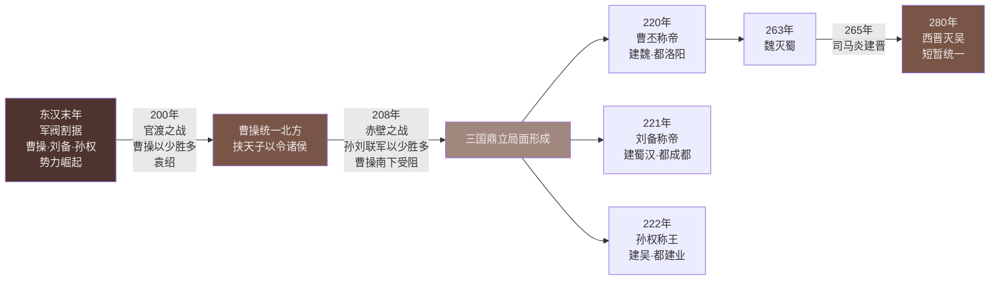

# 第16课 三国鼎立

标签：#三国两晋南北朝 #官渡之战 #赤壁之战 #三国鼎立

## 一、本知识点定位

统编版中国历史七年级上册 **第四单元 三国两晋南北朝时期 · 第16课**。本课学习官渡之战、赤壁之战和三国鼎立局面的形成。

## 二、时间与人物

| 时间 | 大事 | 关键人物 |
|---|---|---|
| 200年 | 官渡之战 | 曹操胜袁绍 |
| 208年 | 赤壁之战 | 孙权、刘备联军胜曹操 |
| 220年 | 曹丕废汉献帝，建魏，定都洛阳（东汉灭亡） | 曹丕 |
| 221年 | 刘备称帝，国号汉（史称蜀汉），定都成都 | 刘备 |
| 229年 | 孙权称帝，建吴，定都建业（今南京）——三国鼎立正式形成 | 孙权 |

## 三、知识梳理

### 1. 官渡之战（200年）

- **背景**：东汉末年军阀割据混战，占据河南一带的曹操"**挟天子以令诸侯**"，招揽人才，实行**屯田**，实力壮大；河北袁绍势力强大。
- **概况**：200年，曹操在**官渡**以少胜多大败袁绍。
- **影响**：为曹操日后**统一北方**打下基础。

### 2. 赤壁之战（208年）

- **背景**：曹操基本统一北方后挥师南下，意图统一全国；孙权、刘备组成联军。
- **概况**：208年，孙刘联军在**赤壁**用**火攻**（周瑜指挥、黄盖诈降）以少胜多大败曹军。
- **曹操失败原因**：北方军队不服水土、不习水战；曹操骄傲轻敌；孙刘联合、战术得当。
- **影响**：为**三国鼎立局面的形成**奠定了基础。

### 3. 三国鼎立的形成

| 国 | 建立时间 | 建立者 | 都城 |
|---|---|---|---|
| 魏 | 220年 | 曹丕 | 洛阳 |
| 汉（蜀汉） | 221年 | 刘备 | 成都 |
| 吴 | 229年 | 孙权 | 建业（今南京） |

### 4. 三国经济的发展

- **魏**：重视农业，兴修水利，北方生产得到恢复和发展。
- **蜀**：发展经济、改善民族关系，加速西南地区开发；蜀锦行销三国。
- **吴**：开发江东，造船业发达；230年孙权派**卫温**率船队到达**夷洲**（今台湾），**加强了大陆与台湾的联系**。

### 5. 评价

三国鼎立结束了东汉末年众多军阀混战的局面，实现了**局部统一**，为以后全国统一创造了条件——从分裂走向统一的过渡阶段。

## 四、重要概念

| 术语 | 定义 |
|---|---|
| 挟天子以令诸侯 | 曹操控制汉献帝、以朝廷名义号令天下的策略 |
| 屯田 | 组织军民垦荒种地以解决军粮的措施 |
| 三国鼎立 | 魏、蜀、吴三个政权并立对峙的局面 |

**知识结构图：三国鼎立形成过程**

**知识结构图：三国经济发展**

<svg xmlns="http://www.w3.org/2000/svg" viewBox="0 0 700 160" style="max-width:100%;height:auto">
  <rect width="700" height="160" fill="#EFEBE9" rx="10"/>
  <text x="350" y="26" text-anchor="middle" font-size="14" font-weight="bold" fill="#3E2723">三国时期各地区经济发展</text>
  <!-- 魏 -->
  <rect x="20" y="45" width="200" height="100" rx="6" fill="#4E342E"/>
  <text x="120" y="68" text-anchor="middle" font-size="13" fill="#EFEBE9" font-weight="bold">魏（北方）</text>
  <text x="120" y="88" text-anchor="middle" font-size="11" fill="#D7CCC8">修建许多水利工程</text>
  <text x="120" y="106" text-anchor="middle" font-size="11" fill="#D7CCC8">北方生产逐渐恢复</text>
  <text x="120" y="124" text-anchor="middle" font-size="11" fill="#D7CCC8">丝织业发达</text>
  <!-- 蜀汉 -->
  <rect x="250" y="45" width="200" height="100" rx="6" fill="#795548"/>
  <text x="350" y="68" text-anchor="middle" font-size="13" fill="#EFEBE9" font-weight="bold">蜀汉（西南）</text>
  <text x="350" y="88" text-anchor="middle" font-size="11" fill="#D7CCC8">丝织业兴旺</text>
  <text x="350" y="106" text-anchor="middle" font-size="11" fill="#D7CCC8">蜀锦行销三国</text>
  <text x="350" y="124" text-anchor="middle" font-size="11" fill="#D7CCC8">诸葛亮治蜀有方</text>
  <!-- 吴 -->
  <rect x="480" y="45" width="200" height="100" rx="6" fill="#A1887F"/>
  <text x="580" y="68" text-anchor="middle" font-size="13" fill="#EFEBE9" font-weight="bold">吴（江南）</text>
  <text x="580" y="88" text-anchor="middle" font-size="11" fill="#D7CCC8">开发江南</text>
  <text x="580" y="106" text-anchor="middle" font-size="11" fill="#D7CCC8">造船业发达</text>
  <text x="580" y="124" text-anchor="middle" font-size="11" fill="#D7CCC8">船队到达夷洲（台湾）</text>
</svg>

## 五、易混辨析

| 对比项 | 官渡之战 | 赤壁之战 |
|---|---|---|
| 时间 | 200年 | 208年 |
| 交战方 | 曹操 vs 袁绍 | 孙刘联军 vs 曹操 |
| 胜者 | 曹操 | 孙刘联军 |
| 共同点 | 都是以少胜多 | |
| 影响 | 奠定曹操统一北方基础 | 奠定三国鼎立基础 |

注意：**曹操是东汉末年人，不是三国人物**——魏国是其子曹丕所建；三国鼎立正式形成的标志是**229年孙权称帝**。

## 六、背记要点

1. 200年官渡之战：曹操以少胜多败袁绍，奠定统一北方基础。
2. 208年赤壁之战：孙刘联军火攻破曹，奠定三国鼎立基础。
3. 220年曹丕建魏（洛阳）；221年刘备建蜀汉（成都）；229年孙权建吴（建业）。
4. 三国鼎立正式形成的标志：229年孙权称帝。
5. 230年卫温到达夷洲（今台湾），加强大陆与台湾联系。
6. 三国鼎立是局部统一，为全国统一创造条件。
7. 曹操属于东汉末年人物。

## 七、自测小题

1. 官渡之战发生于______年，交战双方是曹操和______。
2. 为三国鼎立局面形成奠定基础的战役是（A. 官渡之战 B. 赤壁之战 C. 巨鹿之战）。
3. 魏国的建立者是（A. 曹操 B. 曹丕 C. 司马炎）。
4. 三国鼎立正式形成的标志是______年______称帝建吴。
5. 蜀汉的都城在______，吴国的都城在______。
6. 230年孙权派______率船队到达夷洲，夷洲即今______。
7. 判断：曹操建立了魏国。（对/错）

**答案**：1. 200；袁绍 2. B 3. B 4. 229；孙权 5. 成都；建业 6. 卫温；台湾 7. 错（曹丕所建）

相关：[[第13课 东汉的兴衰]] ｜ [[第17课 西晋的短暂统一和北方各族的内迁]]
