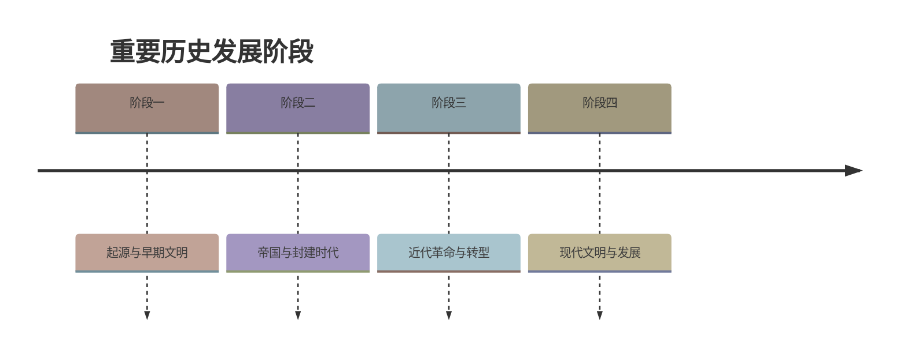

# 第17课 西晋的短暂统一和北方各族的内迁

标签：#三国两晋南北朝 #西晋 #八王之乱 #北方各族内迁

## 一、本知识点定位

统编版中国历史七年级上册 **第四单元 三国两晋南北朝时期 · 第17课**。本课学习西晋的建立与统一、八王之乱与西晋灭亡、北方各族的内迁与十六国。

## 二、时间与人物

| 时间 | 大事 | 人物 |
|---|---|---|
| 263年 | 魏灭蜀 | —— |
| 266年 | 司马炎自立为帝，建立西晋，定都洛阳 | 司马炎（晋武帝） |
| 280年 | 西晋灭吴，统一全国 | —— |
| 晋惠帝时 | 八王之乱，西晋由盛转衰 | 八个宗室诸侯王 |
| 316年 | 内迁的匈奴人灭西晋 | —— |
| 4世纪初—5世纪前期 | 北方主要有15个政权+成汉，合称"十六国" | —— |
| 4世纪后期 | 前秦（氐族苻坚）一度统一北方 | 苻坚、王猛 |

## 三、知识梳理

### 1. 西晋的建立与统一

- 三国后期魏国实力增强，**司马懿**父子逐渐控制魏国大权。
- **263年魏灭蜀**；**266年司马炎**（司马昭之子）废魏帝自立，建立**西晋**，定都**洛阳**。
- **280年西晋灭吴，统一全国**，结束了三国分裂局面。

### 2. 八王之乱与西晋灭亡

- **统治集团腐朽**：西晋皇族、官僚在治国方略上缺乏雄才大略，生活奢侈腐化（石崇王恺斗富），社会风气败坏。
- **八王之乱**：晋惠帝昏庸无能，手握重兵的**八个宗室诸侯王**为争夺中央政权混战十几年，主要在洛阳一带展开。
  - 危害：中原人口大量死亡，幸存者纷纷**南迁**，形成我国古代历史上**第一次大规模的人口迁徙高潮**；**西晋从此衰落**。
- **灭亡**：内迁各族趁乱起兵，**316年**内迁的**匈奴人**攻破长安，西晋灭亡。西晋从统一（280年）到灭亡仅37年，是一个**短暂统一**的王朝。

### 3. 北方各族的内迁

- **时间**：东汉、魏、晋时期。
- **内迁民族**："五胡"——**匈奴、鲜卑、羯、氐、羌**。
  - 氐族、羌族：由西向东迁入陕西关中。
  - 匈奴族、羯族：由北向南迁到山西一带。
  - 鲜卑族：迁到辽宁、陕西及河套地区。
- 西晋向内迁各族收取重税、征兵派役、掠卖人口，激起反抗。

### 4. 十六国与前秦

- 西晋灭亡后，北方各族先后建立许多政权，历史上把北方主要的15个政权连同西南的成汉总称"**十六国**"。
- **4世纪后期**，氐族建立的**前秦**逐渐强盛，皇帝**苻坚**任用汉人**王猛**为丞相，整顿吏治、发展经济、兴办学校，**一度统一了北方**（后在淝水之战中败于东晋，见第18课）。

## 四、重要概念

| 术语 | 定义 |
|---|---|
| 八王之乱 | 晋惠帝时八个宗室诸侯王争夺中央政权的混战 |
| 五胡内迁 | 匈奴、鲜卑、羯、氐、羌等族迁入中原 |
| 十六国 | 西晋灭亡后北方主要15个政权加成汉的总称 |
| 人口迁徙高潮 | 八王之乱后中原人口大规模南迁的现象 |

## 五、易混辨析

| 对比项 | 秦朝 | 西晋 |
|---|---|---|
| 共同点 | 都结束分裂完成统一，都短命而亡 | |
| 存在时间 | 15年 | 统一后37年 |
| 灭亡原因 | 暴政引发农民起义 | 统治腐朽+八王之乱+内迁各族反抗 |

注意：**西晋建立（266年）在前，统一全国（280年）在后**；灭西晋的是**内迁的匈奴人**，不是北方游牧民族"入侵"新势力。

## 六、背记要点

1. 266年司马炎建西晋，都洛阳；280年灭吴统一全国。
2. 西晋统治集团奢侈腐化（如石崇王恺斗富）。
3. 八王之乱使西晋由盛转衰，引发第一次大规模人口南迁高潮。
4. 316年匈奴人灭西晋——短暂统一（统一仅37年）。
5. 内迁五族：匈奴、鲜卑、羯、氐、羌。
6. 北方政权总称"十六国"。
7. 前秦苻坚任用王猛，一度统一北方。

## 七、自测小题

1. 西晋的建立者是______，都城在______。
2. 西晋统一全国是在______年，灭掉的最后一个政权是______。
3. 使西晋由盛转衰的事件是（A. 七国之乱 B. 八王之乱 C. 安史之乱）。
4. 316年灭亡西晋的是内迁的（A. 鲜卑人 B. 匈奴人 C. 羌人）。
5. 魏晋时期内迁的五个主要民族是匈奴、鲜卑、羯、______、______。
6. 4世纪后期一度统一北方的氐族政权是______，其皇帝______任用汉人王猛为相。
7. 判断：八王之乱后，中原人口大量北迁。（对/错）

**答案**：1. 司马炎；洛阳 2. 280；吴 3. B 4. B 5. 氐；羌 6. 前秦；苻坚 7. 错（大量南迁）

相关：[[第16课 三国鼎立]] ｜ [[第18课 东晋南朝政治和江南地区开发]]

### 历史时间轴

