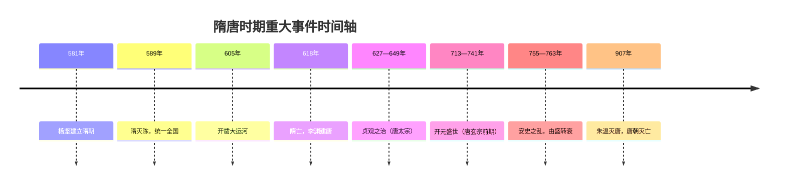

# 繁荣与开放的时代

## 单元导览
隋唐时期（581—907 年）是中国古代历史上一个"繁荣与开放"的时代。隋朝短暂而影响深远，唐朝则把统一多民族国家推向鼎盛，政治、经济、民族关系、对外交流和科技文化都达到新的高峰。

## 时间线
- 581 年：杨坚建立隋朝，定都长安
- 589 年：隋灭陈，统一全国
- 605 年起：开凿大运河
- 618 年：隋亡，李渊建立唐朝
- 627—649 年：唐太宗"贞观之治"
- 713—741 年：唐玄宗前期"开元盛世"
- 755—763 年：安史之乱，唐朝由盛转衰
- 907 年：朱温废唐称帝，唐朝灭亡

**隋唐时期历史时间轴：**

## 本单元主要线索
1. **政治线**：隋统一 → 贞观之治 → 开元盛世 → 安史之乱 → 唐亡与五代十国，详见[[第1课 隋朝统一与灭亡]]、[[第2课 唐朝建立与"贞观之治"]]、[[第3课 开元盛世]]、[[第4课 安史之乱与唐朝衰亡]]。
2. **制度线**：科举制创立与完善、三省六部制运行，为后世沿用。
3. **民族线**：唐太宗被尊为"天可汗"，文成公主入藏，见[[第5课 隋唐时期的民族交往与交融]]。
4. **对外线**：遣唐使、鉴真东渡、玄奘西行，见[[第6课 隋唐时期的中外文化交流]]。
5. **文化线**：唐诗、书法、绘画、雕版印刷，见[[第7课 隋唐时期的科技与文化]]。

## 关键人物速览
| 人物 | 身份 | 主要事迹 |
| --- | --- | --- |
| 隋文帝杨坚 | 隋朝开国皇帝 | 统一全国，发展经济 |
| 隋炀帝杨广 | 隋朝第二位皇帝 | 开大运河、创进士科、暴政亡国 |
| 唐太宗李世民 | 唐朝第二位皇帝 | 贞观之治、天可汗 |
| 武则天 | 中国历史上唯一女皇帝 | "政启开元，治宏贞观" |
| 唐玄宗李隆基 | 唐朝皇帝 | 前期开元盛世，后期安史之乱 |

## 概念对比："繁荣"与"开放"
- **繁荣**：指经济发达（曲辕犁、筒车、唐三彩）、国力强盛、文化昌盛（唐诗）。
- **开放**：指民族政策开明（和亲、册封）、对外交往频繁（长安是国际性大都会）、社会风气兼容并包。
- 二者互为因果：繁荣提供了开放的底气，开放又促进了繁荣。

## 时代特征归纳
- 政治上：国家统一，制度创新（科举制、三省六部制）
- 经济上：农业、手工业、商业全面发展
- 民族关系上：交往交融，"和同为一家"
- 对外关系上：中外交流空前活跃
- 文化上：多元开放，气象恢宏

## 背记要点
1. 隋唐时期的时代特征：**繁荣与开放**。
2. 隋朝的历史地位类似秦朝：**短暂而影响深远，承上启下**。
3. 唐朝两大治世：贞观之治（唐太宗）、开元盛世（唐玄宗前期）。
4. 唐朝由盛转衰的转折点：**安史之乱**。
5. 隋唐制度双璧：**科举制**与**三省六部制**。

## 自测题
1. 隋唐时期的时代特征是什么？
2. 说出唐朝的建立时间、建立者和都城。
3. 唐朝由盛转衰的标志性事件是什么？
4. 为什么说隋朝与秦朝的历史地位相似？请从统一、制度创新、短命而亡三个角度说明。
5. 请按时间顺序排列：开元盛世、贞观之治、安史之乱、隋灭陈统一全国。
