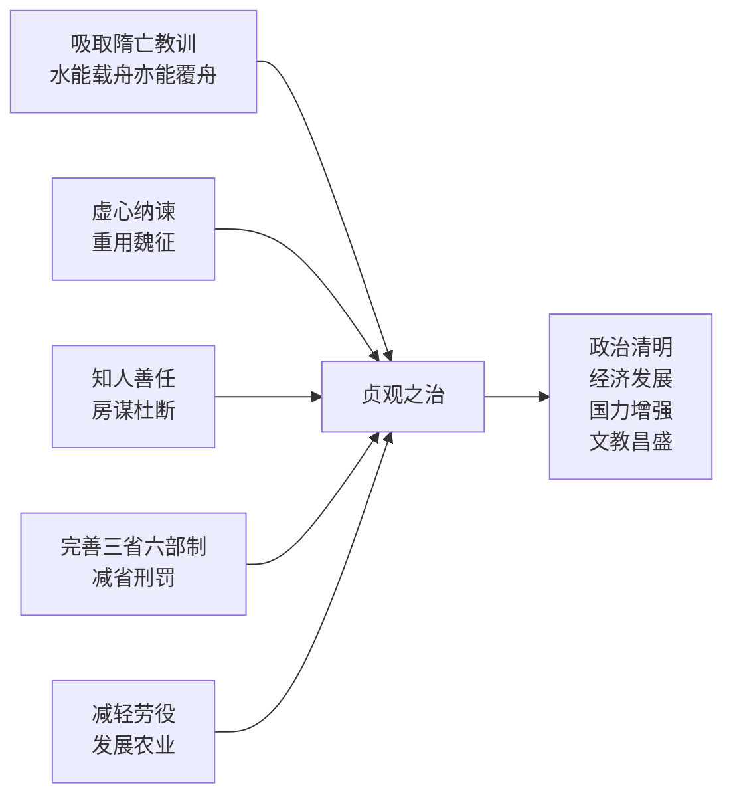
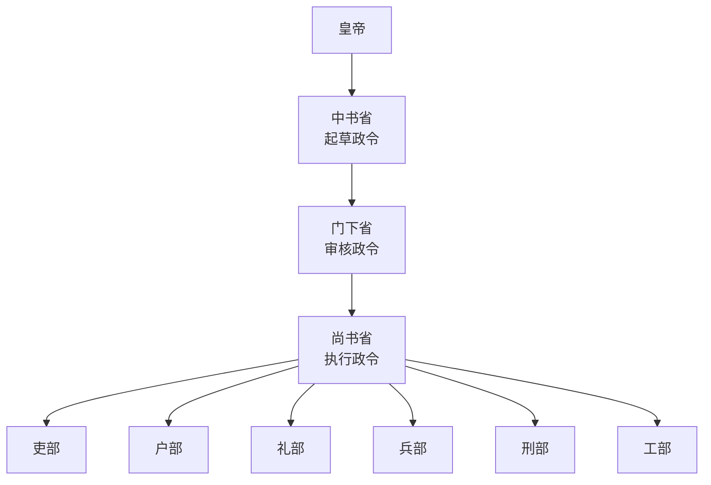

# 第2课 唐朝建立与"贞观之治"

## 时间线
- 618 年：李渊（唐高祖）建立唐朝，定都长安
- 626 年：李世民即位，次年改年号"贞观"
- 627—649 年：贞观年间，出现"贞观之治"
- 690 年：武则天称帝，改国号为周
- 705 年：武则天退位，唐朝国号恢复

## 一、唐朝的建立
- 618 年，李渊在隋末农民起义中趁势起兵，建立唐朝，定都**长安**，随后消灭割据势力，统一全国。
- 626 年，李世民发动"玄武门之变"后即位，即**唐太宗**。

## 二、"贞观之治"
### 1. 唐太宗的治国思想
- 吸取**隋朝速亡**的历史教训（"水能载舟，亦能覆舟"）。
- 勤于政事，虚心纳谏，从善如流：**魏征**敢于直言，被比作"知得失"的一面镜子。
- 广纳贤才：知人善任，房玄龄善于谋略、杜如晦敢于决断（"房谋杜断"）。

**贞观之治形成原因与结果：**

### 2. 治国措施
- **政治上**：
  1. 进一步完善**三省六部制**，明确中央机构的职权及决策程序；
  2. 制定法律，减省刑罚；
  3. 增加科举考试科目，鼓励士人报考，**进士科**逐渐成为最重要的科目；
  4. 严格考察各级官吏的政绩。
- **经济上**：减轻人民的劳役负担，鼓励发展农业生产。
- **边疆治理**：先后击败东、西突厥，加强了对西域的统治（联系[[第5课 隋唐时期的民族交往与交融]]）。

### 3. 结果
政治比较清明，经济得到进一步发展，国力增强，文教昌盛，史称**"贞观之治"**。

## 三、女皇武则天
- 中国历史上**唯一的女皇帝**，晚年称帝，改国号为周。
- **措施**：打击敌对的官僚贵族；大力发展科举制，创立**殿试**制度，亲自面试考生，不拘一格选拔人才；继续推行减轻人民负担的政策和措施，重视发展生产。
- **影响**：社会经济持续发展，人口持续增长，边疆得到巩固和开拓。为后来"开元盛世"局面的出现奠定了基础，史称"**政启开元，治宏贞观**"。
- 其后唐玄宗开创盛世，见[[第3课 开元盛世]]。

## 概念对比：三省六部制
| 机构 | 职能 |
| --- | --- |
| 中书省 | 起草政令（决策） |
| 门下省 | 审核政令（审议） |
| 尚书省 | 执行政令，下辖吏、户、礼、兵、刑、工六部 |
作用：三省分工明确又相互牵制，提高行政效率，同时分割相权、加强皇权。

**三省六部制运作流程图：**

## 人物评价方法
评价唐太宗：既要肯定他吸取隋亡教训、开创贞观之治的功绩，也应知道他通过玄武门之变夺权；评价历史人物要**看主流、看对历史发展的贡献**。

## 背记要点
1. 618 年李渊建唐，定都长安。
2. 贞观之治出现的原因：吸取隋亡教训＋虚心纳谏（魏征）＋善用人才（房玄龄、杜如晦）＋制度完善。
3. 武则天：中国历史上唯一女皇帝，创立殿试，"政启开元，治宏贞观"。
4. 三省：中书（起草）→ 门下（审核）→ 尚书（执行）。
5. 唐太宗的名言："水能载舟，亦能覆舟"，体现以民为本思想。

## 自测题
1. 唐朝建立的时间、建立者和都城分别是什么？
2. "贞观之治"局面出现的原因有哪些？（至少答三点）
3. 魏征、房玄龄、杜如晦分别以什么著称？
4. 武则天对科举制的贡献是什么？如何评价她的统治？
5. 简述三省六部制中三省的分工及该制度的作用。
