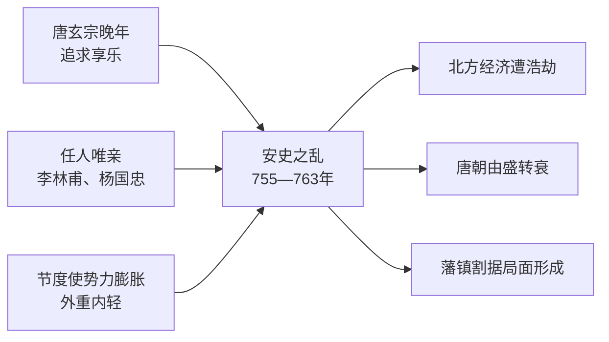
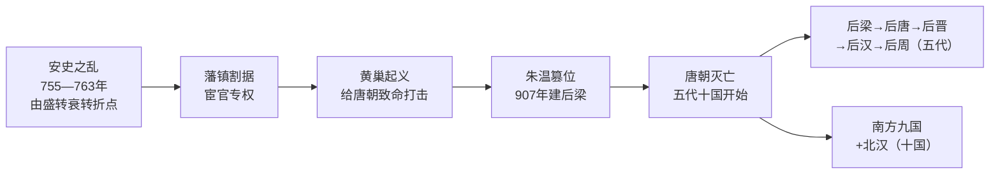

# 第4课 安史之乱与唐朝衰亡

## 时间线
- 755 年：安禄山与史思明发动叛乱，"安史之乱"爆发
- 756 年：叛军攻占长安，唐玄宗逃往四川，太子李亨北上称帝（唐肃宗）
- 763 年：安史之乱被平定
- 唐末：黄巢起义爆发，攻入长安，建立政权
- 907 年：朱温建立后梁，唐朝灭亡，五代十国时期开始

## 一、安史之乱（755—763 年）
### 1. 原因
- 开元末年以后，唐玄宗追求享乐，任人唯亲（重用李林甫、杨国忠），朝政日趋腐败；
- 社会上各种矛盾越来越尖锐，边疆形势日益紧张；
- **节度使**势力膨胀，形成外重内轻的局面；
- 安禄山一身兼任范阳等三地节度使，逐渐扩张势力。

**安史之乱爆发原因因果链：**

### 2. 经过
755 年，安禄山借口朝廷出现奸臣，和部将史思明一起发动叛乱。叛军攻占洛阳、长安，唐玄宗逃往四川。唐朝在北方少数民族军队的援助下，于 763 年平定叛乱。
### 3. 影响
- 对社会经济造成极大破坏，尤其是北方地区遭到浩劫；
- 唐朝的国势从此**由盛转衰**，各种矛盾越来越尖锐；
- 唐朝中央权力衰微，安史旧将和内地节度使权势加大，逐渐形成**藩镇割据**的局面。

## 二、黄巢起义与唐朝灭亡
### 1. 黄巢起义
- **背景**：唐朝后期统治腐朽，宦官专权，藩镇割据的态势越来越严重；人民赋役繁重，生活困苦，又遇连年灾荒。
- **概况**：黄巢率领起义军转战南北，攻入长安，建立政权，给唐朝统治以致命的打击。
### 2. 唐朝灭亡
- 原为农民起义军将领的**朱温**降唐后被封为节度使，后逐渐控制朝政，陆续兼并北方割据势力；
- **907 年，朱温建立后梁政权，唐朝至此灭亡**。

## 三、五代十国的更迭与分立
- **五代**：唐朝灭亡后，北方黄河流域先后出现后梁、后唐、后晋、后汉、后周五个政权。
- **十国**：南方地区出现九个政权，加上北方割据太原的北汉，史称十国。
- **实质**：五代十国是**唐末以来藩镇割据局面的延续**。
- **趋势**：北方政权更迭、战事不断，政局动荡；南方相对安定，经济有一定发展。虽然政权分立，但长期政治统一的历史影响和各地经济发展的密切联系，使**统一始终是一个必然趋势**（后由北宋结束分裂局面，见[[第8课 北宋的政治]]）。

**唐朝衰亡脉络图：**

## 概念对比：唐朝兴衰链条
盛世：[[第2课 唐朝建立与"贞观之治"]] → [[第3课 开元盛世]]
转折：安史之乱（由盛转衰）
衰亡：藩镇割据＋宦官专权＋黄巢起义 → 907 年朱温灭唐

| 事件 | 性质 | 对唐朝的作用 |
| --- | --- | --- |
| 安史之乱 | 统治集团内部叛乱 | 由盛转衰的**转折点** |
| 黄巢起义 | 农民起义 | 给唐朝**致命打击** |
| 朱温建后梁 | 权臣篡位 | 唐朝**正式灭亡** |

## 背记要点
1. 安史之乱：755—763 年，安禄山、史思明发动，唐朝由盛转衰的转折点。
2. 安史之乱的重要背景：节度使权力膨胀，外重内轻。
3. 给唐朝致命打击的是黄巢起义；灭亡唐朝的是朱温（907 年建后梁）。
4. 五代十国的实质：藩镇割据局面的延续。
5. 分裂之中孕育统一：统一始终是历史发展的必然趋势。

## 自测题
1. 安史之乱爆发的原因有哪些？（至少三点）
2. 安史之乱对唐朝产生了哪些影响？
3. 黄巢起义与唐朝灭亡分别有什么标志性事实？
4. "五代"指哪五个政权？五代十国的实质是什么？
5. 从唐朝的兴衰中，你能得到哪些启示？
