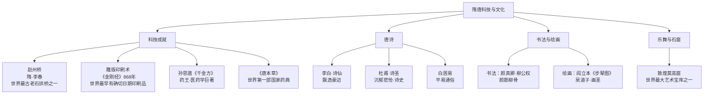

# 第7课 隋唐时期的科技与文化

## 时间线
- 隋朝：李春设计并主持建造赵州桥
- 唐初：已发明雕版印刷术
- 唐中期：孙思邈《千金方》成书（孙思邈生活于隋唐之际）
- 唐朝：《金刚经》刻印（868 年，是世界上现存最早的、标有确切日期的雕版印刷品）
- 盛唐：李白、杜甫等诗人活跃；颜真卿、柳公权、欧阳询书法名世

## 一、科技成就
### 1. 建筑：赵州桥
- 隋朝工匠**李春**设计并主持建造，是世界上现存**最古老的石拱桥**之一，在世界桥梁史上占有重要地位。
### 2. 印刷：雕版印刷术
- 隋唐时期发明**雕版印刷术**；
- 唐朝印制的《**金刚经**》是世界上现存最早的、标有确切日期的雕版印刷品。
### 3. 医药
- **孙思邈**：唐朝著名医药学家，著《**千金方**》，全面总结历代和当时的医药学成果；他被后世尊称为"药王"。
- 唐朝还编修了世界上第一部由国家颁行的药典《唐本草》（《新修本草》）。
### 4. 天文
- 僧一行主持测算出地球子午线长度（了解即可）。

## 二、璀璨的唐诗
唐朝是中国历史上诗歌创作的**黄金时期**，题材丰富，风格多样。
| 诗人 | 称号 | 诗风 | 代表特点 |
| --- | --- | --- | --- |
| 李白 | 诗仙 | 飘逸洒脱、豪迈奔放，想象丰富 | 歌颂祖国山河的壮美 |
| 杜甫 | 诗圣（诗被称"诗史"） | 沉郁悲怆、淳朴厚重 | 反映战争和政治腐败给人民带来的痛苦（生活在由盛转衰时期，联系[[第4课 安史之乱与唐朝衰亡]]） |
| 白居易 | —— | 平易近人、通俗易懂 | 直面社会现实，如《长恨歌》《卖炭翁》 |

**隋唐科技文化成就总览图：**

## 三、书法与绘画
### 1. 书法
- **颜真卿**：端正劲美，雄浑敦厚（"颜体"）；
- **柳公权**：方折峻丽，笔力劲健（"柳体"，与颜并称"颜筋柳骨"）；
- **欧阳询**：楷书笔力险劲（隋唐之际）。
### 2. 绘画
- **阎立本**：擅长人物画，代表作《步辇图》（描绘唐太宗接见吐蕃使者，联系[[第5课 隋唐时期的民族交往与交融]]）；
- **吴道子**：被誉为"画圣"，代表作《送子天王图》，落笔雄劲，风格奔放。

## 四、乐舞与石窟（了解）
- 唐朝乐舞受西域和周边邻国影响，风格多样（《霓裳羽衣舞》）；
- 敦煌**莫高窟**：隋唐时期开凿规模最大，是世界上最大的艺术宝库之一。

## 背记要点
1. 赵州桥——隋朝李春——世界现存最古老石拱桥之一。
2. 《金刚经》——世界现存最早、有确切日期的雕版印刷品。
3. "药王"孙思邈著《千金方》。
4. 诗仙李白、诗圣杜甫、白居易诗歌通俗易懂。
5. 书法：颜筋柳骨；绘画：画圣吴道子、《步辇图》阎立本。

## 自测题
1. 赵州桥的设计者是谁？它在世界桥梁史上有什么地位？
2. 世界上现存最早的、标有确切日期的雕版印刷品是什么？
3. 李白、杜甫的诗风各有什么特点？为什么杜甫的诗被称为"诗史"？
4. 说出唐朝两位著名书法家及其书法特点。
5. 《步辇图》描绘了什么历史场景？反映了什么历史信息？
