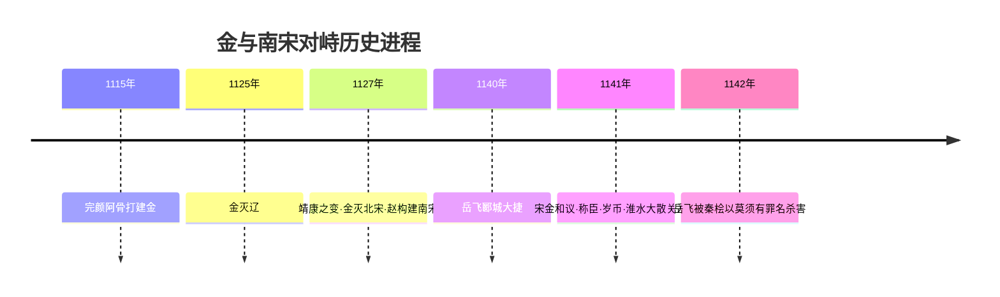

# 第10课 金与南宋对峙

## 时间线
- 1115 年：女真族首领完颜阿骨打建立金政权，都城会宁（后迁中都）
- 1125 年：金灭辽
- 1127 年：金灭北宋（"靖康之变"）；赵构登基，建立南宋，后定都临安
- 南宋初年：岳飞率岳家军北伐，取得郾城大捷
- 1141 年：宋金和议，南宋向金称臣，双方以淮水—大散关一线划定分界线

## 一、女真族的崛起与金的建立
- 女真族生活在黑龙江流域和长白山一带，过着渔猎生活。
- **1115 年，完颜阿骨打（金太祖）**建立金政权。
- 阿骨打的治理：模仿中原王朝制度，改革女真部落军政体制，颁行女真文字，发展生产，女真势力迅速壮大。

**金灭辽、北宋及南宋建立时间轴：**

## 二、金灭辽及北宋
- **金灭辽**：辽天祚帝腐败，金军 1125 年灭辽。
- **金灭北宋**：1127 年，金军攻破开封，北宋灭亡；金军掳走宋徽宗、宋钦宗二帝及大量财物，史称"**靖康之变**"（"靖康耻"）。
- 教训：北宋统治腐败、军备废弛（联系[[第8课 北宋的政治]]重文轻武的消极影响）。

## 三、南宋的建立与岳飞抗金
- **南宋建立**：1127 年，**赵构**（宋高宗）登上皇位，后定都**临安**（今杭州），史称南宋。
- **岳飞抗金**：
  - 岳飞率领"**岳家军**"纪律严明（"冻死不拆屋，饿死不掳掠"），作战勇敢；
  - 在**郾城大捷**中大败金军主力，迫使金军后撤。
- **岳飞遇害**：宋高宗和权臣**秦桧**害怕抗金力量壮大威胁其统治，向金求和，以"**莫须有**"的罪名杀害岳飞。
- **评价岳飞**：岳飞是**抗金名将/民族英雄式的英雄人物**，他的抗金斗争保卫了人民的生命财产，符合人民利益，受到人民永远的尊敬和怀念。（注意教材表述：宋金之战是中华民族内部的战争，一般称岳飞为"抗金英雄"。）

## 四、宋金对峙局面的形成
- **1141 年宋金和议**：南宋向金**称臣**，并给金**岁币**；双方以**淮水至大散关一线**划定分界线。
- 宋金对峙局面形成。此后金迁都燕京，改名中都；南宋统治者满足于半壁江山，偏安江南一隅（"暖风熏得游人醉，直把杭州作汴州"）。
- 南方的相对安定客观上促进了江南经济发展，联系[[第12课 宋元时期经济的繁荣]]。

## 概念对比：北宋 vs 南宋
| 项目 | 北宋 | 南宋 |
| --- | --- | --- |
| 建立者 | 赵匡胤 | 赵构 |
| 时间 | 960 年 | 1127 年 |
| 都城 | 开封（东京） | 临安（今杭州） |
| 主要对手 | 辽、西夏 | 金 |
| 结局 | 1127 年被金所灭 | 1276 年被元所灭 |

## 背记要点
1. 1115 年阿骨打建金；金先灭辽（1125），再灭北宋（1127，靖康之变）。
2. 1127 年赵构建南宋，都临安。
3. 岳飞：岳家军、郾城大捷，被秦桧以"莫须有"罪名杀害。
4. 1141 年宋金和议：称臣＋岁币＋淮水—大散关分界线。
5. 政权更替顺序：辽→金；北宋→南宋；宋金对峙。

## 自测题
1. 金政权是哪一年由谁建立的？
2. "靖康之变"指什么事件？北宋灭亡的原因有哪些？
3. 岳飞抗金的主要事迹有哪些？他为什么受到人民尊敬？
4. 宋金和议的内容是什么？宋金以哪条线为分界线？
5. 比较北宋与南宋的建立者、都城和主要对峙政权。
